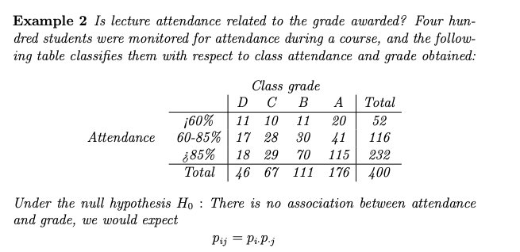
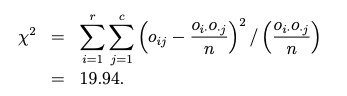
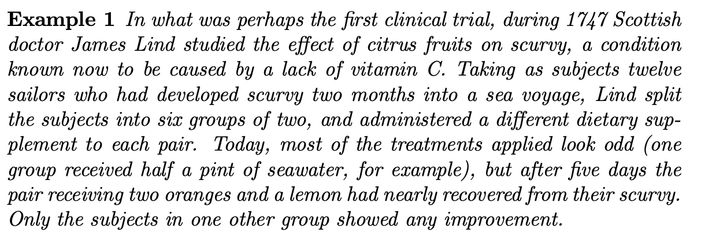

# Lecture 3: Sign Test

- the data are not assumed to follow any parametric distribution

  - i.e the test is distribution free
  - <u>**only assumption is that the data are independent**</u>
  - (mostly used for quick data analysis)
- can be used in either 1-sample or paired 2-sample tests

  - in paired two-sample case, we should convert the original data into differences within each pair
- ==hypotheses are about the population <u>median</u>==
- test statistics only uses signs rather than actual values of the data

  - <u>**tests statistics is the number of positive signs**</u>
  - ==note: this test statistics approach is odd and is against the literature, however, I suspect that <u>they will adjust the p-value calculation accordingly to accommodate this</u>==
    - i.e in the literature it says to count negative or positive signs depending on the $H_A$, but then $\text{p-val} = P(X \geq x)$ always; but in our case, we always count the positive sign but we do the p-value calculation differently depending on the $H_A$
- the exact distribution of the test stat under $H_0$ is the Binomial distribution $B(n, 0.5)$

  - so the $p$-value can be computed exactly
  - alternative is median is greater
    - use the number of positive sign as the test statistics $t = \text{\# of positives}$
    - find $p\text{-value}= P(T \geq t)~~\text{where } T \sim (n, 0.5)$
  - alternative is median is less than
    - use the number of positive sign as the test statistics $t = \text{\# of positives}$
    - find $p\text{-value} = P(T \leq t) ~~\text{where } T \sim (n, 0.5)$
  - alternative is not equal
    - use the number of positive sign as the test statistics $t = \text{\# of positives}$
    - find $p\text{-value} = 2 \times \min(P(T \geq t), P(T \leq t))$
- it is most useful when 

  1. the sample size is small; or
  2. the data may not follow any parametric distribution


> Example: Given some data, you want to check if the "magnitude" (significance) or the drivers injury is the same as the significance of the passenger injury in car accidents
>
> That is
> $$
> H_0: \text{Driver Injury} = \text{Passenger Injury}\\
> H_A: \text{Driver Injury} \neq \text{Passenger Injury}
> $$
> So we can look at every row, and for each one, literally check if there is a difference (so you can do $\text{Driver Injury} - \text{Passenger Injury}$ and get the sign of that)
>
> If you get the same number (so the difference is 0) - we pretend like that data point never happened (sample size decreases)
>
>  
>
> Number of positives $N_+ = 3$ and number of negatives $N_- = 13$. Since we pretend like the 0 rows never happened, $n = 16$
>
> We get the test statistics $T = \min(N_+, N_-) = 3$ in this case (since we're doing a non-equal test)
>
> To calculate the p-value, we want to compute the probability of observing a test stat as extra, or more extreme than the test statistics
>
> TODO: finish

> ## Pre-class Activity: A Test Based on Signs
>
> The New Jersey police wished to assess whether “problem oriented policing” (POP) would affect the numbers of homeless in an area. Problem oriented policing is an approach to policing crime hot–spots that involves a detailed analysis of the region and tailor–made responses to incidents when they occur.
>
> The police selected at random 24 neighbourhoods from the 56 in Jersey City that were deemed problem areas by the police. The neighbourhoods were then paired, with those in each pair considered similar in terms of demographics. One neighbourhood in each pair was allocated at random to POP, while the other region in the pair received standard policing during the same period. The police monitored the number of homeless individuals in the neighbourhood for both six months before and the six months during the intervention. ==In the table below, outcome “+” indicates that the area with POP showed a greater reduction in the numbers of homeless, whereas outcome “–” indicates that the area with standard policing had the higher reduction==. One pair of neighbourhoods was omitted from the study due to inconsistencies in observations and measurements.
>
> 1. What was the purpose of this study?
>    - It's to assess if this new policing approach affect the number of homeless in an area
> 2. What type of study is this? Observational or Experiment?
>    - The neighbourhoods were allocated to receive different type of policing interventions - so I think it's experiment (they are actively making change and there's a control group)
>
> <u>Review Questions</u>
>
> 1. You roll a standard die 20 times and count the number of sixes observed. This random variable follows which probability distribution?
>
>    - you had 20 independent trials, each with the same probability, and you count the number of occurrences &rightarrow; sounds like Binomial to me
>
> 2. How many of the following conditions need to be satisfied to apply the Binomial distribution?
>
>    1. Experiment consists of n identical trials, where number of trials is fixed in advance.
>    2. Outcomes on each trial can be dichotomized into two complementary categories:“success”
>       and “failure”.
>    3. Probability of the success event, p, is the same from trial to trial.
>    4. The n trials are independent of each other.
>
>    - all of this is required


# Lecture 4: Rank Test

- it is also a non-parametric test

- note: this is also known as the <u>Wilcoxon Rank Sum Test</u>

- it's used to determine if there's a significant difference between 2 independent groups in terms of their medians

  - it is a distribution-free version of the 2 sample $t$-test
  - note: so rank test is for independent 2 sample while sign test is for paired test

- test is useful when:

  - the data do not follow normal distributions
  - the sample size is small

- hypothesis

  - $H_0$: the two population distribution are the same
    - i.e two population medians are the same
  - $H_1$: the value of one distribution is systemically higher or lower than the other population
    - (that is, the distribution of $y$ is the same as the distribution of $x$, just shifted by a variable $\theta$)
      - this fact is often overlooked &rightarrow; there is an assumption that the 2 population have the same distribution shape
    - can be one-sided or two-sided
      - two-sided: $\theta \neq 0$
      - one-sided: $\theta > 0$ or $\theta < 0$
    - for similarly shaped distribution, we can formulate $H_1$ in terms of medians

- test statistics: sum of the ranks of the data in one sample

  - rank is literally the ordering of the values when combined together (see example)

    - so we combine the data from both samples, order them from smallest to largest (rank 1 &rightarrow; rank n + m) 
    - then we sum them up

  - we can find $W_x$ and $W_y$
    $$
    W_x = \sum^m_{i=1}R_i^x ~~~~~~~~\text{(rank $x_i$ in combinaed data)} \\
    W_y = \sum^n_{i=1}R_i ^y ~~~~~~~~\text{(rank $y_i$ in combinaed data)} \\
    $$

  - special case: if $n = m$, under $H_0$, $W_x \overset{d}{=} W_y$

  - general case: how does $W_x$ behave under $H_0$?

    - we can enumerate all possibilities 
    - can enumerate all possibilities, there are ${n+m} \choose m$ ways the x values can appear in combined sample

- $p$-value can be computed exactly using probability calculation

  1. can enumerate the possibilities

     - there are ${n +m \choose m}$ ways of ordering the combined sample, all equally likely under $H_0$
     - could therefore find the probabilities for each of the possible values of $W_X$ under $H_0$
     - don't really like the probability calculation approach - see if there's a better way (maybe a formula)

  2. tables of critical values exist (see Neave, p.53 for example) - though these tables are for the test stat $U$
     $$
     U \coloneqq \min \left(W_X - \dfrac 1 2 m(m+1), W_Y - \dfrac 1 2 n(n+1)\right)
     $$

  3. if $m$ and $n$ are sufficiently large, then $H_0$ is approximately
     $$
     W_X \sim N \left(\dfrac 1 2 n(n+m+1), \dfrac 1 {12} mn(m + n +1) \right)
     $$

- note: <u>if ties had occurred in the data</u>, we assign the average of the ranks that would have been assigned had the tied values been different

  - ex. say we have 

     

  - the lowest score of the wife ties with a score of her husband (score 8), we can do

     

  - although the sampling distribution of $W_X$ changes slightly due to the tie

    - if there are many ties though the test may perform poorly, something to keep in mind when using the procedure

> ## Pre-class Activity
>
>  
>
> 1. What method would you use to display the data in a courtroom?
>    - I'd use a box and whisker (boxplot) to effectively show the distribution of times to promotion for both men and women, highlighting the median, quartiles, and any outliers in the data
> 2. Discuss with your group the data and the issues. What is the question being posed by the plaintiff with regards to the data?
>    - plaintiff is likely questioning whether there is a significant gender-based difference in the time taken for promotion within the company
>    - more specifically, data is used to argue that women, on average, wait longer for promotion than men
> 3. In constructing a test for these data, what would be your null hypothesis?
>    - that there is no difference in the time it takes for men and women to get promoted
>    - (no significant difference in median times to promotion between men and women)
> 4. In conducting a hypothesis test here, would you take a one–sided or two–sided alternative?
>    (a) One–sided
>    (b) Two–sided
>    Does it matter whether it is one–sided or two–sided alternative?
>    - one sided since plaintiff says that it's longer than women i.e `median_women > median_men`
>    - yes it does matter because the other direction would not support the plaintiff's claim
>
> ## Review Question
>
> 1. There are 10 soccer players. In how many ways can 2 captains be chosen randomly?
>    - this is a combination problem - picking `(A,B)` is the same as picking `(B,A)`
>    - so we can do ${}_{10}C_2 = 45$
>    - or we can do permutation $(10 \times 9) / 2$ because there's 10 ways to pick the first dude, 9 ways to pick the second, but we want to not count the duplicate mentioned above


# Lecture 5: Kruskal-Wallis Test

- we want to extend comparison of samples from two populations to cases where data are in 3 or more groups

  - the parametric equivalence would have been the ANOVA test
  - however, the ANOVA requires certain assumptions 
  - although ANOVA is quite robust to mild violations of its assumptions, it should not be used in cases where there are clear departures from Normality (for example), at least when sample sizes are small

- case study: class of 36 children was divided into five groups of nine at random. Group A was taught a method in arithmetic in the usual method, while groups B (publicly praised), C (publicly criticised) and D (ignored) were taught using differing techniques. At the end of the session, all children sat the same test, and their marks are recorded below

   

  - in this situation, we may be interested in testing the null of the form

    $H_0: \text{The data in groups are all from identical distribution}$

    - this asserts that the distribution underlying the data within the groups have the same mean (and median)

  - natural negation to this for the alternative hypothesis is

    $H_A: \text{The data in the groups are not all from identical distributions}$

- aside: Chi-squared distribution 

  - there's a degree of freedom element (like t)

  - if $X$ follows the Chi-squared distribution with $n$ degrees of freedom, write 
    $$
    X \sim \chi^2_n
    $$

    - the distribution covers the positive half of the real line, and when $n > 2$, it's unimodal

  - important fact: if $X_1, X_2, \ldots, H_n$ are independent standard normal variables then 
    $$
    X_1^2 + X_2^2 + \ldots + X_n^2 \sim \chi_n^2
    $$
     

  - this probability distribution is continuous and has a density function which is positive only on positive number

  - the mean and variance of $\chi_n^2$ is not so easy to prove, but we can take as given: if $X \sim \chi_n^2$ then

    - mean of $X$ is $n$
    - variance of $X$ is $2n$

- constructing the test

  - say we have $g$ groups, we respective sample size $n_1, n_2, \ldots, n_g$ and $n = \sum^G_{i=1} n_i$ so it's the total number of observations

  - the test ranks the entire dataset in order, assigning 1 to the lowest number, and $n$ to the highest number

    - ties can be handled as in the sum test, with the average of the ranks assigned where necessary

  - the average of all the ranks is denoted $\bar R$, and the mean of the ranks within each group are denoted $\bar R_1, \bar R_2, \ldots, \bar R_g$

  - test considers the variability of the within-group mean rankings $\bar R_1, \bar R_2, \ldots, \bar R_g$

    - under the null hypothesis we would expect these rankings to vary less than in cases where the alternative hypothesis holds
    - since when the data are from identical distributions each mean rank would follow the same distribution

  - so the test stat is closely related to the variance of the mean rankings
    $$
    H \coloneqq \dfrac{12 \sum^g_{i=1} n_i (\bar R_i - \bar R)^2}{n(n+1)}
    $$

  - under $H_0$, the test statistics $H$ follows the $\chi^2_{g - 1}$ distribution

    - meaning large values of $H$ are inconsistent with $H_0$​, since the variance of the mean rankings will inflate when the data arise from more than one distribution

  - p-value is found by finding the probability <u>to the right</u> of the observed value of $H$ for the $\chi_{g-1}^2$ distribution

- back to our case study

  - we can do side by side boxplot of the scores

     

    - scores for teaching method B (praise) seem markedly higher, and rather less variable, than those from the other methods

  - we can calculate the test stat via R or by hand 

    - rank for A: `18,22,3,12,3,12,15.5,18,8` &rightarrow; mean is 12.4

    - the other rank means are 30.6, 22.5, 8.5 

    - overall mean rank is 18.5

    - so we have 
      $$
      \begin{align*}
      H &=\dfrac{12 \sum^g_{i=1} n_i (\bar R_i - \bar R)^2}{n(n+1)} \\
      &= \dfrac{12 \sum^4_{i=1} 9(\bar R_i - \bar R)^2}{36 \times 37} \\
      &= 24.48
      \end{align*}
      $$

  - and here we have $H \sim \chi_3^2$ since $g = 4$

    - the probability to the right of 24.24 is tiny, so the p-value is very low
    - there is strong evidence to reject the null

# Lecture 6: Permutation Test

- can be used for one - sample situations but are more usually used when two or more samples are to be compared
- idea is to consider values of some test statistics over all possible re-groupings (or re-labelling of the data)
  - find the proportion that give values of the statistics at least as inconsistent with the null hypothesis as that observed
- case study:  the US trial Capaci v. Katz and Besthoff, Inc. in 1981, the plaintiff claimed that she and other women had been discriminated against in respect to their times to promotion. Tended at the trial were the data below, which show times (in months) from hiring to promotion, split by gender:
  - let the test statistic here the sum of the promotion times for the two women (chosen for us, not sure why)
    - observed to be $229 + 453 = 682$
  - like rank sum, we fix the number of men and women at 22 and 2 respectively
  - under the null (there is no difference in promotion times for men and women), the sum of any pair of values chosen from the 24 times would be expected to be similar to that observed for the two women
  - howevever, of the ${24 \choose 2} = 276$ possible pairs of values, only three (specifically `(229,453), (229,483), (453,483)`) have a sum at least as large as the one observed
  - so the p-value is $3 / 276 =  0.011$
  - this provides a strong evidence against the null 
- when performing two-sample permutation test, with $m$ and $n$ observations in each group, we do 
  1. choose the test stat, compute its value for the data observed
  2. find the test stat for all possible re-groupings of the $n + m$ observations where $n$ are in one group and $m$ is in the other
  3. count number of re-groupings that produce a test stat at least as inconsistent with the null as the observed test stat
     - this count should include the case from the data observed
  4. p-value is the count from the previous step divided by total number of possible re-groupings $n + m \choose n$
- always viable to perform a permutation test provided the observations are independent of each other and the null hypothesis asserts that the data are all from the same distribution
  - main obstacle to using such tests was computing power: when neither $n$ nor $m$ are small, the number of possible re-groupings may be vast 
  - ex. finding the number of ways 10 numbers add up to 100 is not a trivial task
- note on generalizing to population
  - not all data require generalization to a larger population, as with the Capaci v. Katz and Besthoff trial (who only cared about those men and women)
  - however, typically, data represent samples from larger populations, and random sampling allows for population-level inference
  - most human subject studies lack random sampling, complicating inference, especially in observational studies
  - designed experiments can infer cause-and-effect if random assignment to treatments is used, even without random sampling
  - conclusions you can draw from randomized experiments are not the same as those from observational studies
    - in a randomized experiment, because subjects are assigned to different treatments by chance, you can make stronger inferences about cause and effect
    - observational studies often cannot definitively establish causality because of potential confounding variables &rightarrow; usually more about association rather than causation
  - studies without random sampling or treatment assignment offer weak population-level inference, often relying on theoretical model

- there are 2 types of error one can make when assessing evidence in favour of $H_0$ being true
  1. Type I error: we reject $H_0$ when it is true
     - this is like convicting an innocent person in a trial 
     - we denote the probability of this happening $\alpha$ - we call this the <u>significance level</u> of the test
  2. Type II error: we fail to reject $H_0$ when it is false 
     - this is like acquitting a guilty defendant in a trial
     - we denote the probability of type II error by $\beta$

# Lecture 7: The Power Function

- we say that the <u>power</u> of a test is $1 - \beta$ 

  - where $\beta$ is the probability of committing a type II error

- note: only in cases where the alternative hypothesis specifies a unique value for the unknown parameter can we compute the power

  - that is: the power of a test cannot be calculated when $H_1$ proposes a range of values for the parameter of interests

- suppose we're interested in a single parameter $\theta$ in a hypothesis test and the significance level $\alpha$ is considered fixed (at 5%, for example) - we can define the <u>power function of a test</u> as 
  $$
  \pi(\theta) \coloneqq P(\text{reject } H_0)
  $$

  - power function depends on the value of the parameter $\theta$
  - and it's defined as the probability of rejecting $H_0$ at that particular value of $\theta$ 
  - the power function also depends on the chosen value of $\alpha$
  - important: <u>you can think of it as the probability of **correctly rejecting** $H_0$​</u>

- we prefer tests that make errors with low probabilities - the ideal power function is
  $$
  \pi(\theta) = \begin{cases}
  0 & \text{if } \theta \in H_0 \\
  1 & \text{if } \theta \in H_1
  \end{cases}
  $$

  - where $\theta \in H$ means that $\theta$ takes a value consistent with hypothesis $H$ 
    - so we should reject $H_0$ (return 1) if $H_1$ is true ($\theta \in H_1$)
  - this ideal function is not possible
  - best we can hope for is that the power function is low for values of $\theta \in H_0$, and high for values in $H_1$

# Lecture 8: Chi Squared goodness-of-fit test

- we introduce some tests that are used to assess whether a data set are consistent with a proposed model

- a well known and very useful class of tests are based on a comparison of a key test statistic with the Chi-squared distribution

  - test is often useful for studying categorical data

  - ex. a consumer study might be interested in a possible relationship between car ownership and the possession
    of a microwave oven

    - individual in the study can fall into one of two categories for each of these variable (yes or no)

    - so there are four possible sets into which an individual might fall when both variables are considered

    - so we can do a two-way table type

        

  - in other words

    - a statistical test used to determine whether a sample of categorical data fits a hypothesized or expected distribution
    - it assesses whether the observed frequencies of categorical data significantly differ from the expected frequencies under a specified theoretical distribution or model

- set up: assume each observation can be put into one of $k$ mutually exclusive categories $A_1, A_2, \ldots, A_k$

  - if $k = 2$, we could use the Binomial distribution to model the counts in question &rightarrow; but we need a generalization

  - aside: multinomial distribution

    - assume there are $n$ independent trials, each having possible outcomes labelled $A_1, A_2, \ldots, A_k$ 

    - and let us define the probabilities of each at outcome in a trial as 
      $$
      p_i = P(\text{outcome $i$ occurs at a trial}),~~~~~~ i = 1, \ldots, k
      $$

    - the probability we observe $x_i$ of event $A_i$ with the order irrelevant is 
      $$
      \left( \dfrac{n!}{x_1!x_2! \times \ldots \times x_k!} p_1^{x_1} p_x^{2_2} p \times \ldots \times p_k^{x_k}\right)
      $$

    - the expected value for each event $A_i$ is 
      $$
      e_i = n \times p_i~~~~~~~ i = 1, \ldots, k
      $$

- simple chi-squared test

  - the chi-squared test in simple situations postulate the probabilities $p_i$

    - i.e we test the null hypothesis $H_0: p_i = p_{i0}$ for $i = 1, \ldots, k$, where each $p_{i0}$  is a proposed probability and $\sum_i p_{i0} = 1$

  - we observe frequencies $o_1, \ldots, o_k$ of each of the $k$ possibilities, with $\sum_i o_i = n$

  - under our proposed model (i.e the proposed Multinomial probabilities) the expected values are $e_1, e_2, \ldots, e_k$

    - note: it doesn't always have to be the multinomial, we just need a distribution to get the theoretical expected values of each category $e_i$ 

  - provided $n$ is reasonably large, under $H_0$ we have
    $$
    \sum^k_{i=1} \dfrac{(o_i - e_i)^2}{e_i} \sim \chi_{k-1}^{2}
    $$

    - we would reject $H_0$ if the summation above is too large (falling in the upper tail of the $\chi_{k-1}^2$​ dist)

> Example 1
>
> We had 60 throw of a die and that gave
>
>  
>
> And we're interested in determining if the die is fair, so we have
> $$
> H_0: p_i = \dfrac 1 6~~~~\text{for } i = 1,\ldots, 6
> $$
> Under this hypothesis, all theoretical expected values $e_i = 10$ &rightarrow; thus the squared differences $(o - e)^2 = 25, 9, 36,1,16,49$, respectively. This gives us
> $$
> \sum^k_{i=1} \dfrac{(o_i - e_i)^2}{e_i} = 13.6
> $$
> Is this consistent with the $\chi^2_5$ distribution? Well the 95% point of the distribution is $\chi_5^2(0.95) = 11.07$, so 13.6 fall above this upper tail, and so we would <u>reject the null hypothesis at the 5% level</u>

- some remarks
  - combining cells together can be a good idea in some cases, though may cause the test to lose power
  - more advance: the $k-1$ degree of freedom come from the number of free parameters that are assigned under $H_0$
    - in the example above, you freely assign 5 probabilities, but the last value can only be 1 number since $\sum^6_{i=1} p_i = 1$
  - the theoretical expected value should not be too small, otherwise we risk inflating the test stat artificially 
    -  rule of thumb is that no expected value should be less than three 
    - though the odd small value can be tolerated provided the sample size is large enough ($n > 4k$ say)

> Pre-class Acitivity
>
> (I don't usually do them but this one seems difficult/interesting)
>
> Review question
>  
>
> - either you $(\text{win, lose})$ or $(\text{lose, win})$ so the answer is e)
>
> Question 1
>
>  
>
> - $P(AA) = 4/5\times 4/5 = 16/25$
> - note that there are 2 ways to get the heterozygous genotype (`Aa` and `aA`, and they're different for some reason)
>   - the question wasn't exactly clear, in reality, the phenotype known as `Aa` can come from either `aA` or `Aa` - so the question really should have been $P(\text{heterozygous phenotype}) = P(\text{Aa or aA})$
>   - so $P(Aa) = 2 \times 4/5 \times 1 /5 = 8/25$
>
> Question 2
>
>  
>
> - each individual have 2 allell, so $n = 1000$
>
> - in the AA group, each individual have 2 A &rightarrow; so we have $2 \times 298$ A
>
> - in the Aa group, we have 489 A and 489 a
>
> - in the aa group, we have $213 \times 2$ a allele
>
> - here we only care about A so we have
>   $$
>   \dfrac{2 \times 298 + 489}{2000} = 0.5425
>   $$
>
> Question 3
>
>  
>
> - now we have $p_{A} = 0.5425, p_{a} = 1- p_A = 0.4575$
> - so $E(AA) = 2000 \times p_{AA} = 2000 \times (0.5425)^2 = 294.3$
> - $E_{Aa} = 2000 \times p_{aA} \times 2 = 4000 \times 0.4575 = 496.4$
> - $E_{aa} = 2000 \times p_{aa} = 209.3$


# Lecture 9: Contingency Table

- most common use of the Chi-squared test is for contingency tables

- set up:

  - data are cross–classified by two (or possibly more) categorical variables

  - each observation falls into one cell in the two–way table, and so we are looking at data that are counts

  - let there be $r$ rows and $c$ columns in our table

    - interest resides in testing for some kind of association between the categorizing variables

    - we call the count in cell $(i, j)$ as $o_{ij}$ &rightarrow; $\sum_{i=1}^r \sum_{j=1}^c o_{ij} = n$​

       

- test for independence 

  - test the hypothesis that there is no dependence between the two qualitative variables categorising the data

  - let 
    $$
    \begin{align*}
    p_{ij} &= P(\text{observation falls in row $i$, column $j$})\\
    p_i &= P(\text{observation falls in row $i$}) \\
    p_j &= P(\text{observation falls in column $j$})
    \end{align*}
    $$

  - our null hypothesis is
    $$
    H_0: p_{ij} = {p_i \times p_j} ~~~~~~\text{for all } i = 1,\ldots, r, ~~~j, = 1 \ldots, c
    $$

    - probability of ending in a cell is probability of landing in that row, then probability of landing in that column (regardless of row) - hence they are independent

  - test statistics
    $$
    \chi^2 \coloneqq \sum^r_{i=1}\sum^c_{j=1} \dfrac{(o_{ij} - np_ip_j)^2}{n p_i p_j}
    $$

    - note that the probabilities in the above are not known &rightarrow; <u>they must be estimated using the proportions</u>
      $$
      \begin{align*}
      \hat p_{i}&: \dfrac{\text{sum in the $i$th row}}{n} = \dfrac{o_{i}}{n} \\
      \hat p_{j}&: \dfrac{\text{sum in the $j$th col}}{n} = \dfrac{o_{j}}{n}
      \end{align*}
      $$

    - note: a degree of freedom is removed for each parameter estimated

      - there's some math involved here but point is $df = (r-1)(c-1)$

    - under $H_0$, the expected values are 
      $$
      e_{ij} = n \cdot \hat p_i \cdot \hat p_j
      $$

      - basically very similar to the chi squared activity, you estimate the probability using the data, then use that probability to compute the theoretical expectation, then compare that with the actual count to get the test statistics

  - basic example

     

    - we estimate the row probabilities as $52/400, 116/400, 232/ 400$

    - we estimate the column probabilities as $46/400, 67/400, 111/400, 176/400$

    - the test stat

       

    - further analysis

       

- test for homogenity

  - in this case we are testing "are the columns (say) homogeneous populations with respect to the rows", meaning
    $$
    H_0: p_{i1} = p_{i2} = \ldots = p_{ic}~~~~~\text{ for } i = 1, \ldots, r
    $$

  - example:

     

    - we are testing for homogeneity - basically saying that the proportion of smokers in each severity category is the same across all levels of cigarette consumption 
      $$
      H_0: p_{i1} = p_{i2} = p_{i3}
      $$

      - suggests that the severity of emphysema is not associated with how much the subjects smoke

    - the calculation is the same as above, we can find the expected value 

        

    - p-value and interpretation

       


#  Lecture 10: Fisher’s Exact Test

- if testing for association (independence or homogeneity) in 2x2 table - we can apply a <u>exact test</u> by Fisher

  - test is based on the marginal totals of the table (row and column sum) and consider the distribution of the cell counts given those marginal totals 
  - idea is to examine the "most extreme" tables, with regards to the null, that are possible with the same marginal totals; then sum those probabilities 
  - hence we can find an exact p-value for the table observed by summing the probs of the tables at least as inconsistent but having the same marginal total

- data in the 2x2 table are of the form 

    

  - given the marginals ($R_1, R_2, C_1, C_2$), if we have one of the cell, say $o_{11}$, we can figure out the rest of the table

  - using that, we can enumerate the total possible tables (<u>iterate through all possible values of $o_{11}$</u>​) and compute their probabilities under the null (no association between variables I and II)

  - given the marginal totals, under $H_0$, the probability of a given table is 
    $$
    P(\text{get this table}) = \dfrac{{C_1 \choose o_{11}} {C_2 \choose {R_1 - o_{11}}}}{n \choose R_1} = \dfrac{R_1! R_2! C_1! C_2!}{o_{11}! o_{12}! o_{21}! o_{22}!n!}
    $$

  - so to perform the test, we consider all tables with the same marginal totals as that observed, and compute their probs under $H_0$ using the above formula
    - then consider the set of possible tables at least as unlikely as the one observed, and sum their probabilities
    - this probability (which includes probability of table seen), is the p-value of the test

- example:

   

  - given the marginal totals, the rest of the table can be determined by the top left entry $o_{11}$ - which can range from 0 - 6 in this case (min of the 2 associated marginals 6 and 9) - so there are 7 possible tables

     

  - under the null (using the formula above), the probability of each table can be found

      

    - for instance
      $$
      P(o_{11}=2 \mid H_0) = \dfrac{{9 \choose 2}{6 \choose 4}}{{15 \choose 6}} = 0.1079
      $$

  - to determine which tables are "at least as extreme" in a Fisher's exact test, you look for all the tables that have a probability equal to or less than the probability of the observed table

    - we observed table $o_{11 }= 2$ which has probability of 0.1079

    - the tables with probabilities lower than that are $o_{11} = 0, 1, 6$

    - summing all this up we get
      $$
      \begin{align*}
      \text{p-value} &= P(o_{11} = 0 \mid H_0) + P(o_{11} = 1 \mid H_0)+ P(o_{11} = 2 \mid H_0)+ P(o_{11} = 6 \mid H_0) \\
      &= 0.0002 + 0.0110 + 0.1079 + 0.0168 \\
      &= 0.1359
      \end{align*}
      $$

  - thus  there is insufficient evidence against the null hypothesis that there is no association between the presence of lip and the number of handles

- some notes 

  - could have come up with the same conclusion using chi-squared goodness of fit test
  - statisticians would prefer Fisher's exact test in this case
    - the Chi-squared test can perform poorly when expected counts are small
    - for small overall sample sizes the Chi-squared test performs poorly in terms of significance level and power
  - the Fisher test is akin to a permutation test - it considers all ways the test stat could arise under the null

# Lecture 11: Density curve fitting

- essentially a simple extension of the Chi-squared test we met in the last section, but adapted to test for the fit of more general distribution

- motivating example: below is a tabulation of the lengths (in seconds) of a thousand telephone calls coming in to an exchange

   

  - if we plot this, we see it looks normal-ish, but we want to check if that is an appropriate model

  - when treating the data as Normal, we're imagining a curve of the form
    $$
    c\dfrac{1}{\sqrt{2 \pi \sigma^2}} \exp \left(- \dfrac 1 2 \left(\dfrac{x - \mu}{\sigma} \right)^2 \right)
    $$

    - $c$ is some constant
    - and good estimators of $\mu$ and $\sigma^2$ is the sample mean $\bar x$ and (adjusted) sample variance $s^2$, respectively

  - the question at hand is essentially <u>how well does the $N(\bar x, s)$ fit the data at hand</u> 

- we use the chi-squared test to see how well it fits

  - we compare the observed counts in each of the sets with the counts expected under the $N(\bar x, s)$​

  - again, Chi-squared has the test stat
    $$
    \chi ^2 = \sum_{i=1}^k \dfrac{(o_i - e_i)^2}{e_i}
    $$

    - $k$ is the number of sets for which we have counts
    - $o_i$ and $e_i$ are the observed and expected number respectively in class $i$

- in our example, calculate gives us $\bar x  = 475 \text{ secs}$ and $s = 151 \text{ secs}$

  - say we want to find the expected observations

  - first we label the boundary points $b_1, \ldots, b_k$ 

    - i.e here $b_1 = 100, \ldots b_{10} = 1000$ (they took the right boundary)

  - then there are two options

    1. find $z_i = \dfrac{b_i - 475}{151}$ then use standard normal table

       - or instead of standard normal it's `pnorm(z1, mean = 0, sd = 1, lower.tail=TRUE)`

    2. use `pnorm` function straight up and specify our mean and var 

       ```R
       c2 <- pnorm(c1, mean=475, sd=151, lower.tail=TRUE)
       ```

       where `c1 = (b1, ... b10)`

  - in both cases, multiplying by 1000 give

     

    - multiply by 1000 because there was 1000 examples (i.e that was $n$​)

  - we compute that $\chi^2 = 10.4$ 

  - there were 2 parameters to be estimated ($\mu$ and $\sigma^2$), and ten sets of frequencies to be compared

    - so $df = 9 - 2 = 7$

  - we get the critical value $\chi^2 (0.95) = 14.1$​ so if we test at the 5% confidence interval there is no evidence to reject the hypothesis that the calls are Normally distributed 

    - note: for these kind of questions, it is hard to get the p-value, hence we went with the critical value approach instead

- further: if we believed our data were from

  1. the $B (n, p)$ distribution, then assuming $n$ was known the test has $k −1 − 1 = k − 2$ degrees of freedom
  2. the $Po(\lambda)$ distribution
     - the single parameter is estimated by the sample mean and the test has $k − 2$ degrees of freedom
     - if $\lambda$ is assumed, then it'll be $k-1$ df


# Lecture 12: Graphical tests of goodness-of-fit - Probability plots

- this is an informal, graphical method for deciding whether a data set is from some specified distribution

- normal scores

  - consider an independent and identically distributed (IID) sample ranked in order $x_{(1)} \leq \ldots \leq x_{(n)}$ and we wish to decide whether observations arise from some RV $X \sim N(\mu, \sigma)$

  - if the model is appropriate for the data - we know
    $$
    \dfrac{X - \mu}{\sigma} \sim N(0,1)
    $$

  - so if $y_{(1)} \leq y_{(2)} \leq \ldots \leq y_{(n)}$ were an ordered sample from $N(0,1)$ we would expect a plot of $x_{(i)}$ against $y_{(i)}$ to be a straight line, with slope of $\sigma$ and intercept $\mu$ since approximately
    $$
    x_{(i)} = \sigma y_{(i)} + \mu
    $$

- definition 1:  The Normal scores for a given integer $n$ are the expected values of an ordered sample of size $n$ taken at random from the standard Normal distribution

  - if the data are stored in vector `y`, then the command `csores` in the `exactRankTests` package can be used
    to generate the associated Normal scores and create a plot, as follows

    ```R
    nsy <- cscores(y, type = "Normal", int = FALSE)
    plot(nsy, y)
    ```

  - the command `qqnorm` is an alternative to the above, produces a Normal scores plot directly

    - another command `qqline` adds a line that passes through the first and third quartiles

    - sample plot

       

- example 1

   

- lognormal distribution

  - Normal scores provide a graphical test for the goodness—of—fit of another distribution, the <u>Lognormal distribution</u>
    $$
    f(x) = \dfrac{1}{x\sigma \sqrt{2\pi}} \exp \left(- \dfrac{(\log (x) - \mu)^2}{2\sigma^2} \right)
    $$
    for $x > 0$ and depends on two parameters, $\sigma > 0$ and $\mu$

  - the distribution is unimodal but not symmetrical 

     

  - notation: if $X$ follows the distribution above, then there's also a link with the normal
    $$
    \begin{align*}
    X &\sim LN(\mu ,\sigma) \\
    
    \Rightarrow \log(X) &\sim N(\mu, \sigma)
    \end{align*}
    $$

  - hence a simple test for Lognormality is to plot the logs of the data against the Normal scores, and treat the resulting plot like a Normal probability plot

# Lecture 13: Introduction to Bootstrapping

- in some situations it is difficult to make assumptions about the sampling distribution of a statistic
  - in particular, there are no obvious way to robustly assess the variance of an estimator
- suppose we have sample of size $n$ - denoted $S_n = {x_1, x_2, \ldots, x_n}$
  - let $t$ denote the <u>value</u> of statistics $T$ of interest (i.e mean, median, variance)
  - we draw $M$ simple random samples with replacement from $S_n$
    - means each observation in a bootstrap sample is taken by picking from $S_n$ at random, then replacing that observation (putting it back) before selecting the next observation
  - for each sample selected, the statistics $t$ is found
- in this way, a set of $M$ values of $T$ are drawn, denote $\{t_1^*, t_2^*, \ldots, t^*_m\}$​
  - those $M$ values comprise the <u>empirical bootstrap distribution</u> (EBD) for $T$
- the empirical bootstrap distribution provides an approximation to the bootstrap distribution
  - which is the distribution of values of T that would arise if all possible samples with replacement were taken from $S_n$
  - side note: regarding the "true" bootstrap distribution (not the EBD)
    - there are ${2n-1} \choose n$ possible samples with replacement - if we have all of them, we can construct the "true" bootstrap distribution
    - as you can see, this number gets pretty big, so only for small $n$ can we compute this fully 
  - as long as $M$​​ is large, <u>the EBD provides a close approximation to the bootstrap distribution</u>

- <u>**properties of EBD**</u>

  1. the EBD is centered around the sample value $t$
  2. the mean of the EBD is an estimate of the mean of the sampling distribution of $T$
  3. the standard deviation of the EBD estimates the standard deviation of $T$
  4. basically can use EBD like sampling distribution if you want to calculate bootstrap confidence interval for the parameter estimated by the statistics $T$

- example

   

  - basically, he graphed the EBD and took its quantile to get the CI

     

- bootstrap approach is most effective when it is difficult to specify the sampling distribution of the statistic T

  - so unless we have a very small sample (like in Prof Statto's case), the bootstrap may not be so useful when T is the sample mean
    - because in that case, sampling theory gives good information about the sampling distribution of $\bar x$ and its variance 
    - i.e using CLT you can say the mean is normally distributed around the sample mean and adjusted sample variance

# Lecture 14: Hypothesis Testing in Bootstrapping

- it's possible to use suitable EBD to create bootstrap alternative to classical hypothesis test 

  - theory about how to choose the test statistic in bootstrap hypothesis test is not simple &rightarrow; focus on case where bootstrap test is similar to well-known test

- one-sample t-test

  - recall: a sample $S_n = \{x_1, x_2, \ldots, x_n\}$ is taken at random from distribution with mean $\mu$, when testing null hypothesis $H_0: \mu = \mu_0$, we construct the test stat
    $$
    t = \dfrac{\bar x - \mu_0}{s / \sqrt{n}}
    $$
    where $\bar x$ and $s$ is the sample mean and sample standard deviation, respectively

    - under the assumption that the data are from a Normal distribution, $t$ follows the $t_{n-1}$ distribution when $H_0$ is true 
    - though test is quite robust to departures from the assumption, it's not justifiable to use if sample size is small 

  - bootstrap version: the studentized test statistics is found for each bootstrap sample as follows

    1. draw a sample random sample with replacement from $S_n$

    2. compute the mean and standard deviation $\bar x ^*$ and $s^*$ from bootstrap sample

    3. compute the studentized test statistics 
       $$
       t^* = \dfrac{\bar x ^* - \bar x}{s^* / \sqrt{n}}
       $$

    - repeat the above steps $M$ times, then <u>the EBD for $t$ is created</u> 
      - not the difference in definitions for $t^*$ and $t$ - $t$ is centered on $\mu_0$, while $t^*$ is centered on $\bar x$​
    - p-value for this bootstrap test is determined by the EBD and the alternative hypothesis - the cases are
      1. when $H_a: \mu \neq \mu_0$, the p-value is the proportion of $t^*$ values greater than $|t|$ or less than $-|t|$
      2. when $H_a: \mu > \mu_0$, the p-value is the proportion of $t^*$ values greater than $t$
      3. when $H_a: \mu < \mu_0$, the p-value is the proportion of $t^*$ values less than $t$

  - example

     

    - then we see how many are less than $-2.4086$

       

# Lecture 15: Experimental Design

- important class of statistical studies are experiments

  - like observational studies, in an experiment the items on which data are obtained - called either the experimental units or, in cases where they are humans, subjects - are randomly assigned to the different experimental conditions

  - measurement taken on each experimental unit is called the response

  - in simplest experiment, researcher has identified an explanatory variable, termed a factor, that can be changed to set the different experimental conditions

  - experimental units are randomly assigned to different levels of the factor, and the response variable measured on each unit

  - researcher then compares the values of the response under the different levels of the factor, to see whether there is an apparent effect

  - example

     

- b/c experimental units are assigned randomly, via an experiment we may hope to establish a cause and effect relationship between the response variable and a factor

  - <u>such a relationship can never be inferred from an observational study, since there may be confounding variable</u>

- key principles of experiments

  1. Control
     - as much as possible, conditions for all experimental units, are kept the same apart from changes to the factor
     - example: in example above, Lind ensured that the living conditions and diets of all his subjects were the same during his study on scurvy, so that as much as possible variation in the health of the sailors could be attributed to the supplement
  2. Randomization
     - experimental units must be assigned to treatments at random
     - only then can the possible effects of any hidden or confounding variables be eliminated
  3. Replication
     - only way to assess whether variability in the response variable is due to the treatments applied(rather than just random chance) is to have more than one subject in each treatment group
     - with replication we can estimate the variability within each group, and compare it to the variation between each group
     - second form of replication is when entire studies are repeated to attempt to validate the results of an earlier study
  4. Blocking
     - there may be attributes of the experimental units that cannot be controlled but which nevertheless may affect the response variable
     - example
       - suppose a type of cancer progresses differently in men and women
       - test the effectiveness of three treatments, we could obtain thirty men and thirty women, and randomly assign the sixty subjects to the three treatments without regard for gender
       - let the response be the two-year survival rate
       - in doing the experiment as described it could be the case that one treatment is applied to mostly women (by random assignment)
       - given that gender is known to be associated with survival times for this cancer, it would be preferable for the men and women to be separated and randomly assigned a treatment within each gender block
       - this way we could be sure that ten men and ten women receive each treatment, with gender being the blocking variable

# Lecture 16: Introducing ANOVA

- the aim throughout is to study the relationship of a response variable Y, say, with explanatory variables that are factors

  - factor is an explanatory variable that exists at different levels, the levels being controlled by the experiment
  - levels of factors may be either qualitative or quantitative 

- approach here involves splitting the variation in the response variable into components that enable judgements to be made about the relationship between response and the factor

  - hence the name: analysis of variance (ANOVA)

- example: the following data are from a chemical plant and give the yields (in kg) that resulted from trying four different catalysts in a chemical process

    

  It is of interest to determine whether the catalyst used affects the yield produced in the process.

  - here, we have one qualitative factor with four levels
  - the response is the amount of yield at each trial
  - there were 6 replications at each level of the factor - giving 24 trials in total

# Lecture 17: The basic model - ANOVA

- let us assume that we have $g$ groups, and $t$ observation in each

  - no necessity to enforce equal numbers in each group, but it makes the formulae easier - but also make the experiment more sensible

  - let $y_{ij}$ denote $j$th observation in the $i$th group (for $i = 1, 2 \ldots, g$ and $j = 1, 2, \ldots, t$)

  - the overall mean of these values are 
    $$
    \bar y = \dfrac{1}{gt} \sum^g_{i=1}\sum^t_{j=1} y_{ij}
    $$

  - the model we must assume in the analysis of variance (ANOVA) can be written as 
    $$
    \begin{align*}
    y_{ij} &= \mu + a_i + e_{ij}\\
    \mu &= \text{the expected value of } \bar y \\
    a_i &= \text{the group (or treatment) effect for group $i = 1, \ldots, g$}\\
    e_{ij} &= \text{independent error variables, assumed to be from $N(0 \sigma)$ for some $\sigma$}
    \end{align*}
    $$

  - we will let $\bar {y}_i$ denote the sample mean in the ith group - then since $\bar y$ is the mean of the group means, we have
    $$
    \sum^g_{I=1} (\bar y_i - \bar y) = 0
    $$

    - after doing some math we get 

        

- testing the null hypothesis

  - under the model, the null hypothesis test for the equality of means within the groups can be written as 
    $$
    H_0: \alpha_1  = \alpha_2 = \ldots = \alpha_g 
    $$
    (in other words, all the group effects are zero)

    - ANOVA attempts to decide on the plausibility of this statement by comparison of the variation within the groups with the variation between the groups 

    - we basically say
      $$
      \text{overall variability} = \text{within group SS} + \text{between group SS}
      $$
      (SS is short for sum of squares)

  - if $H_0$ is true, we would expect the within-group variation to be comparable to the between-group variation

  - if $H_0$ is false, we would expect the Between Group SS to dominate

  - key formula
    $$
    \begin{align*}
    
    \dfrac{\text{(Between group SS)}/(g-1)}{\text{(Within group SS)}/g(t-1)} &\sim F_{g-1,g(t-1)}\\
    \\
    \text{Within Group SS} &= \sum^g_{i=1}\sum^{n_i}_{j=1} (y_{ij} - \bar y)^2 \\ 
    \text{Between Group SS} &= \sum^g_{i=1}\sum^{n_i}_{j=1} (\bar y_i - \bar y)^2 \\ 
    &= \sum^g_{I=1} n_i (\bar y_i - \bar y)^2 \\
    
     n_i &= \text{number of sample in that group}
    \end{align*}
    $$

    - and so if $H_0$ is false, this value would be inflated
    - so our critical region will lie in the upper tail of the F distribution

  - The Within group SS is sometimes called either the Error SS or the Residual SS

  - example:

     

     

    - work out the math yourself, this work is pretty shotty

       

    - to test the null hypothesis that the catalysts all have the same effect, we look at the mean square ratio, $24.6 / 1.81 = 13.6$
    - the figure is to be compared with the $F_{3,20}$ distribution
    - the 95% point of this distribution 3.10, and as 13.6 is greater - it lies in the critical region so we reject

- unequal sample size 

  - basically the equation above is already written for unequal sample size
  - but then it'll follow an $F_{g-1, n-g}$ distribution

- estimate $\sigma^2$

  - recall that it is assume that observation in each group are normally distributed with common variance $\sigma^2$

  - we can estimate each within-group variance using
    $$
    s_i^2 = \dfrac{1}{n_i - 1} \sum^{n_i}_{j=1} (y_{ij} - \bar y_i)^2
    $$


# Lecture 18: Multiple Comparisons

- sometimes in ANOVA the null is not uninteresting (i.e it's obvious that the underlying means are not equal)

- more interesting to investigate which factor level seems to have highest or lowest impact on the response

- to study pairwise comparisons - we must recall that overall significance of many individual hypothesis test will be over-inflated

  - to accommodate, we set the individual signficiance level small to 
    $$
    \dfrac{0.05 }{G}
    $$

  - this compensates, and it can be shown that the chance of a single type I error is now no more than 0.05

- to compare two groups, $l$ and $m$ we base inference on
  $$
  \bar y_l + \bar y _m
  $$

  - this implies that the $\bar y_l + \bar y _m$ has the variance
    $$
    \dfrac{\sigma^2}{n_l} + \dfrac{\sigma^2}{n_m}
    $$
    we would estimate the square root of this by
    $$
    ESD(\bar y_l + \bar y _m) = \left(\dfrac{s_p^2}{n_l} + \dfrac{s^2_p}{n_m} \right)^{\frac 1 2}
    $$

- ==the value of $\bar y_l + \bar y _m$​ will be considered significantly different from 0 if its absolute value is greater than==
  $$
  d_{l, m} = t_{n-g} \left(1 - \dfrac{0.05}{2G}\right) \left(\dfrac{s_p^2}{n_l} + \dfrac{s^2_p}{n_m} \right)^{\frac 1 2}
  $$
  where $t_{n-g}(1-0.05/2G)$ is the $(1-0.05/2G)$ percentile of the $t_{n-g}$ distribution


# Lecture 19: Interaction in Two-Way ANNOVA

- two way analysis of variance 

  - consider data classified by two variables of interest

  - now the rows and columns represent levels of some experimental factor

  - ex.  agricultural experiment to test a variety of wheat might involve measuring the yield obtained in each of three areas in three consecutive years, with perhaps four plots (i.e., replications) in each are

     

    - would be of interest to test whether the yield appears to vary across the areas, and whether the yield seems to differ from year to year
    - further, if there are apparent area and year effects, is there evidence of a so-called interaction between the two (i.e. does the area affect appear to differ from year to year)

- general two-way model: let our two-way table consist of $c$ columns and $r$ rows, with $m$ replications in each cell

  - let the $k$th replicate in the $j$th row of the ith column by $y_{ijk}$

  - the general model assumes that 
    $$
    y_{ijk} = \mu + \alpha_i +\beta_j + (\alpha\beta)_{ij} + \varepsilon_{ij}
    $$

    - $\mu$ is the expected value of $\bar y$ (the overall mean across the entire table)
    - $\alpha_i$ is the effect of the ith column
    - $\beta_i$ is the effect of the jth row
    - $(\alpha\beta)_{ij}$ is the row-column interaction effect
    - $e_{ij}$ are independent error variables, assume to be from the $N(0, \sigma)$ distribution with some $\sigma^2$

  - quick graphical check to see if interaction terms should be included is to plot cell means for each row (or column) then join together the means for each columns

    - intersecting lines may suggest there there is significant interaction 

    - called cell means plot

       

- no-interaction model

  - we assume that there is no significant interaction - so the $(\alpha \beta)_{ij}$ term is removed 

  - to make the formula easier, we also assume there is is a single replication in each cell (so $m = 1$)
    $$
    y_{ij} = \mu + \alpha_i + \beta_j + e_{ij}
    $$

    - note: in cases where $m=1$, we cannot even possibly estimate interaction term, because the system is over-parameterized

  - skipping over some math, we have 
    $$
    \text{Total Variation} = \text{Column SS} + \text{Row SS} + \text{Residual variation}
    $$

    - the last term is the variation in the data after the row and column effect has been accounted for 

  - hypothesis: here we're testing for the equality of the row effects
    $$
    H_0: \alpha_1 = \ldots = \alpha_c = 0
    $$

    - test statistics
      $$
      \dfrac{\sum^c_{i = 1} \sum^r_{i=1}(\bar y_i - \bar y)^2/ (c-1)}{{\sum^c_{i=1}\sum^r_{j=1} (y_{ij}-\bar y_i - \bar y_j + \bar y)^2} / (r-1)(c-1)} \sim F_{(c-1),(r-1)(c-1)}
      $$

    - if$H_0$​ is false, the numerator in the fraction above will be inflated

      - so the critical region for the test of the null hypothesis is the upper tail of the appropriate F distribution

  - hypothesis: equality for the row effect

    - test statistics
      $$
      \dfrac{\sum^c_{i = 1} \sum^r_{i=1}(\bar y_j - \bar y)^2/ (r-1)}{{\sum^c_{i=1}\sum^r_{j=1} (y_{ij}-\bar y_i - \bar y_j + \bar y)^2} / (r-1)(c-1)} \sim F_{(r-1),(r-1)(c-1)}
      $$

  > Example: an experiment was performed by five technicians in each of four different laboratories, the amount of produce (in g) recorded 
  >
  >  
  >
  > Calculations with ANOVA table gave
  >
  >  
  >
  > To test whether the technicians are the same (i.e., whether the column effects are identical), from the table above we calculate the column mean square as 
  > $$
  > \begin{align*}
  > F_\text{treatment} &= \dfrac{MS_\text{treatment}}{MS_\text{error}} \\
  > F_\text{column} &= \dfrac{MS_\text{column}}{MS_\text{error}} =\dfrac{39.92}{5.96} = 6.70 \sim F_{4, 12}
  > \end{align*}
  > $$
  > The 95% point of the $F_{4,12}$​ distribution is 3.26, the test statistics is above that so we would reject
  >
  > Similarly, if we wanted to perform a test for whether the labs are identical (test for row effects)
  > $$
  > F_\text{row} = \dfrac{MS_\text{row}}{MS_\text{error}} = \dfrac{115.92}{5.96} = 19.45 \sim F_{3,12}
  > $$
  > And the 95% critical value for $F_{3,12}$ is 3.49 so we would reject

- interaction models

  - note: assuming $(\alpha \beta)_{ij} = 0$ for all $(i, j)$ is equivalent to saying 

    1. there's no interaction between A and B
    2. the effects of A and B are defined to be additive
    3. different between any two levels of A is the same at all levels of B
    4. different between any two levels of B is the same at all levels of A

  - questions naturally arise in hypothesis testing about which if any of these parameters in the full model are zero

  - the ANOVA table would look like 

     

    - mean squares, as usual, are the sums of squares divided by their degrees of freedom, and averages are over all subscripts
    - F ratios are defined as dividing the corresponding mean square by the error MS
    - we still say the the test statistics follow $F_{\text{treatment dof}, \text{ error dof} }$

  > Example: Primer paint is applied to aircraft wings by either dipping or spraying. Three types of primer paint were tested in an experiment that involved three replications under each method of application. After the primer was applied in each case a finishing paint was coated on, and the adhesive force of the primer was measured. The adhesive forces measured are tabulated below
  >
  >  
  >
  > This is the plot of means
  >
  >  
  >
  > (this suggest that both method and primer type affect the response, but there's no interaction)
  >
  > We can get the ANOVA table as 
  >
  >  
  >
  > Now 95% critical values of $F_{1, 12} = 4.75, F_{2,12} = 3.89$. We would reject the null hypothesis that application method has no effect, as well as reject the null hypothesis that the primer type has no effect, but <u>we will not reject the null hypothesis that there is no interaction</u> 

# Lecture 20: Analysis of Two–way Designs

- I think I already did the pre-reading for this

# Lecture 21: Linear Regression

- standard scenario

  - measurements on a response (dependent) variable Y
  - corresponding values for $k \geq 1$ explanatory (or independent/predictor) variables $x_1, \ldots, x_k$

- usual to assume that values of the explanatory variables are not random, but "fixed" over a range of values

  - not always true
  - but extra difficulty occurs when $x$ values are random and has associated errors

- aim is to identify the form of the model that might exist relating $Y$ values to those of $x_1, \ldots, x_k$

  - estimating the relevent parameters with optimal accuracy
  - testing hypotheses regarding those parameters and making predictions on the strength of the model we've decided upon

- basic model 
  $$
  Y = \beta_0 + \beta_1 x_1 + \ldots \beta_k x_k + \varepsilon
  $$

  - where $\beta_0, \ldots \beta_k$ are unknown parameters

  - $\varepsilon$ indicates and error term (of 0 mean and constant variance $\sigma^2$)

  - this function is termed a <u>linear model</u> - referring to the linearity in parameters, not explanatory variable 

    - ex. this is linear
      $$
      Y = \beta_0 + \beta_1 x + \beta_2 x^2 + \varepsilon
      $$

    - ex. this is not linear
      $$
      Y = \beta_0 + e^{-\beta_1 x_1} + \dfrac{\beta_2^2}{\beta_1} x_2 + \varepsilon
      $$

# Lecture 22: Sum of Squares of Regression

- what amount of variation in the y values can be attributed to the linear model we are fitting? 

  - attempt to answer this question by examining some “sums of squares” which naturally arise in the model fitting

- after some math surrounding the residual, we have
  $$
  \text{SS about the mean} = \text{SS due to the regression} + \text{SS about regression}
  $$

  - SS is short for sum of squares 
  - so in assessing the varation in the $y$​ values about their mean, some of the variation is due to the regression line fitted, and the remainder accounted for by the fact that all values did not lie exactly on the line

- we are more confident in a model with regression SS large relative to residual SS
  $$
  R^2 \coloneqq \dfrac{\text{Regression SS}}{\text{Total (corrected) SS}}
  $$

  - a value near 1 would suggest the model fit well

- degree of freedom

  - any sum of squares has a df associated with it

     

  - the error mean square (often called the residual MS) is denoted $s^2$ and provides an estimate of the variation between the regression line, $\sigma^2_{y \mid x}$, based on $n-2 $ degree of freedom 

    - this unknown variance is only be $\sigma^2$ exactly when the model fitted is true, otherwise$\sigma^2_{y \mid x} > \sigma^2$

# Lecture 23: Properties of Estimators

- theorem for least square estimates $b_0$ and $b_1$
  - they are unbiased estimators for $\beta_0$ and $\beta_1$
  - $Var(b_1) = \sigma^2/S_{xx}$
  - $Var(b_0) = (\sigma^2 \sum x_i^2) / (nS_{xx})$
  - $Cov(b_0, b_1) = -(\bar x \sigma^2)S_{xx}$​
- estimators $b_0$ and $b_1$ are the best linear unbiased estimators of $\beta_0$ and $\beta$​ respectively
  - that is, for all linear estimators that are unbiased, $b_0$ and $b_1$ have the least variance 
- in addition to the linear model, we further assume that each error term is normally distributed with zero mean and variance $\sigma^2$
  - $e_i \sim N(0, \sigma)$ IID
  - then $b_0$ and $b_1$ are also Normally distributed (being linear combinations of the $y_i$ values) - with mean and variance given by the above theorems

# Lecture 24: Multiple Linear Regression

- TODO: section 5 + MLR notes, but probably in class work is enough

- correlation

  - correlation coefficient $p_{xy}$ between any two variables $x$ and $y$ measure their collinearity (expect to be closely related to slope)
    $$
    r_{xy} \coloneq \dfrac{S_{xy}}{\sqrt{S_{xx}S_{yy}}}
    $$

  - interpetation is slightly different

    - $r_{xy}$ measure the collinearity between $x$ and $y$ whilst $b_1$ describes change in $y$ when a unit change is made to $x$

    - we can also see that
      $$
      r_{xy} = (\text{sign of $b_1$})(R^2) ^{1/2} = R
      $$

      - where $R^y$ is the multiple correlation coefficient 

    - more generally, in cases where there are multiple correlation coefficient 
      $$
      r_{y \hat y} = R
      $$


# Lecture 26: Residuals

- residuals can be defined as 
  $$
  e_i = y_i - \hat y_i
  $$

  - where $y_i$ is the actual observation and $\hat y_i$ is the predicted observation by the model

- plot for residuals: diagnostic tests for the fit of our model and possible departures from the Normal assumption

  - not important whether we use raw residuals or their standardized form

  - plots against fitted value

    - we plot the standardized residual against the fitted value $\hat y_i$

    - a good fit would be if we see a patternless "band" around zero (also expect their magnitude to be Normally distributed, so for small sample we don't expect to see absolute residual values greater than 3 for example)

    - ex. good

       

    - ex. bad

       

      - there's a funnel shape
      - this kinda shows non-constancy of variance
      - possible way to fix this is transformation (later)

    - slope or curve pattern in the plot suggests that the model is inadequate and that extra terms (such as
      higher powers or cross product terms) should be included

    - note: we plot residuals against $\hat y_i$ and not $y_i$ because residuals are correlated with observed value but not fitted values

  - plot against predictor variables

    - plots of (raw or standardized) residuals against one or all predictor variables have a similar interpretation 
    - once again a patternless "cloud" of points centred at zero is desired

  - normal score plots

    - check the set of data against their normal scores for a sample of the same size

    - satisfactory plot should be approximately a straight line of unit slope passing through the origin

       

- sometimes a pattern we see in a residual plot provides intuition about how the regression model could be improved

  - ex. if we saw a curved relationship between the residuals and one of the two explanatory variables, this can suggest we should try <u>adding the square</u> of the explanatory variables to the model
  - but most of the time this is not intuitive, mostly just trial and error

- transformation

  - we can try and transform the data for better inference or performance
  - there is a tradeoff
    - transformation may improve behaviour of the residual but at the cost of making the model harder to interpret 

# Lecture 27: Dummy Variables in Regression

- dummy variables are used in regression models to represent qualitative variables, such as different groups or categories
  - encode group membership, with one category chosen as the reference group against which others are compared
  - ex. if there are 3 groups (A, B, C), two dummy variables X1 and X2 can be created where
    - X1 = 1 for observations from group A, 0 otherwise
    - X2 = 1 for observations from group B, 0 otherwise
    - group C is kinda implicitly represented by X1 = 0 and X2 = 0
  - if there are $g$ groups you have $g-1$ dummy variables
  - note: in the example above, group C is called the baseline
    - (R would actually choose alphabetically what's the baseline, so it would choose A as the baseline)
- equivalence to ANOVA
  - in regression analysis, dummy variables can replicate ANOVA procedures for comparing group means.
  - the ANOVA F-test for equality of group means is equivalent to testing the coefficients associated with dummy variables in regression.
  - regression framework re-expresses population group means in terms of intercept and dummy variable coefficients.
  - hypothesis testing in regression mirrors ANOVA, where the null hypothesis corresponds to all coefficients being zero
  - note: the hypothesis tests for the coefficients of these dummy variables in regression are analogous to the tests conducted in ANOVA, ===but the overall frameworks and objectives of ANOVA and regression analysis remain distinct==
    - ANOVA (Analysis of Variance) is typically used to compare means across multiple groups or categories
    - Regression analysis is used to examine the relationship between one or more predictor variables and a response variable
- testing interaction efects 
  - interaction effects between factors can be tested using dummy variables in regression
    - interaction occurs when the effect of one factor depends on the level of another factor
  - interaction is represented by an additional term in the regression model, often denoted by the product of dummy variables or a separate term
  - null hypothesis for interaction is typically that the interaction coefficient is zero
  - so either approach kinda works
    - F-stat we obtain from ANOVA is the square of the t-stat we obtain from the regression (so p-value should remain the same between the 2 approaches)
- 
