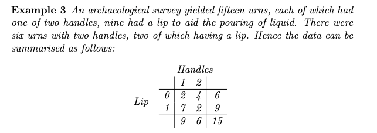
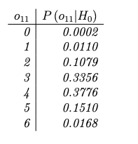
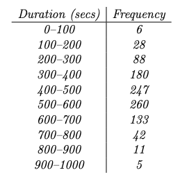
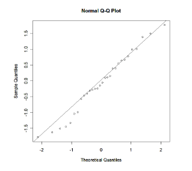
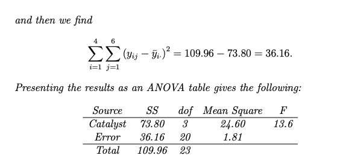
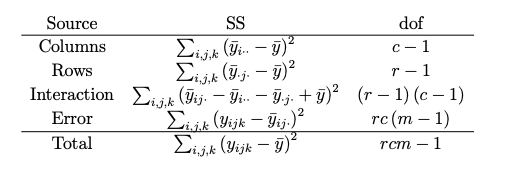
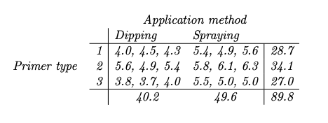
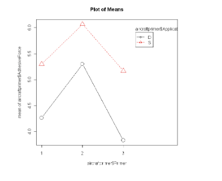
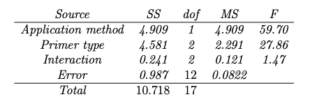

# Non-Parametric Test

- recall: test like the $t$-test relies on assumption that the data comes from a population that is normally distributed
  - if this doesn't hold, we need to rely on the CLT which requires a large sample size ($\geq 30$)
  - so if we satisfy neither of these assumptions, we use non-parametric tests
- non-parametric tests are test that doesn't rely on the any distribution assumption of the data
  - <u>**only assumption is that data is independent**</u>

## Sign Test

- this is a non-parametric test that can be used for a <u>one-sample t-test</u> or a <u>paired t-test</u>

  - in the paired case, we should convert the original data into differences within each pair

- hypothesis

  - null hypothesis $H_0$: the median of a distribution is equal to some value
  - alternative hypothesis $H_a$: basically just not the null, can be one-sided or two-sided
  - ex. in the paired case:
    - null: the median of the differences between paired observations is zero. In other words, there is no systematic difference between the two sets of paired observations
    - alternative: the median of the differences between paired observations is not zero; this implies that there is a systematic difference between the two sets of paired observations
  - note: the "signs" here means the sign of the result after you've subtracted it against the specified value in the null (most of the time you're subtracting against 0)

- test statistics: <u>number of positive signs</u>

  - so looking at your data, count the number of positive numbers and negative numbers

  - the exact distribution of the test stat under $H_0$ is the Binomial distribution $Bin(n, 0.5)$​
    $$
    T \sim Bin(n, 0.5)
    $$
    where $T$ is the test statistic

- p-value

  - alternative: median is greater
    $$
    p\text{-value}= P(T \geq t)
    $$

  - alternative: median is less than
    $$
    p\text{-value} = P(T \leq t)
    $$

  - alternative: median is not-equal (two-sided)
    $$
    p\text{-value} = 2 \times \min(P(T \geq t), P(T \leq t))
    $$

- it is most useful when 

  1. the sample size is small; or
  2. the data may not follow any parametric distribution

- note:

  - **ranks are very resistant to outliers** - thus if your method relies on ranks, it's more likely to be robust to outliers

- aside: reminder about Binomial 
  $$
  \begin{align*}
  X & \sim \text{Bin}(n, p) \\
  P(X = x) &= {n \choose x} (p)^x(1-p)^{n-x} \\
  P(X \leq x) &= \sum^{x}_{i=1} P(X = i) 
  \end{align*}
  $$

  - with big enough sample size, this could be approximated via a Normal distribution
    $$
    \text{Bin}(n, p) \longrightarrow N(np, npq) ~~~~~~~\text{where } q = 1-p
    $$


> Example:
>
>  
>
> After taking the difference between the neighbourhood pairs 
>
>  
>
> (here they gave us the sign already after subtracting, but if not you need to take the difference of the neighbourhood pairs, subtract by hypothesized value which is 0 in this case and get the sign of that)
>
> So the test statistics $T = 10$​ where $T \sim \text{Bin}(11, 0.5)$
>
> To calculate the p-value, use the two-sided formula
> $$
> \begin{align*}
> p\text{-value} &= 2 \times \min\{P(t \geq 10), P(t \leq 10)\} \\
> &= 2 \times P(t \geq 10) \\
> & = 2 \times 0.00586 \\
> &= 0.01172
> \end{align*}
> $$
> So we'd reject


## Wilcoxon Rank Sum Test

- also known as the <u>Wilcoxon Rank Sum Test</u>
- it is a non-parametric version of the <u>2-sample t-test</u>
  - used to determine if there's a significant difference between 2 independent groups in terms of their **medians**
  - <u>can also be used for paired</u>
- hypothesis

  - $H_0$: the two population distribution are the same
    - i.e two population medians are the same
  - $H_1$: the value of one distribution is systemically higher or lower than the other population
    - (that is, the distribution of $y$ is the same as the distribution of $x$, just shifted by a variable $\theta$)
      - this fact is often overlooked &rightarrow; there is an assumption that the 2 population have the same distribution shape
    - can be one-sided or two-sided
      - two-sided: $\text{median} \neq \theta$
      - one-sided: $\text{median} > \theta$ or $\text{median} < \theta$
    - for similarly shaped distribution, we can formulate $H_1$ in terms of medians
  - point: hypothesis is about the distribution being the same and if the shape is the same, we can talk about medians
- test statistics: <u>sum of the ranks of the data in one sample</u>
  - we usually take the sum of the smaller sample
  - we'll call this quantity $W_x$ which is the sum of the ranks of the smaller sample
  - note: rank is literally the ordering of the values when combined together (see example)
    - so we combine the data from both samples, order them from smallest to largest (rank 1 &rightarrow; rank n + m) 
    - then we sum them up
  - note: regarding ties, we'd assign average ranks (see later)
    - if all the ties come from a single sample, randomly assigning them is fine too
- p-value
  - can enumerate all possibilities, there are ${n+m} \choose m$ ways the x values can appear in combined sample, all equally likely &rightarrow; **this is your denominator**
  - then you want to find all the way to order our data to get a statistics that's as extreme or more extreme than our test statistics &rightarrow; **this count is your numerator**

> Example: 
>
>  
>
> Sample size here is small, can't use CLT or any parametric test.
>
> The null hypothesis is that the distribution of promotion times in the company are the same for the two genders (that is, the underlying medians of the promotion times in the company are equal. The alliterative is heavily impllied that the median promotion time of women is greater than that of men i.e `median_time_women > median_time_men`
>
> Rank the data
>
>  
>
> (here, note that `14, 14, 14` are ties, their rank would have been `4, 5, 6` if they were close but not equal, so we could have done `(4 + 5 + 6) / 3 = 5` and assign the ranks `5, 5, 5`; however, since the ties come from the same group, we don't have to do that and just do `4, 5, 6`)
>
> The test statistics is the rank sum of the smaller sample so $W_{\text{women}} = 22 + 23 = 45$​
>
> Finding the denominator: how many ways are there to label 24 numbers so that there are 2 women and 22 men
> $$
> {24 \choose 2} = {24 \choose 22} = 276
> $$
> Finding the numerator: we want to find the number of <u>pairs</u> (in this case because $n_\text{women} = 2$) that'll give rank sum that's $\geq 45$. The options are
> $$
> \begin{align*}
> (22, 23) &= 45 \\ 
> (21, 24) &= 45 \\ 
> (22, 24) &= 46 \\ 
> (23, 24) &= 47
> \end{align*}
> $$
> So there are 4 ways we can get the same or more extreme test statistics than the one we observed.
>
> Thus, we have
> $$
> p\text{-value} = \dfrac{4}{276} = 0.0145
> $$
> So we'd probably reject

## Kruskal-Wallis Test

- similar to Wilcoxon rank sum test but can be used to compare more than 2 groups

  - so it's a nonparametric test that allow use to compare more than 2 groups &rightarrow; alternative to ANOVA
  - note: although ANOVA is quite robust to mild violations of its assumptions, it should not be used in cases where there are clear departures from Normality (for example), at least when sample sizes are small

- hypotheses
  $$
  \begin{align*}
  H_0 &: \text{The population medians of all groups are equal}\\ 
  H_1 &: \text{At least one population median is different}
  \end{align*}
  $$

  - $H_0$ is basically saying the data in the groups are all from identical distribution

- important fact: if $X_1, X_2, \ldots, H_n$ are independent standard normal variables then their sum follows a $\chi^2_n$ distribution
  $$
  X_1^2 + X_2^2 + \ldots + X_n^2 \sim \chi_n^2 \\ 
  \\
  E[\chi^2_n] = n \\
  Var[\chi^2_n] = 2n
  $$

- test statistics

  - we rank the data as we did in the Rank Test (handle ties the same way)

  - the test considers the variability of the within-group mean rankings $\bar R_1, \bar R_2, \ldots, \bar R_g$​

    - we assume it varies less under the case the null was true than if the null was false

  - the statistic
    $$
    \begin{align*}
    H &\coloneqq \dfrac{12 \sum^g_{i=1} n_i (\bar R_i - \bar R)^2}{n(n+1)} \\ 
    \\
    \bar R_i &= \text{mean of the ranks within group $i$} \\ 
    g &= \text{number of groups} \\ 
    n_i &= \text{size of sample $i$} \\ \\
    H &\sim \chi^2_{g-1}
    \end{align*}
    $$
    (large values of H indicate different distributions - against the null)

- p-value: it's an upper tail test of the chi-squared distribution

  - so p-value is found by finding the probability <u>to the right</u> of the observed value of $H$ for the $\chi_{g-1}^2$ distribution

> Example
>
>  
>
>  
>
> $H_0:$ the distribution of the scores are the same for the 3 treatments
> $H_a:$ the distribution of the scores are different between the 3 treatments (at least 1 is different)
>
> Using the ranks given, we can compute
> $$
> \begin{align*}
> \bar R &= \dfrac{120}{15} = 8 \\ 
> \bar R_1 &= \dfrac{1+2+4+5+7}{5} = 3.8 \\ 
> \bar R_2 &= \dfrac{8+10+11+12+13.5}{5} = 10.9 \\ 
> \bar R_3 &= \dfrac{3+6+9+13.5+15}{5} = 9.3
> \end{align*}
> $$
> Calculating the test statistics
> $$
> \begin{align*}
> H &= \dfrac{12 \sum^3_{i=1} 5(\bar R_i - \bar R)^2 }{15 \times 16} \\ 
> & = \dfrac{12 \left( 5\left[(3.8-8)^2 + (10.9 - 8)^2 + (9.3 -8)^2\right] \right) }{15 \times 16} 
> \\
> &= \dfrac{12 \times 138.7}{15 \times 16}  \\
> &= 6.935
> \end{align*}
> $$
> This value is pretty big so it's a hint against the null, but we'll compute the p-value using R
>
> ```R
> # do upper tail test of the chi-square distribution, 3 groups so df = 2
> pchisq(6.935, 2, lower.tail=FALSE) # get 0.031
> 
> # alternatively, the whole test
> dall <- data.frame(
>   AL = c(16, 10, 20, 29, -14), # AL
>   AR = c(51, 58, 52, 47, 32), # AR
>   PL = c(58, 12, 62, 43, 26)) # PL
> )
> 
> kruskal.test(dall)
> ```
>
> Since p-value is sufficiently small, we reject


## Permutation Test

- non-parametric version for two-sample t-test

  - good alternative for Wilcoxon rank sum test &rightarrow; especially when we have a lot of tied ranks

- hypotheses:
  $$
  \begin{align*}
  H_0 &: \text{the distribution between the groups are the same}\\
  H_1 &: \text{the distribution between the groups are different}
  \end{align*}
  $$
  
- test statistic: <u>difference of the sample mean</u>

  - other test stat may also be used (i.e sum of the sample like in the pre-readings) &rightarrow; so it must be picked

- p-value 

  - find the proportion that give values of the statistics at least as inconsistent with the null hypothesis as that observed

  - like rank sum, we find out how many ways to order the number within samples &rightarrow; **this is the denominator**
    $$
    \text{denom} = {{n_1 + n_2} \choose n_1} = {{n_1 + n_2} \choose n_2}
    $$

  - again, like rank sum, find the number of ways to order the number to get the test statistic as extreme as the one observed 

    - "as extreme" here depends on the alternative, could be greater than, or less than the observed test statistics (or both)
  
  - the p-value is their fractions

> Example
>
>  
>
> The null hypothesis could be that the distribution of numbers of O-ring failures are same for launches above and below 65 degree
>
> Let the test statistics be $t = \bar x_\text{above 65}  - \bar x_\text{after 65}$
> $$
> \begin{align*}
> \bar x_\text{above 65} &= \dfrac{1 + 1 + 2}{20} = 0.2 \\ 
> \bar x_\text{after 65} &= \dfrac{1+1+1+3}{4 = 1.5} \\ 
> 
> t &= \bar x_\text{above 65}  - \bar x_\text{after 65}\\
> &= 0.2 - 1.5 = -1.3
> \end{align*}
> $$
> The denominator can be found as ${24 \choose 4} = 10,626$
>
> Consider the ways the data can be regrouped to give a test statistics as extreme as ours (this was kinda cherry picked for the question)
>
>  
>
> - example: `(1, 1, 2, 3)`
>   - there is only one 2 and 3, so there is no choice when selecting those observations
>   - however, there are 5 1s altogether, and two could be selected &rightarrow; that's ${5 \choose 2} = 10$ ways
>   - so there are 10 ways to regroup the data where the group of four is $(1,1,2,3)$
>
> So we can calculate the p-value
> $$
> \begin{align*}
> p\text{-value} &= \dfrac{\text{number of ways}}{\text{total number of ways}} = \dfrac{10 + 10 + 85}{10,626} \\
> &= \dfrac{105}{10,626} = 0.00988
> \end{align*}
> $$
> So we'd probably reject

NOTE: the Rank Test was basically the permutation test with the test statistics chosen as the sum of their ranks

# Power of  Test

- there are 2 types of error one can make when assessing evidence in favour of $H_0$ being true

  1. Type I error: we reject $H_0$ when it is true
     - this is like convicting an innocent person in a trial 
     - we denote the probability of this happening $\alpha$ - we call this the <u>significance level</u> of the test
  2. Type II error: we fail to reject $H_0$ when it is false 
     - this is like acquitting a guilty defendant in a trial
     - <u>we denote the probability of type II error by $\beta$</u>

- we say that the <u>power</u> of a test is $1 - \beta$ 

- Neyman-Pearson principle of evaluating tests: for every hypothesis testing problem, there are usually many tests that can be used

  - first control Type I error (i.e significance level $\alpha$), then maximize power
  - with the same significance level, the higher the power, the more desirable the test

- power is affected by

  - effect size (the difference between the true distribution and the hypothesized distribution)

    - bigger effect size = bigger power

  - the sample size

    - bigger sample size = bigger power

  - significance level

    - $\alpha$ and $\beta$ are inversely related
    - decreasing significance level = decrease power

  - variability

    - higher variability = decrease power 

  - the test being used

    - ex. in our case study, we were given 2 different rejection rules

      - reject when $T \geq 8$ or reject when $T \in \{0, 1, 9, 10\}$

      - each of these have different power functions, say $T \sim \text{Bin}(n, p)$​
        $$
        \begin{align*}
        \pi(p) &= P(T = 8,9,10 \mid p) \\
        &= {10 \choose 8} p^8(1-p)^2 + {10 \choose 9} p^9(1-p) + p^{10} \\ \\
        
        \pi(p) &= P(T = 0,1,9,10 \mid p) \\
        &= (1-p)^{10} + {10 \choose 1}p(1-p)^9 + {10 \choose 9} p^9(1-p) + p^{10}
        \end{align*}
        $$

- power is often used in sample size calculations as well

  - e.g., if a 80% power is desirable for detecting a difference of 0.5, how
    many observations should we collect?

> Example
>
> Suppose that the cancer recurrence under drug C is 10% based on previous studies. A researcher wishes to check if the cancer recurrence rate has increased in recent years. He designed a new experiment, collected a sample of 20 patients, and decided to reject previous conclusion (i.e., 10% recurrence rate) if the observed recurrence percentage is more than 20%.
>
> <u>What is the type I error probability based on the decision rule the researcher uses?</u>
>
> Since our sample size is 20, this is basically saying, we will reject if we get more than $20 \times 0.2 = 4$ people
>
> Important thing to notice here is that this can be reduced to a BINOMIAL distribution, since we have some probability/proportion $p$ and we're trying to see how many occurrence will happen (ideal setup for binom)
>
> So let X be the number of patients who get recurrence, we have $X \sim \text{Bin}(20, 0.1)$ under the null (from past studies it says that $p = 0.1$)
> $$
> \begin{align*}
> P(\text{type I error}) &= P(\text{reject} \mid \text{null is True}) = P(X > 4 \mid p = 0.1) \\ 
> &= \sum^{20}_{i=5} P(X = i \mid p = 0.1) \\
> &= \sum^{20}_{i=1} {20 \choose i} (0.1)^i(0.9)^{20-i}
> \end{align*}
> $$
> <u>The researcher wishes to have 80% power to detect a possible 15% recurrence rate. How many data should he collect (i.e., what should be the sample size n)?</u>
>
> Now, we know that the TRUE proportion $p = 0.15$, so the null is False, thus we can formulate 
> $$
> \begin{align*}
> \text{Power} &= P(\text{reject} \mid \text{null is false}) = P(X > 4 \mid p = 0.15) \\
> &= \sum^{n}_{i = (0.2\times n) + 1} P(X = i \mid p = 0.15) \\
> &= \sum^{n}_{i = 0.2n+1} {n \choose i} (0.15)^i (0.85)^{n-i}
> 
> 
> \end{align*}
> $$
> And you solve for $n$

# Goodness Of Fit

- we introduce some tests that are used to assess whether a data set are consistent with a proposed model

## Chi-Square Goodness of Fit

- a well known and very useful class of tests are based on a comparison of a key test statistic with the Chi-squared distribution

  - test is often useful for studying categorical data
  - maybe you'll see tables and things like that 

- set up: assume each observation can be put into one of $k$ mutually exclusive categories $A_1, A_2, \ldots, A_k$

  - the expected value for each event $A_i$ is 
    $$
    e_i = n \times p_i~~~~~~~ i = 1, \ldots, k
    $$

  - the question gives you a some distribution that usually has some probabilities assigned to each categories

    - i.e we're testing the null hypothesis 
      $$
      H_0: p_1 = a, p_2 = b, \ldots p_k = k
      $$
      each $p_i$ is a proposed probability and $\sum p_i = 1$ 

  - we then observe frequencies $o_1, \ldots, o_k$ of each of the $k$ possibilities, with $\sum_i o_i = n$ (this is the real frequencies)

    - given $n$, we can find the expected frequencies $e_i$ like above

  - provided $n$ is reasonably large, under $H_0$ we have
    $$
    \sum^k_{i=1} \dfrac{(o_i - e_i)^2}{e_i} \sim \chi_{k-1}^{2}
    $$

    - we would reject $H_0$ if the summation above is too large (falling in the upper tail of the $\chi_{k-1}^2$ distribution)

- remarks: the theoretical expected value should not be too small, otherwise we risk inflating the test stat artificially 

  -  rule of thumb is that no expected value should be less than three 
  -  though the odd small value can be tolerated provided the sample size is large enough ($n > 4k$ say)
  -  point: small sample size and small expected counts are bad

> Example 
>
> We had 60 throw of a die and that gave
>
>  
>
> And we're interested in determining if the die is fair, so we have
> $$
> H_0: p_i = \dfrac 1 6~~~~\text{for } i = 1,\ldots, 6
> $$
> Under this hypothesis, all theoretical expected values $e_i = 10$ 
>
> We can calculate the squared differences $(o - e)^2 = 25, 9, 36,1,16,49$, respectively. This gives us
> $$
> \sum^k_{i=1} \dfrac{(o_i - e_i)^2}{e_i} = 13.6
> $$
> Is this consistent with the $\chi^2_5$ distribution? Well the 95% point of the distribution is $\chi_5^2(0.95) = 11.07$, so 13.6 fall above this upper tail, and so we would <u>reject the null hypothesis at the 5% level</u>


## Contingency Table

- also a Chi-squared test but here we have both column and row variables

  - let there be $r$ rows and $c$ columns in our table

  - we call the count in cell $(i, j)$ as $o_{ij}$ &rightarrow; $\sum_{i=1}^r \sum_{j=1}^c o_{ij} = n$

     

- hypothesis: 

  - testing for independence

    - null hypothesis: there is no dependence between the two qualitative variables categorizing the data
      $$
      \begin{align*}
      H_0&: p_{ij} = {p_i \times p_j} ~~~~~~~~~~~~\text{for all } i = 1,\ldots, r, ~~~j, = 1 \ldots, c \\ 
      \\ 
      p_{ij} &= P(\text{observation falls in row $i$, column $j$})\\
      p_i &= P(\text{observation falls in row $i$}) \\
      p_j &= P(\text{observation falls in column $j$})
      \end{align*}
      $$

      - in other words, it assumes that the distribution of one variable is the same across all levels of the other variable

    - expected frequency for each cell is obtained by multiplying the row and column totals and dividing by the total sample size
      $$
      \begin{align*}
      e_{ij} &= \dfrac{r_i \times c_j}{n} \\ 
      \\
      r_i&= \text{total count of observations in row $i$} \\
      c_j &= \text{total count of observations in column $j$} \\
      \end{align*}
      $$

  - testing for homogeniety

    - null hypothesis: distributions of the categorical variable are the same across different groups or populations
      $$
      H_0: p_{i1} = p_{i2} = \ldots = p_{ic}~~~~~\text{ for } i = 1, \ldots, r
      $$

      - assumes that the distribution of the categorical variable is uniform or constant across all levels of the grouping variable

    - expected frequency for each cell is obtained by multiplying the corresponding reference row total by the column total and dividing by the total sample size
      $$
      \begin{align*}
      e_{ij} &= \dfrac{r_\text{ref} \times c_j}{n} \\ 
      \\ 
      r_\text{ref} &= \text{total count of observations in reference row}\\
      c_j &= \text{total count of observations in column $j$} \\
      \end{align*}
      $$

      - note that the reference row can be any row, but it's usually taken to be the first

- test statistics
  $$
  \chi^2 \coloneqq \sum^r_{i=1}\sum^c_{j=1} \dfrac{(o_{ij} - e_{ij})^2}{e_{ij}}
  $$

  - note: a degree of freedom is removed for each parameter estimated

    - there's some math involved here but point is $df = (r-1)(c-1)$​​

- R code

  ```R
  CHFdata <- matrix(c(242, 1513, 1053, 4161), nrow=2, byrow=TRUE) # make the matrix
  chisq.test(CHFdata, correct = FALSE)
  ```

> Example: Testing for Independence
>
>  
>
> The hypotheses
>
>  
>
> Calculating the expected values 
> $$
> \begin{align*}
> e_{11} &= \dfrac{1755 \times 1295} {6969} = 326.12 \\
> e_{12} &= \dfrac{1755 \times 5674}{6969} = 1429.88 \\
> e_{21} &= \dfrac{5214 \times 1295}{6969} = 968.88 \\ 
> e_{22} &= \dfrac{5214 \times 5674}{6969} = 4245.12
> \end{align*}
> $$
> (the expected value given from the textbook is a little off for some reason, I think there was a typo somewhere)
>
> Calculating the test statistic
>
>  
>
> The degree of freedom is $df = (r - 1)(c-1) = 1 \times 1 = 1$
>
> Test stat value fall far in the upper tail of the distribution, if we do the math it's something like $2 \times 10^{-9}$ - so we would reject the null

TODO: potentially do example for homogeneity as well

## Fisher Exact Test

- limitation of the chi-square test

  - doesn't work well when many of the $e_i$ are small ($<5$) 
  - also implies doesn't work well when $n$ is small

- Fisher's exact test: can use if testing for association (independence or homogeneity) in 2x2 table

  - alternative to $\chi^2$ test
  - $H_0$: the two binary variables are independent 

- the test: the data is in 2x2 table

   

  - given the marginals ($R_1, R_2, C_1, C_2$), if we have one of the cell (say $o_{11}$) we can figure out the rest of the table

  - using that, we can enumerate the total possible tables (<u>iterate through all possible values of $o_{11}$</u>​) and compute their probabilities under the null (no association between variables I and II)

  - given the marginal totals, under $H_0$, the probability of a given table is 
    $$
    P(\text{get this table}) = \dfrac{{C_1 \choose o_{11}} {C_2 \choose {R_1 - o_{11}}}}{n \choose R_1} = \dfrac{R_1! R_2! C_1! C_2!}{o_{11}! o_{12}! o_{21}! o_{22}!n!}
    $$

  - so to perform the test, we consider all tables with the same marginal totals as that observed, and compute their probs under $H_0$ using the above formula

    - then consider the set of possible tables <u>at least as unlikely as the one observed</u>, and sum their probabilities
      - note: this means look at tables who's probability is equal to or lower than the probability of the table we observed
    - this probability (which includes probability of table seen), is the p-value of the test

> Example:
>
>  
>
> Given the marginal totals, the rest of the table can be determined by the top left entry $o_{11}$ - which can range from 0 - 6 in this case (min of the 2 associated marginals 6 and 9) - so there are 7 possible tables. All possible tables look like
>
>  
>
> Using the formula, the probability of each table can be found 
> $$
> P(o_{11}=2 \mid H_0) = \dfrac{{9 \choose 2}{6 \choose 4}}{{15 \choose 6}} = 0.1079
> $$
> If we do the same for all possible values of $o_{11}$
>
>  
>
> To determine which tables are "at least as extreme" in a Fisher's exact test, you look for all the tables that have a probability equal to or less than the probability of the observed table. 
>
> - we observed table $o_{11 }= 2$ which has probability of 0.1079
>
> - the tables with probabilities lower than that are $\{0, 1, 2, 6\}$ (include the observed one too)
>
> - summing all this up we get
>   $$
>   \begin{align*}
>   \text{p-value} &= P(o_{11} = 0 \mid H_0) + P(o_{11} = 1 \mid H_0)+ P(o_{11} = 2 \mid H_0)+ P(o_{11} = 6 \mid H_0) \\
>   &= 0.0002 + 0.0110 + 0.1079 + 0.0168 \\
>   &= 0.1359
>   \end{align*}
>   $$
>
> Thus there is insufficient evidence against the null hypothesis that there is no association between the presence of lip and the number of handles

## Density curve fitting

- essentially a simple extension of the Chi-squared test we met in the last section, but adapted to test for the fit of more general distribution
  - basically, we used the proposed general distribution (i.e Normal, Poisson, etc) to find the expected values, then perform Chi-squared test from there
- degree of freedom
  - general formula: $k - 1 - \text{\# of param estimated from sample}$
  - Normal: there are 2 parameters to be estimated ($\mu$ and $\sigma^2$)
    - $df = k - 1 -2$
  - Poisson: one parameter to be estimated ($\lambda$)
    - $df = k - 1 - 1$​
    - (if $\lambda$ is assumed, it's simply $k - 1$)
  - Binomial: one parameter to be estimated ($p$)
    - $df = k - 1$​​​
- the process
  - divide continuous data into intervals 
  - count the number of observations in each interval
  - compare the counts against the expected counts under the distribution proposed 

- note on the interval size
  - there may be more than one choices of the intervals
  - but you want to make sure that the expected counts in each interval are not too small (at least larger than 3)


> Example: 
>
> Below is a tabulation of the lengths (in seconds) of a thousand telephone calls coming in to an exchange
>
>  
>
> We want to check if this data is Normally distributed (or if the Normal distribution is a good fit for it)
>
> We want to perform the chi-squared test, so we need to find the expected counts
>
> First, we label each "bucket" by their boundary points (we choose right boundary in this case)
> $$
> b_1 = 100, b_2 = 200, \ldots , b_{10} = 1000
> $$
> We can find the expected counts as $e_i = n \times p_i = 1000 \times p_i$. The probability of each bucket $p_i$ can be found using R or Z table (need to normalize first)
>
> 1. find $z_i = \dfrac{b_i - 475}{151}$ then use standard normal table
>
>    - or instead of standard normal it's `p_i <- pnorm(z_i, mean = 0, sd = 1, lower.tail=TRUE)`
>
> 2. use `pnorm` function straight up and specify our mean and var 
>
>    ```R
>    p_i <- pnorm(b_i, mean=475, sd=151, lower.tail=TRUE)
>    ```
>
>    where `c1 = (b1, ... b10)`
>
> After doing that, we can get the expected counts
>
>  
>
> Then it's simple chi-squared, we get $\chi^2 = 10.4$. The degree of freedom in this case was $k - 1- 2 = 10 - 1- 2 = 7$ 
>
> The critical value $\chi^2 (0.95) = 14.1$ so if we test at the 5% confidence interval there is no evidence to reject the hypothesis that the calls are Normally distributed 
> (note: for these kind of questions, it is hard to get the p-value, hence we went with the critical value approach instead)

TODO: the in-class stuff

## Graphical Goodness-of-Fit Tests

- an informal, graphical method for deciding whether a data set is from some specified distribution

- QQ plots

  - compare the quantiles (ordered values) of the dataset to the quantiles of a theoretical distribution

  - so sort the data points then calculate the corresponding quantiles of the proposed distribution (i.e the Normal)

    - quantiles are determined using the inverse cumulative distribution function (CDF) of the theoretical distribution

  - data quantiles are then plotted against the theoretical quantiles (quantiles on the x-axis)

  - <u>if the dataset follows the theoretical distribution closely, the points on the plot will fall along a straight line</u> 

     (this is a "good" plot)

    - if it's good, it should also follow 
      $$
      x_{(i)} = \sigma y_{(i)} + \mu
      $$
      so if the data is from $N(\mu, \sigma^2)$, you expect the QQ plot to have slope of $\sigma$ and y-intercept of $\mu$​
      
    - note: from past exams we say to plot quantiles of data against the theoretical quantiles of $N(0, 1)$​

  - aside: another option is probability plots

    - plots the ordered data against an ordered sample (with equal size) from the standard normal N(0,1), and a near straight line is expected if normality holds
    - so instead of quantiles, it plots the data itself

- code in R

  ```R
  nsy <- cscores(y, type = "Normal", int = FALSE)
  plot(nsy, y)
  
  # another option - this one plots it for you
  qqnorm() + qqline()
  ```

- aside: Lognormal distribution

  - Normal scores provide a graphical test for the goodness—of—fit of another distribution, the <u>Lognormal distribution</u>

  - notation: if $X$ follows the distribution above, then there's also a link with the normal
    $$
    \begin{align*}
    X &\sim LN(\mu ,\sigma) \\
    
    \Rightarrow \log(X) &\sim N(\mu, \sigma)
    \end{align*}
    $$

  - hence a simple test for Lognormality is to plot the logs of the data against the Normal scores, and treat the resulting plot like a Normal probability plot

    - so log first, then do steps mentioned above

# Bootstrapping

## Intro

- variance and standard deviation are key to inference

   

  - tell us how unlikely or likely an observed value is
  - sometimes the standard deviation estimate (standard error) can be easily estimated
    - ex. for sample mean of a simple random sample &rightarrow; $SE(\bar x) = \dfrac{s}{\sqrt{n}}$ where $s$ was the sample standard deviation and $n$ is sample size
  - but for statistics like the median this is hard to compute/estimate
  - when sample size is small
    - distributional assumptions are hard to justify
    - the CLT may not work
  - so we have bootstrapping!

- bootstrapping

  - useful for 
    - constructing confidence intervals
    - calculating standard errors
  - does not rely on distributional assumptions

- how to do boostrapping

  - suppose we have sample of size $n$ - denoted $S_n = {x_1, x_2, \ldots, x_n}$
  - let $t$ denote the <u>value</u> of statistics $T$ of interest (i.e mean, median, variance)
  - we draw $M$ simple random samples <u>with replacement</u> from $S_n$
    - means each observation in a bootstrap sample is taken by picking from $S_n$ at random, then replacing that observation (<u>putting it back</u>) before selecting the next observation
  - for each sample selected, the statistics $t$​ is found
    - so we find $M$ values of $T$, $\{t_1^*, t_2^*, \ldots, t^*_m\}$
    - those $M$ values comprise the <u>empirical bootstrap distribution</u> (EBD) for $T$

- the empirical bootstrap distribution (EBD)

  - the empirical bootstrap distribution provides an approximation to the bootstrap distribution
  - bootstrap distribution: distribution of values of T that would arise if all possible samples with replacement were taken from $S_n$
  - as long as $M$ is large, <u>the EBD provides a close approximation to the bootstrap distribution</u>
  - <u>**properties of EBD**</u>
    1. the EBD is centered around the sample value $t$
    2. the mean of the EBD is an estimate of the mean of the sampling distribution of $T$
    3. the standard deviation of the EBD estimates the standard deviation of $T$
    4. basically can use EBD like sampling distribution if you want to calculate bootstrap confidence interval for the parameter estimated by the statistics $T$​

- basically, when you don't want to rely on the Normality assumption or CLT, you can get the confidence interval from the EBD - say you want to build the 95% confidence interval

  - get the EBD via bootstrap resampling
  - get the 2.5% and 97.5% percentile of the EBD, that is your CI
    - in R, `c(quantiles(EBD, 0.025), quantiles(EBD, 0.095))`

## Hypothesis Testing in Bootstrapping

- it's possible to use suitable EBD to create bootstrap alternative to classical hypothesis test 

- one-sample t-test

  - recall: a sample $S_n = \{x_1, x_2, \ldots, x_n\}$ is taken at random from distribution with mean $\mu$, when testing null hypothesis $H_0: \mu = \mu_0$, we construct the test stat
    $$
    t = \dfrac{\bar x - \mu_0}{s / \sqrt{n}}
    $$
    where $\bar x$ and $s$ is the sample mean and sample standard deviation, respectively

    - under the assumption that the data are from a Normal distribution, $t$ follows the $t_{n-1}$ distribution when $H_0$ is true 
    - though test is quite robust to departures from the assumption, it's not justifiable to use if sample size is small 

  - bootstrap version: the studentized test statistics is found for each bootstrap sample as follows

    1. draw a sample random sample with replacement from $S_n$

    2. compute the mean and standard deviation $\bar x ^*$ and $s^*$ from bootstrap sample

    3. compute the studentized test statistics <u>for each sample</u>
       $$
       t^* = \dfrac{\bar x ^* - \bar x}{s^* / \sqrt{n}}
       $$

    - repeat the above steps $M$ times, then <u>the EBD for $t$ is created</u> 
      - note the difference in definitions for $t^*$ and $t$: $t$ is centered on $\mu_0$, while $t^*$ is centered on $\bar x$​
    - p-value for this bootstrap test is determined by the EBD and the alternative hypothesis - the cases are
      1. when $H_a: \mu \neq \mu_0$, the p-value is the proportion of $t^*$ values greater than $|t|$ or less than $-|t|$
      2. when $H_a: \mu > \mu_0$, the p-value is the proportion of $t^*$ values greater than $t$
      3. when $H_a: \mu < \mu_0$, the p-value is the proportion of $t^*$ values less than $t$​
    - alternatively, you can determine the critical value of $t$ using the EBD, and compared it with your <u>observed original sample test stat</u>

> Example: 
>
>  
>
> Suppose that Starbucks claims that the distribution of caffeine content in its regular Breakfast Blend has a mean no greater than 300 mg - so the mean $\mu$ is the parameter of interest here 
>
> We can establish the hypothesis
> $$
> \begin{align*}
> H_0 &: \mu = 300 ~~(\text{or } \mu \leq 300 \text{ would have been ok too})  \\
> H_1 &: \mu > 300
> \end{align*}
> $$
> We would usually perform a one-sample t-test, but in this case we have a small sample size and we don't know if the underlying data is Normally distributed or not
>
> We'll compute the test statistics
> $$
> \begin{align*}
> t &= \dfrac{\bar x - \mu}{s/\sqrt{n}} \\ 
> &= \dfrac{371.97 - 300}{126.37/\sqrt{6}}\\
> &= 1.395
> \end{align*}
> $$
> The we'll compute the test stat <u>for each resample</u> as 
> $$
> t^* = \dfrac{\bar x -371.97}{s^*/\sqrt{6}}
> $$
> Once you have received the contribution from all members, combine the values into one vector as follow
>
>  
>
> If we're simply looking at the EBD, we can use the 95% quantile of the EBD for $t$. We would reject if the observed test statistics from the original sample (1.395) is higher than the critical value retrieved from the EBD
>
> If we wanted to get the p-value, we would look at the proportion of $t^* > t$ which in this case is 0.111, so we do not reject the null

# Experimental Design

- important class of statistical studies are experiments

  - like observational studies, in an experiment the items on which data are obtained - called either the experimental units or, in cases where they are humans, subjects - are randomly assigned to the different experimental conditions

  - measurement taken on each experimental unit is called the response

  - in simplest experiment, researcher has identified an explanatory variable, termed a factor, that can be changed to set the different experimental conditions

  - experimental units are randomly assigned to different levels of the factor, and the response variable measured on each unit

  - researcher then compares the values of the response under the different levels of the factor, to see whether there is an apparent effect

- because experimental units are assigned randomly, via an experiment we may hope to establish a cause and effect relationship between the response variable and a factor
  - <u>such a relationship can never be inferred from an observational study, since there may be confounding variable</u>
- key principles of experiments

  1. Control
     - as much as possible, conditions for all experimental units, are kept the same apart from changes to the factor
  2. Randomization
     - experimental units must be assigned to treatments at random
     - only then can the possible effects of any hidden or confounding variables be eliminated
  3. Replication
     - only way to assess whether variability in the response variable is due to the treatments applied(rather than just random chance) is to have more than one subject in each treatment group
     - with replication we can estimate the variability within each group, and compare it to the variation between each group
     - (replication can also refer to when entire studies are repeated to validate original findings)
  4. Blocking
     - there may be attributes of the experimental units that cannot be controlled but which nevertheless may affect the response variable
     - example
       - suppose a type of cancer progresses differently in men and women
       - et the response be the two-year survival rate
       - given that gender is known to be associated with survival times for this cancer, it would be preferable for the men and women to be separated and randomly assigned a treatment within each gender block
       - this way we could be sure that ten men and ten women receive each treatment, with gender being the blocking variable

> Example
>
> Primer paint is applied to aircraft wings by either dipping or spraying. Three types of primer paint were tested in an experiment that involved three replications under each method of application. After the primer was applied in each case a finishing paint was coated on, and the adhesive force of the primer was measured. The adhesive forces measured after treatment on each aircraft wing are tabulated below:
>
>  
>
> - the response variable
>   - adhesive force
> - the experimental units
>   - the aircraft wings
> - the factors
>   - primer type and application method
> - the levels of the factors
>   - two for application method, three for primer type
> - number of treatments
>   - it's the combination of all the levels so $2 \times 3 = 6$
> - whether blocking was applied
>   - no
>
> 
>
> A manufacturer wishes to investigate possible differences in solubility of two cosmetic creams it makes. Three different labs tested two samples of each of the two types of cream, A and B, for percentage of solubility in water. The data are given below:
>
>   
>
> - the response variable 
>   - the percentage solubility in water
> - the experimental units
>   - the cream samples
> - the factors
>   - cream type 
>   - they take the lab to the be blocking variable
> - the levels of the factors
>   - 2 - cream A and cream B
> - the number of treaments
>   - 2 as well
> - was blocking applied
>   - blocking variable is a factor that is not of primary interest in an experiment, but is included to control for variability
>     - groups subjects that are similar in ways that are expected to affect the response variable, so that any differences within these groups can be attributed more confidently to the treatment rather than to other sources of variability
>   - here, "lab" is considered a blocking variable because the conditions or techniques at each lab could affect the results
>     - by blocking according to the lab, the experiment controls for any lab-to-lab variability, which allows for a clearer comparison of the primary factor, which is the cream type

# ANOVA

## Intro

- the aim throughout is to study the relationship of a response variable Y, say, with explanatory variables that are factors

  - factor is an explanatory variable that exists at different levels, the levels being controlled by the experiment
- approach here involves splitting the variation in the response variable into components that enable judgements to be made about the relationship between response and the factor

  - hence the name: analysis of variance (ANOVA)
- assumptions
  - **Independence:** Observations within each group are independent of each other.
  - **Normality:** The dependent variable should be approximately normally distributed within each group.
  - **Homogeneity of Variances:** The variance of the dependent variable should be equal across all groups.

## One-way ANOVA (basic model)

- one way here means we only have 1 explanatory variable (which may have multiple factors)

- hypotheses
  $$
  \begin{align*}
  H_0 &: \mu_1 = \mu_2 = \ldots = \mu_g \\
  H_1 &: \text{at least one of the $\mu_i$ are not equal}
  \end{align*}
  $$

- the math 

  - let us assume that we have $g$ groups, and $n_i$ observation in each (so we can have different number of observations in each group)

  - the group means
    $$
    \begin{align*}
    &\text{for a group $i$}: &&\bar y_i =\sum^{n_i}_{j = 1} y_{ij} &&i = 1, \ldots, g
    \end{align*}
    $$

    - provide a summary statistic for each group's central tendency

  - the overall mean
    $$
    \bar y = \dfrac{1}{gt} \sum^g_{i=1}\sum^t_{j=1} y_{ij}
    $$

    - overall mean gives us a measure of central tendency across all groups
    - serves as a reference point for comparing individual group means

  - sum of squares 

    - **Between-Group Sum of Squares ($SS_\text{between}$):** measures the variability between the group means
      $$
      SS_\text{between} = \sum^g_{i=1} n_i \cdot (\bar y_i - \bar y)^2
      $$

    - **Within-Group Sum of Squares ($SS_\text{within}$):** Measures the variability within each group
      $$
      SS_\text{within} = \sum^g_{i=1} \sum^{n_i}_{j=1} (y_{ij} - \bar y_i)^2
      $$

      - ==this is also known as Error SS or the Residual SS==
      - ==also is the assumed common variance between the groups==
      
    - **Total Sum of Squares ($SS_\text{total}$​):** measures the total variability in the data
      $$
      \begin{align*}
      SS _\text{total} &= \sum^g_{i=1}\sum^{n_i}_{j=1} (y_{ij} - \bar y)^2 \\
      &= SS_{within} + SS_{between}
      \end{align*}
      $$

      - helps us quantify the amount of variability in the data and how much of that variability can be attributed to differences between groups versus differences within groups
      - if the <u>between-group variation is much larger than the within-group variation, then there may be a difference between the groups</u>

  - degree of freedom

    - $\text{DF}_\text{between} = g - 1$​
    - $\text{DF}_\text{within} = n - g$ where $n$​ is the total number of observations across groups
    - $\text{DF}_\text{total} = n - 1$
    - DF are used to calculate mean squares and are critical for determining the appropriate statistical distribution to use for hypothesis testing

  - mean square

    - they are the $SS$ divided by their respective degree of freedom
      $$
      \begin{align*}
      MS_\text{within}& = \dfrac{ SS_\text{within} }{DF_\text{within}} \\
      
      MS_\text{between}& = \dfrac{ SS_\text{between} }{DF_\text{between}}
      \end{align*}
      $$

    - I didn't write down $MS_\text{total}$​ because we don't care for it very much

  - test statistics

    - it's called the <u>F ratio</u> and it's as followed
      $$
      F = \dfrac{MS_\text{between}}{MS_\text{within}}
      $$

      - if $H_0$​ is false, this value would be inflated and be big
      - also known as <u>mean-square ratio</u>

    - and this test stat follows a $F_{\text{df\_between, df\_within}}$​

- steps

  - calculate SS, MS and DF
  - once you have that, you can calculate the F ratio
  - from there, we do an upper tail test of the F-distribution
    - ex. get the critical region of the F-distribution at 95% and compare it with our test stat

- note: estimating $\sigma^2 $​

  - ==we can say that $s^2_p = MS_\text{within}$==

- skeleton ANOVA

   

> Example 
>
>  
>
>  
>
> Given the ANOVA table, we can compute the F ratio (aka mean square ratio)
> $$
> F = \dfrac{24.6}{1.81} = 13.6 
> $$
> And from our degree of freedom, the test statistics follows a $F_{3, 20}$ distribution
>
> The 95% point of this distribution 3.10. Since 13.6 is greater, it lies in the critical region so we reject the null

### Multiple Comparison

- sometimes in ANOVA the null is not uninteresting (i.e it's obvious that the underlying means are not equal)

  - but ANOVA doesn't actually tell you <u>which</u> of the means are different

- so something you'd possibly want to do is to carry out pairwise hypothesis tests

  - i.e. compare every pair of means together to see which one is different 
  - ex. $(\mu_1 \text{ vs } \mu_2), (\mu_2 \text{ vs } \mu_3), \ldots$

- we must recall that overall significance of many individual hypothesis test will be over-inflated

  - to accommodate, we set the individual signficiance level small to 
    $$
    \dfrac{0.05 }{G}
    $$

  - this compensates, and it can be shown that the chance of a single type I error is now no more than 0.05

- Tukey's honestly significant difference (HSD) test for pairwise comparison: **the value of $\bar y_l - \bar y _m$ will be considered significantly different from 0**
  $$
  d_{l, m} = t_{n-g} \left(1 - \dfrac{0.05}{2G}\right) \left(\dfrac{s_p^2}{n_l} + \dfrac{s^2_p}{n_m} \right)^{\frac 1 2}
  $$

## Two-way ANOVA

- two way analysis of variance 

  - consider data classified by two variables of interest

- now the rows and columns represent levels of some experimental factor

- ex. agricultural experiment to test a variety of wheat might involve measuring the yield obtained in each of three areas in three consecutive years, with perhaps four plots (i.e., replications) in each are

     

    - would be of interest to test whether the yield appears to vary across the areas, and whether the yield seems to differ from year to year
    - further, if there are apparent area and year effects, is there evidence of a so-called interaction between the two (i.e. does the area affect appear to differ from year to year)

- general two-way model: let our two-way table consist of $c$ columns and $r$ rows, with $m$ replications in each cell

  - let the $k$th replicate in the $j$th row of the ith column by $y_{ijk}$

  - the general model assumes that 
    $$
    y_{ijk} = \mu + \alpha_i +\beta_j + (\alpha\beta)_{ij} + \varepsilon_{ij}
    $$

    - $\mu$ is the expected value of $\bar y$ (the overall mean across the entire table)
    - $\alpha_i$ is the effect of the ith column
    - $\beta_i$ is the effect of the jth row
    - $(\alpha\beta)_{ij}$ is the row-column interaction effect
    - $e_{ij}$ are independent error variables, assume to be from the $N(0, \sigma)$ distribution with some $\sigma^2$

- plot of means

  - quick graphical check to see if interaction terms should be included is to plot cell means for each row (or column) then join together the means for each columns
  - intersecting lines may suggest there there is significant interaction 
  - TODO: main effect and lecture 19 stuff

- no-interaction model

  - we assume that there is no significant interaction - so the $(\alpha \beta)_{ij}$ term is removed 

  - to make the formula easier, we also assume there is is a single replication in each cell (so $m = 1$)
    $$
    y_{ij} = \mu + \alpha_i + \beta_j + e_{ij}
    $$

    - note: in cases where $m=1$, we cannot even possibly estimate interaction term, because the system is over-parameterized

  - skipping over some math, we have 
    $$
    \text{Total Variation} = \text{Column SS} + \text{Row SS} + \text{Residual variation}
    $$

    - the last term is the variation in the data after the row and column effect has been accounted for 

  - hypothesis: here we're testing for the equality of the row effects
    $$
    H_0: \alpha_1 = \ldots = \alpha_c = 0
    $$

    - note: you can do the same thing for the column effect, exactly the same idea

  - math 

    - in the no-interaction model of two-way ANOVA, when considering the row factor, you're essentially treating the rows as the "groups" or "levels" of a single categorical factor
      - completely disregard the columns, pretend like they're not there
    - calculate the SS, DF, and MS for the row factor similarly to how you would in a one-way ANOVA

  - test statistics 

    - since we're testing for the equality of the row effect
      $$
      \text{test stat} = \dfrac{MS_\text{row}}{MS_\text{error}}
      $$

    - and the test statistics follows a $F_{\text{df\_row}, \text{df\_error}}$​ distribution

  - note: assuming $(\alpha \beta)_{ij} = 0$ for all $(i, j)$ is equivalent to saying 

    1. there's no interaction between A and B
    2. the effects of A and B are defined to be additive
    3. different between any two levels of A is the same at all levels of B
    4. different between any two levels of B is the same at all levels of A

- interaction model

  - the ANOVA table would look like 

     

    - mean squares, as usual, are the sums of squares divided by their degrees of freedom, and averages are over all subscripts
      - F ratios are defined as dividing the corresponding mean square by the error MS
      - we still say the the test statistics follow $F_{\text{treatment dof}, \text{ error dof} }$​​

- skeleton two-way ANOVA table

   

> <u>Example: No-interaction model</u>
>
> An experiment was performed by five technicians in each of four different laboratories, the amount of produce (in g) recorded 
>
>  
>
> Calculations with ANOVA table gave
>
>  
>
> To test whether the technicians are the same (i.e., whether the column effects are identical), from the table above we calculate the column mean square as 
> $$
> \begin{align*}
> F_\text{column} &= \dfrac{MS_\text{column}}{MS_\text{error}} =\dfrac{39.92}{5.96} = 6.70 \sim F_{4, 12}
> \end{align*}
> $$
> The 95% point of the $F_{4,12}$​ distribution is 3.26, the test statistics is above that so we would reject
>
> Similarly, if we wanted to perform a test for whether the labs are identical (test for row effects)
> $$
> F_\text{row} = \dfrac{MS_\text{row}}{MS_\text{error}} = \dfrac{115.92}{5.96} = 19.45 \sim F_{3,12}
> $$
> And the 95% critical value for $F_{3,12}$​ is 3.49 so we would reject
>
> 
>
> <u>Example: Interaction model</u>
>
> Primer paint is applied to aircraft wings by either dipping or spraying. Three types of primer paint were tested in an experiment that involved three replications under each method of application. After the primer was applied in each case a finishing paint was coated on, and the adhesive force of the primer was measured. The adhesive forces measured are tabulated below
>
>  
>
> This is the plot of means
>
>  
>
> (this suggest that both method and primer type affect the response, but there's no interaction)
>
> We can get the ANOVA table as 
>
>  
>
> Now 95% critical values of $F_{1, 12} = 4.75, F_{2,12} = 3.89$. We would reject the null hypothesis that application method has no effect, as well as reject the null hypothesis that the primer type has no effect, but <u>we will not reject the null hypothesis that there is no interaction</u> 


# Linear Regression

## Intro

- regression review : linear model implies the following relationship
  $$
  y= \beta_0 + \beta_1 x + \varepsilon
  $$

  - $y$ is the <u>response</u> variable
  - $x$ is the <u>explanatory</u> variable
  - $\beta_0$ is the intercept, $\beta_1$ is the slope
    - this is the population parameter, we need to esimtate it to get $\hat \beta_i$
  - $\varepsilon$​ is the error term

- residual: $e_i$ is the vertical distance from the (actual) point from the line fitted

  - can be negative or positive (depends on if the point is above or below the line) &rightarrow; so we square it
  - $e_i = y_i - \hat y_i$​
  - ==we try to minimize $\sum^n_{i=1} e_i^2$​==
  - sum of the residuals is always 0
    - sum of the squares of residuals is a different story

- least squares estimates 

  - simple linear regression model
    $$
    y = \beta_0 + \beta_1 x + \varepsilon
    $$

  - the simple linear regression line
    $$
    \hat y = b_0 + b_1 x
    $$

    - so $b_0$ and $b_1$ are estimates $\beta_0$ and $\beta_1$ (based on data)

    - slope
      $$
      \begin{align*}
      b_1 &= r \dfrac {s_Y}{s_X}  \\
      \\
      r &: \text{sample correlation coefficients for $x$ and $y$} \\
      s_Y &: \text{sample standard deviation of $y$} \\
      s_X &: \text{sample standard deviation of $x$}
      \end{align*}
      $$

    - intercept
      $$
      \begin{align*}
      b_0 &= \bar y - b_1 \bar x \\
      \\
      \bar y &: \text{sample mean of $y$} \\
      \bar x &: \text{sample mean of $x$}
      \end{align*}
      $$

  - ==regression line will go through $(\bar x, \bar y)$​==

- coefficient of determination ($R^2$ score)

  - interpreted as the proportion of the variation in the response variable that is explained by the model
    $$
    \begin{align*}
    R^2 &= \dfrac{\sum (y_i - \bar y)^2 - \sum e_i^2}{\sum (y_i -\bar y)^2} \\
    &= 1 - \dfrac{\text{RSS}}{TSS} \\
    &= r^2
    \\\\
    \text{TSS} &= \sum e_i^2 \\ 
    \text{TSS} &= \sum (y_i - \bar y)^2 
    \end{align*}
    $$

  - note: this statistics is just the square of the sample correlation
    - i.e $\sqrt{R^2} = r = \text{sample correlation coefficients for $x$ and $y$}$

- variance of the residuals 
  $$
  s^2 = \dfrac{\sum e_i^2}{n - 2}
  $$

  - note: the denominator is based on how many parameters you have (here you have $\beta_0$ and $\beta_1$​)

> Example: The Name Game
>
>  
>
>  
>
> Quite strong positive correlation which supports a linear model, also the scatter plot show that a linear model might work well enough
>
> Finding the regression line using given data
> $$
> \begin{align*}
> b_1 &= \dfrac{rS_Y}{S_X} = \dfrac{0.798 \times 5.219}{2.160} \approx 1.93 \\
> b_0 &= \bar y  - b_1\bar x = 68.286 - 1.93 \times 5 = 58.64 \\
> \\
> \hat y &= b_0 + b_1x = 58.64 + 1.93 x 
> \end{align*}
> $$
> Interpretation of the slope: <u>It indicates that increasing the position in the group by one person would increase</u>
> <u>the percentage of names recalled by 1.93%</u> 
>
> Given the fact that we know $\sum^7_{i=1}(y - \bar y)^2 = 163.428$ and $\sum^7_{i=1}e_i^2 = 59.286$. We can calculate the $R^2$ score
> $$
> R^2 = \dfrac{163.428 - 59.286}{163.428} = 0.637
> $$
> Interpretation of $R^2$: measures the percentage of variation in the data accounted for by the model and not the residual variation 

## Regression Sum of Square

- we are usually interested in drawing conclusions about the population parameter

  - i.e is $\beta_1 = 0$

  - we'll use ANOVA (F-test) to test
    $$
    H_0: \beta_1 = 0\\
    H_a: \beta_1 \neq 0
    $$

- ignoring some math, we have 

   

  - if the parameter (i.e the slope) is not zero, we would expect the model the Model SS (often called the Regression SS) to be larger 
    - i.e because the line is doing a better job of explaining the variation in the data compared to when the slope is zero and there's no relationship being captured

- we are more confident in a model with regression SS large relative to residual SS
  $$
  R^2 \coloneqq \dfrac{\text{Regression SS}}{\text{Total (corrected) SS}}
  $$

  - a value near 1 would suggest the model fit well

- degree of freedom

  - any sum of squares has a df associated with it

     

  - the error mean square (often called the residual MS) is denoted $s^2$​ and provides an estimate of the variation between the regression line

  - the $F$ stat has a degree of freedom of $(\text{df\_MSM, df\_MSE})$ and we are again doing an <u>upper tail test</u> (because when $H_0$​ is false we expect this statistics to be inflated)
    $$
    F_{\text{df\_MSM, df\_MSE}}
    $$

> Example
>
>  
>
>  
>
> Given this, we can fill out the table 
>
>  
>
> We can construct the following hypothesis test
>
> We can construct hypothesis test
> $$
> \begin{align*}
> &H_0: \beta_1 =0 &&H_1: \beta_1 \neq 0
> 
> \end{align*}
> $$
> under the assumption that $\varepsilon \sim N(0, \sigma)$ for some $\sigma$, the test statistics is
> $$
> \begin{align*}
> F &= \dfrac{MSM}{MSE} \\
> F &\sim F_{1, n-2}
> \end{align*}
> $$
> Test statistic falls in the far upper tail of the F distribution it would follow if the pH level did not depend linearly at all on the (log of) time since slaughter. 
>
> At the 5% significance level we would reject the null hypothesis that the pH level does not depend linearly on the log of the time since slaughter (i.e reject $H_0: \beta_1 = 0$)


## Properties of Regression Estimators

- motivation

  - we want to quantify the uncertainty around a parameter estimates
  - informally: give us a sense of how much faith we should have in that point estimate
    - population mean is more likely to be close to 0 if CI is $(-1, 1)$ than if it's $(-1000, 1000)$​
  - consider parameter estimates as random variables (e.g sample mean) - so we say $B_0$ is a random variable with estimates and variance

- the estimators

   

  - lower case letters are the estimators for the parameters (upper case letters)
  - estimators are all unbiased
    - estimators do not underestimate or overestimate the population parameter
  - want to quantify variance of these estimators

- standard error for the slope: $se(b_1)$
  $$
  \begin{align*}
  Var(b_1) &= \dfrac{\sigma^2 }{\sum^n_{i=1} (x_i - \bar x)^2} \\
  se(b_1) &= \sqrt{\dfrac{s^2}{\sum^n_{i=1} (x_i - \bar x)^2}}
  \end{align*}
  $$

- alternative test for $H_0: \beta_1 = 0$
  $$
  \dfrac{b_1 }{se(b_1)} \sim t_{n-2}
  $$

  - note: if you square this, you would get the F statistics

> Example
>
>  
>
> Given the model and ANOVA table 
>
>  
>
> We can see that the $F$ stat falls above the 95 percentile of $F_{1,48}$ (which is 4.04), we would reject the null. Now we want to build a confidence interval for the slope, recall that 
> $$
> CI = \text{estimate} \pm t^*_{n-2} \times se(\text{estimate})
> $$
> From ANOVA table, we know that $s^2 = 61.47$ (it is MSE), and also
> $$
> \begin{align*}
> se(b_1) &= \sqrt{\dfrac{s^2}{\sum^n_{i=1}(x_i - \bar x)^2}} \\
> &= \sqrt{\dfrac{61.47}{49 \times 46.45^2}} \\
> &= 0.0241
> \end{align*}
> $$
> Thus our CI is
> $$
> \begin{align*}
> CI &= \text{estimate} \pm t^*_{n-2} \times se(\text{estimate})\\
> &= 0.07313 \pm 2.01 \times \text{se(estimate)} \\
> &= 0.07313 \pm 2.01 \times 0.0241 \\
> &= (0.0246, 0.122)
> \end{align*}
> $$
> We can note that the CI does not include 0

## Multiple Linear Regression

- we can have more than one predictor

  - we have multiple linear regression model

    	

  - the parameters themselves $\beta_i$ need to be linear, the $x$ can be whatever 

- visualizing the relationship between $Y$ and $(X_1, X_2)$ is dififcult

  - 3D plots are hard to view and 2D scatterplots do not fully represent the relationship between 3 variables (especially if there are correlation between $X_1$ and $X_2$)

  - example

     

    - we can see that $X_1$ is significant and $X_2$ is not based on their p-value
    - however, there's a possiblity that $X_2$ is still related to $Y$, despite its low p-value, but its effect could be obscured by the presence of $X_1$​ due to multicollinearity

- <u>multicollinearity occurs when predictors are correlated with one another, which can distort the apparent importance of the predictors in the model</u>

  - in cases of multicollinearity, sometimes one predictor can be removed without much loss of information
  - this is because the correlated predictors may contribute redundant information about the response Y

- multiple $R^2$

  - it's still defined the same as before (same formula and all)
  - important note: multiple $R^2$ will always increase with more parameters 
    - so when comparing models of different size, use adjusted $R^2$ instead

## Curve Fitting In Regression

- not all relationships are linear

- method is the same, we want to minimize residual sum of squares

  - adding an explanatory variable will decrease the RSS

  - exceptions: where RSS will stay the same

    - if $y = \beta_0 + \beta_1 x_1$ with no error, we have perfect fit - the RSS will be 0, so cannot be lower
    - or if $x_1$ and $x_2$ are perfectly correlated

    - but perfectly fitted data is not realistic IRL

- best seen through an example

  - first analysis: we just do a regular regression

     

  - second analysis: use an $x^2$ term

    - use a multiple linear gression with $X$ and $X^2$​

       

    - in R `lm(formula = y ~ x + I(x^2))`

    - we get pretty good results (at least better) - all terms are significant 

    - interpretation: a bit tricky now

      - to interpret we need to look at the derivative
      - `X` and `X^2` are not 2 different variables, so you can't exactly hold one thing constant while the other things changes
      - so you need to look at the rate of change of `X`, which is the derivative
      - we say: **for any value $c$, $b_1 + 2b_2c $ is the estimated rate of change in the conditional mean of $Y$ given $X$ as $X$ increases from $X = c$**  

  - comparing them 

     

  - note: if we were to compare RSS, 2nd one will always be better because it has more terms

- interpreting polynomial regression

  - regression line is: $y = b_0 + b_1x + b_2 x^2$

  - how does $y$ changes with respect to $x$
    $$
    \dfrac{dy}{dx} = \dfrac{d(b_0 + b_1 x + b_2 x^2)}{dx} = b_1 + 2b_2x
    $$

  - things to remember

    - cannot interpret $b_1$ and $b_2$ separately in this case 
    - because you can't change $X$ and keep $X^2$ fixed
    - because rate of change depending on the value of $X$​​

- polynomial model of order q

   

  - total parameter is $q + 1$ parameters

  - algorithm to pick between these different $q = x$ models

     

  - limitation polynomial models: it maybe unstable if the order is higher than 2 (i.e $p \geq 3$)

    - the relationship may change if samples are taken from the same population
    - also extrapolations are dangerous 

## Model Diagnostics (Residuals)

- estimates, intervals and hypothesis test in a regression analysis assume that the model is correct

  - if the model is incorrect for the data, the methods used could be incorrect

- how do we know if the model we are using is good?

  - we can check whether the assumptions of the model seems reasonable for our data

- in linear regression, we assume:

  - mean of response is a linear function of the predictors
  - errors are independent
  - errors are Normal random variables with mean zero and constant variance (i.e $e_i \sim N(0, \sigma^2)$)
  - ==we need to check that these assumptions hold==

- plots that we use

   

  - QQ plot (top left): helps you assess the assumption of normality in the residuals
    - since we have a linear line, this is indicating that our errors are normal
  - Residual vs Fitted plot (top right): helps you assess the assumption of constant variance (homoscedasticity) and linearity
    - we have a random cloud ish pattern, so this indicates that our errors have constant variance (homoscedasticity)
    - random distribution of points around the horizontal line suggests that the relationship between the predictor variables and the response variable is approximately linear
  - Residuals vs Predictor Variables (bottom 2): helps you check for the presence of patterns or trends in the residuals with respect to individual predictor variables
    - the plot for $X_2$ looks random so it suggests a good fit there
    - curved pattern in the residuals versus $X_1$ plot suggests that the relationship between $Y$ and $X_1$ is not linear &rightarrow; we can try a $X_1^2$ term

> Given these different plots, call out any thing you notice might be wrong and what you'd try to remedy
>
> <u>Example 1</u>
>
>  
>
> - for this one, there seems to be several outliers, so we can try to remove them 
>
> - our new model looks a lot better 
>
>    
>
> <u>Example 2</u>
>
>  
>
> - plots doesn't particularly call out to us to add $X_1^2$ or $X_2^2$ and there doesn't seem to be any outliers
>
> - however, we can see a "funnel" shape pattern in the plot of the residual against the fitted value
>
>   - indicate that the variation increases with the fitted value
>
>   - common to try some transformations to remedy this
>
>   - if we take the square root of the response variable, the plots become
>
>      
>
>   - tradeoff: transformation may improve behaviour of the residual but at the cost of making the model harder to interpret 

## Multiple Regression and ANOVA

- dummy variables are used in regression models to represent qualitative variables, such as different groups or categories

  - ex. if there are 3 groups (A, B, C), two dummy variables X1 and X2 can be created where
    - X1 = 1 for observations from group A, 0 otherwise
    - X2 = 1 for observations from group B, 0 otherwise
    - group C is kinda implicitly represented by X1 = 0 and X2 = 0
  - if there are $g$ groups you have $g-1$ dummy variables
  - note: in the example above, group C is called the baseline
    - (R would actually choose alphabetically what's the baseline, so it would choose A as the baseline)

- ANOVA vs regression

   

  - they are equivalent! (in the setup above)
  - when doing regression, we're checking for the significance of $\beta_i$ (except for $\beta_0$), if any of them are significant, that's evidence against the null

- interaction testing with regression

   

  - basically, ANOVA can be written as a regression model

- comparisons

   

> Example
>
>  
>
> We've done this with ANOVA, but we can do a different encoding with ANOVA
>
> We can define
>
> - $X_1 = 1$ if taught by Smith, $X_1 = 0$ otherwise 
> - $X_2= 1$ if taught using clickers, $X_2 = 0$ otherwise
> - $X_3 = 1$ if taught by Smith using clickers, $X_3 = 0$ otherwise (we are assuming there is interaction - we omit this term if we assume no interaction) 
>
> To summarize
>
>  
>
> If we regress, we can get
>
>  
>
> We get same p-value, same conclusion, everything (actually, F-stat we obtain from ANOVA is the square of the t-stat we obtain from the regression)


# Logistic Regression

## Risk and Odds Ratio

- for this portion, we will look at the relationships between 2 binary variables 

   

  - in particular 

     

- risk: the probability that an event will occur

  - ex. the risk of a successful pirating attempt for large eagle
    $$
    \dfrac{83}{83 + 17} = 0.83
    $$

    - there are 100 large eagles, 83 of which successfully stole some fish &rightarrow; hence 83% risk

- risk ratio: a summary of the dependence of $Y$ on $X$ is the risk ratio

  - this is the ratio of the chance that $Y = 1$ given $X=1$ to the chance that $Y=1$ given $X=0$

  - ex. find the sample risk ratio for the eagle data set

    - it's chance of success of large eagles over chance of successful of small eagles
      $$
      \hat{RR} =\dfrac{\text{prob success of large eagles}}{\text{prob success of small eagles}}= \dfrac{83 / (83 + 17)}{17/(17+43)} = \dfrac{83/100}{17/60} = 2.929
      $$

    - can be interpreted as a ratio $\text{prob success of large eagles}:\text{prob success of small eagles}$ so large eagles are 3 times more likely to succeed

- linear regression would be a bad idea in such cases

  - linear regression methods assume that the error is normally distributed, and thus the error should
    be able to take values from $-\infty$ to $\infty$
    - we have proportion data, which can only have values between 0 and 1 (such the error values could only take values between -1 and 1)
    - it is unlikely that we would not violate the normality assumption
  - also while we had a sample of 160 attempts in the original data (i.e. $n=160$), if we use proportion data we only have 2 data points ($n = 2$)

- odds: defined as 
  $$
  \text{odds} = \dfrac p {1-p}
  $$
  where p is the probability of success

  - common alternative measure for binary variables

  - ex. what are the odds of a successful pirating attempts for large eagles

    - odds of success is the probability of success over the probability of failure

      - probability of success: $83/100$
      - probability of failure: $17 / 100$

    - overall the odds is
      $$
      \text{odds} = \dfrac{0.83}{0.17} \approx 4.882
      $$

    - means that for every 1 unsuccessful attempt, large eagles have $\approx 4.882$ successful attempts

- odds ratio

  - alternative summary of the dependence of $Y$ on $X$ is the odds ratio

  - this is the ratio of the odds that $Y=1$ given $X=1$ to the odds that $Y=1$ given $X=0$

  - ex. what is the odds ratios for the eagle dataset (we found the odds for small eagles to be 0.395)
    $$
    \hat{OR} = \dfrac{4.882}{0.395} \approx 12.349
    $$

- note:  if our null hypothesis is that there is no difference between small and large eagles, ==we would hypothesize that the value of the ratio (risk or odds) is 1==

## Intro

- useful for the case where $Y$ is binary response and $X$ is continuous

  - i.e frog survival is affected by pollutant concentration? (survive is response and it's Yes or No, while Pollutant concentration is a numeric number)

  - we can't use linear regression cuz it'd look like this

     

    - the line above can output stuff that's lower than 0 or greater than 1 - which doesn't make sense in our context because it's binary response

- logistic regression 

  - response Y follows a binomial (or Bernoulli) distribution

  - models the probability of Y=1 given the value of X
    $$
    \begin{align*}
    P(Y = 1 \mid X) &= \text{expit}(\beta_0 + \beta_1X) \\
    \\
    \text{expit}(z) &= \dfrac{1}{1+e^{-z}}
    \end{align*}
    $$

    - this transform z to the probability scale

       

  - alternative definintion
    $$
    \begin{align*}
    \text{logit}(P(Y = 1 \mid X)) &= \beta_0 + \beta_1 X\\
    \\
    \text{logit}(p) &= \log \left(\dfrac{p}{1-p} \right)
    \end{align*}
    $$
    

    - it transform from the probability scale to the whole real line

       

  - use logit if you want the log odds, use expit (which is the exponentiated version of log odds) if you want just the probability 

- the model

  - after running in R, you will get some output for $\beta_0, \beta_1, \ldots$

  - the model looks like
    $$
    \log(\dfrac p {1-p}) = \beta_0 + \beta_1 X_1 + \ldots \beta_k X_k
    $$

    - $p$ is the probability of the response being "positive" 
    - $\log(p/1-p)$​ is called the **log odds**
    - so for increase in $X_i$ (keeping all else constant), we have a $\beta_i$ increase in <u>log odds</u>

  - alternate form: you can also exponentiate
    $$
    \dfrac p {1-p} = e^{\beta_0} \times e^{\beta_1 X_1} \times e^{\beta_k X_k}
    $$

    - if $e^{\beta_j} > 1$: for each one unit increase in $X_j$, the odds of the event occuring increase by a factor of $e^{\beta_j}$
    - ex. if $\beta_1 = 0.693$, then for $X_1$, we calculate $e^{0.693} \approx 2$ &rightarrow; interpret this as for each one-unit increase in $X_j$, the odds of the event occurring are doubled 
    - from here you can also figure out the probability $p$ given some data point

- interpretation

  - the logistic regression function is modelling the log odds (that's the response)
  - interpreting in log odds
    - intercept: $\hat{\beta}_0$ represents the log-odds of the reference group (e.g., non-students)

    - slope: $\hat{\beta}_1$​ represents the difference in log-odds between the treatment and the reference group (e.g., students vs. non-students)
  - interpreting the exponentiated version
    - intercept: $e^{\hat{\beta}_0}$ represents the odds of the reference group, i.e., proportion of success relative to proportion of failures in the sample 

    - slope: $e^{\hat{\beta}_1}$​​​ represents the *odds ratio*, i.e., ratio between the odds of the treatment vs the odds of the reference group


> Example
>
>  
>
>  
>
> - Based on the logistic regression output, what would you estimate the chance of low birthweight to be for a 25-year-old, non-smoking mother?
>
>   - want the probability so we'll use expit
>     $$
>     \text{expit}(\hat\beta_0 +\hat\beta_125 + \hat\beta_2 0) = \text{expit}(0.06091 - 0.04978 \times 25) = \text{expit}(-1.184) = \dfrac{1}{1+e^{1.184}} = 0.23
>     $$
>
>   - so there's a 23% chance
>
> - Give an estimate of the multiplicative increase in the odds of low birthweight for a smoking mother compared to a non-smoking mother of the same age
>
>   - since it's multiplicative increase, we want to do the exponentiated version of the output (which is $\hat\beta_2$ here)
>     $$
>     e^{\hat\beta_2} = e^{0.69185} = 2.00
>     $$
>
>   - so it's 2 times as likely 
>
> - Give a 95% confidence interval for the multiplicative increase in the odds of low birthweight for a smoking mother compared to a non-smoking mother of the same age
>
>   - usual approach of CI for $\beta_2$ give us 
>     $$
>     0.69185 \pm (1.96 \times 0.32181)
>     $$
>
>   - we move to the odds ratio scale be exponentiating so if we exponentiate both endpoints we get 
>     $$
>     (1.06, 3.75)
>     $$
>
>     - note that $e^{\beta_2}$ is not actually the middle of this exponentiated interval, but that's fine


# Time Series

## Run Test

- time series: a sequence of measurements of the same variable made over time

  - ex. daily closing stock prices, daily temperature

- serial correlation

  - refers to the correlation between a variable and its lagged values over time
    - i.e it measures the degree to which a variable is correlated with itself at different points in time
  - common issue in time series data and can arise when there is a pattern or structure in the data that persists over time  &rightarrow; violates one of the assumptions of many statistical models, including linear regression, which assumes that the errors (residuals) are independent of each other
  - when serial correlation is present, it can lead to inefficient parameter estimates, biased standard errors, and misleading inference

- run test

  - we want to check if there is serial correlation in the data (if there is, data is no longer independent)

    - run test is a simple method for testing independence, and it is non-parametric
    - if there are more distinct runs or patterns in the data, it could suggest that there might be serial correlation present

  - expected number of runs: for independent observations, the mean number of runs can be approximated by
    $$
    \begin{align*}
    \mu &= \dfrac{2 n_a  n_b}{n_a + n_b} + 1 \\
    \\
    n_a &= \text{\# of observations above the sample mean} \\
    n_b &= \text{\# of observations below the sample mean}
    \end{align*}
    $$

  - want to know if this difference between observed and expected # of runs is significant &rightarrow; statistical test

    - test statistic
      $$
      \dfrac{\text{\# of runs } - \mu}{\sigma}
      $$

    - the variance of the number of runs is approximated as 
      $$
      \sigma^2 \approx \dfrac{2n_a n_b (2n_an_b -n_a-n_b)}{(n_a+n_b)^2 (n_a+n_b-1)}
      $$

    - under the null hypothesis of independence: **the tests statistics approximately follows the $N(0,1)$​ distribution** (i.e two-sided z-test)

> Example
>
>  and the mean is 166.19
>
> From counting, we can see that we have 5 runs here
>
> Calculating the expected number of runs
> $$
> \begin{align*}
> n_a &= 10 ,~~~~~n_b= 13 \\
> \mu &= \dfrac{2 \times 10 \times 13}{23} + 1 = 12.304\\
> \end{align*}
> $$
> so it's somewhat of a large difference between observed and expected
>
> Computing the run test itself
> $$
> \begin{align*}
> n_a &= 10, n_b = 13, \mu = 12.304, \text{observed \# of runs} = 5 \\
> \sigma&=\sqrt{\dfrac{2 \times 10 \times 13(2 \times 10 \times 13 - 10 - 13)}{(10+13)^2 (10+13-1)}} = 2.301 \\\\
> \text{test stat} &= \dfrac{5 - 12.304}{2.301} = -3.174
> \end{align*}
> $$
> Computing the p-value against the standard normal (2-sided alternative) - we get a p-value of 0.0015 thus providing **strong evidence for serial correlation**


## Time Series Smoothing

- properties of a time series: a times series $x(t)$ can exhibit

  - trend: long term change in the mean of the series
    - a tendency to go up or down
  - seasonal effect: regular variation with "season"
    - "season" might be month day year, etc
    - basically saying that such effects are periodic
    - ex. temperature (colder during the winter, warmer during the spring)
  - cyclical effect: oscillations of possibly unknown cause
    - not associated with fixed or known period

- decomposing a time series: 

  - assumption of a seasonal effect $S(t)$

    - is additive
      $$
      \begin{align*}
      X(t) &= \mu + S(t) + \varepsilon(t) \\
      \\
      \mu &: \text{underlying mean} \\
      S(t) &: \text{seasonal effect} \\
      \varepsilon (t) &: \text{random component}
      \end{align*}
      $$

    - repeats itself every $p$ time units (the period)
      $$
      S(t + p) = S(t)
      $$
       

    - does not induce change in the mean 
      $$
      S(t + 1) + \ldots + S(t + p)  = 0~~~~~~~ t= 0,1,\ldots
      $$

      - i.e when summed over an entire period, the net effect is 0

- estimating the seasonal effect

  1. Smoothing 

     - smooth it over the period (here 4)

         

     - you would expect that $Sm(x(t))$ does not exhibit a seasonal effect
     - the first value where $Sm(x(t))$ is located is at $t = 2.5$ (this is a bit weird so we want to center the smoothed series)

  2. Centering

     - create $Cm(x(t))$ by averaging 2 consecutive values of $Sm(x(t))$

        

     - plotting 

        

  3. Average Diff

     - estimate the seasonal indices as 

       - mean difference between $Cm(x(t))$ and the original series $x(t)$ for each quarter where the two series have value

     - i.e the estimate for the the second quarter effect

        

     - computing all of them

        

       - example: this here is 4 periodic  

          

         - the stars are 500.90 and 500.86 after calculation 

         - to find effect for quarter 1 we look at indices (1-index): 1, 5, 9, 13

           - within these, we find the difference between $x(t) - Cm(t)$
           - notice that since index 1 doesn't have a $Cm(t)$, we ignore it

         - finding all of them 

            

  4. Adjusting 

     - recall that our assumption is that the seasonal effect does not induce change (i.e $S(1) + S(2) + S(3) + S(4) = 0$)

     - but the sum of our estimate indices is $-29.7$

     - to adjust, we subtract the average discrepancy ($-29.7/4 = -7.428$)

        

  - use the model above to predict Q1 2012

     

     

# TODO 

- for cheatsheet

  - quick recap on the parametric test

    - assumptions (equal variance and normality/CLT)

  - basic distributions formula

    - Binomial
      - how to turn into Normal approximation $N(np, npq)$
    - Poisson
  
  - QQ vs probability plots
  
    - diff
      - in a Normal Q-Q plot, observed quantiles of the sample data are directly plotted against the quantiles of a theoretical normal distribution
      - in a Normal probability plot, observed data values are transformed into standardized z-scores (or percentiles) and then plotted against the corresponding quantiles of the normal distribution
    - same:
      - deviation from the straight line indicate a poor fit
  
  - power calculation
  
    - also significance level calculation
    - see `mid_sample.pdf` question 6
  
  - skeleton ANOVA table
  
    - for one-way, two-way
    - ANOVA comparison turned pairwise
      - if there are $k$, if you're doing pairwise comparison, there are ${k \choose 2} = \dfrac{k \times (k-1)}{2}$​ comparisons - need to adjust the significance level accordingly 
    - assumptions of ANOVA

  - interaction vs confounder

  - Fisher + chi-squared test 

    - truly understand the examples

    - turning Fisher into Binomial

      - `midterm-2015` Q4

    - testing for independence
  
      >In the context of the given air pollution study, saying that "the two communities are equally bothered by air pollution" is another way of stating that whether a household is bothered by air pollution (X) is not associated with the community to which the household belongs (Y). If the two variables, X and Y, are independent, it means that the probability of a household being bothered by air pollution is the same regardless of whether they are in Community A or Community B.
      >
      >Statistical independence between two categorical variables means that the distribution of one variable is not influenced by the presence of different categories in the other variable. In this case, the null hypothesis $H_0$ is stating that being bothered by air pollution is independent of the community, which implies that the proportions of households bothered by air pollution in both communities are expected to be the same if the null hypothesis is true.

# Random