# Random First Lecture Review

- read review notes on Canvas?

- Q: woman tosses a fair coin 3 times and flips at least 1 tail. What is the probability that she flipped 3 tails

  - solving it using conditional probability
    $$
    \dfrac{P(K = 3)}{P(K \geq 1)} = \dfrac{P(K=1)}{P(K=1)+P(K=2)+P(K=3)}
    $$

    - and we know $K = Bin(n, 1/2)$
    - solve this and you get 1/7

  - alternatively 

    - there's 8 total combination of coins state (`HHT` for example)
    - get rid of `HHH` because we know there's at least 1 tail
    - desired outcome is `TTT` so it's 1/7

- Q: company is interested in distributing a newly designed light bulb. They leave on a sample of thirty bulb until each expires. Life time of each is recorded. The company tests a hypothesis using the mean lifetime. Parameter of interest would be 

  - parameter: numerical characteristic of the population
  - the parameter in this case is "mean lifetime of the new type of lightbulb" (doesn't mention the sample - so it's a parameter)
  - bonus: variable of interest is "lifetime of the new bulb"

- types of data

  - categorical 
    - nominal: no order
    - ordinal: there's ordering to the data
  - numerical 
    - interval: you can do arithmetic operation on them
      - no absolute 0?
    - ratio: can do you any arithmetic operation - there's absolute zero

- first thing to do after getting a (clean) dataset is to do graphical analysis (look at it) and describe the data

- we take random sample so that the sample is representative of the population

  - if it is representative - we can make inference about the population using the sample

- stratified sampling

  - we consider the proportions of the population
  - from those <u>strata</u> - we'll do sampling

- statistic: numerical measurement of the sample

  - parameter is numerical measure of the population
    - statistics value can vary from sample to sample &rightarrow; need to take into account variability (standard error)

  - i.e average grade of the population is the parameter, but average grade of the 10-sample students is a statistics

- distribution of a statistics is called the <u>sampling distribution</u>

- CLT: if you take large enough sample ($n \geq 30$), doesn't matter what population distribution, the distribution of the <u>**sample statistics**</u> is known (Normally distributed with some mean and some sigma)

# Non-Parametric Tests

## Sign Test

- Motivating Question: would it be appropriate to use a t-test to test whether the mean length is greater than 7
  
   
  
  - A: No we cannot, because
    - t-test assumes data comes from population that is normally distributed (unimodal and symmetric distribution) &rightarrow; this data is spread out (non-normal), small data set 
    - we need the distribution to be at least near normal, and data set needs to be > 30, which our dataset does not seem to be
  - <u>**we can do non-parametric tests when the assumptions for certain tests fail**</u>
  
- <u>**sign tests**</u>
  
  - first non-parametric test we'll learn
  - non parametric test means that they are <u>distribution free</u> (does not make assumption about underlying distribution of the data)
  - so test statistics is independent of the distribution from which the data came
  

> <u>Case Study</u>
>
> Police want to assess impact of POP on areas with many violent crimes. POP involves tailor-made response to incidents when they occur. Police want to compare POP with standard policing in terms of numbers of homeless and loiterers in area.
>
> - <u>Question to consider</u>: Take as our test statistic the number of pairs in which the POP area showed an improvement in the numbers of homeless and loiterers compared to its paired control area. If your null hypothesis is true, what would be the mean of the sampling distribution of the test statistic?
>
> - Null Hypothesis:
>
>   - null should be that <u>there are no differences between the 2 policing methods</u>
>     - in other words, the probability of a POP area showing an improvement in the numbers of homeless and loiterers is the same as the probability of a control area showing an improvement
>   - given that the null hypothesis assumes no difference between the POP and control areas, we can assume that there's a <u>50% chance of a POP area showing an improvement and a 50% chance of a control area showing an improvement</u> for each pair of neighbourhoods
>     - that is, under $H_0$, we expect half of the pairs to have $+$ and half to have $-$
>     - also mean that under $H_0$, probability of success (improvement) for each pair is $p = 0.5$
>   - the median is the value that separates the upper half from the lower half of a sample
>     - so under the null, we're assuming the median of the differences in homeless reductions is equal to zero
>
> - Test Statistics
>
>   - $t$: number of pairs in which POP policing showed greater reduction in homelessness than standard policing
>
>   - $t$: number of $+$
>
>   - to calculate the mean (expected value) of the sampling distribution of the test statistics, you can simply do probability of success times number of pairs (sample size)
>     $$
>     \begin{align*}
>     E(t) &= n \times p ~~~~~ \text{(because it's a binomial)} \\
>     &= 11 \times (0.5) \\
>     &= 0.5
>     \end{align*}
>     $$
>
>     - we can guess at this point it's a binomial because each pair is independent and the probability is the same for each
>
> - We'll then take a two-sided alternative hypothesis - in how many ways could the outcomes have come out to be at least as inconsistent with the null hypothesis as that actually observed?
>
>   - if we want to count them manually
>
>      
>
>     - we count both (i.e 10 + and 10 -) because we're doing two sided, so we need to account for both tails (TODO: double check)
>
>   - but like we said, under the null, <u>the test statistics should follow a binomial distribution</u> (multiple independent trials, same probability) &rightarrow; $T \sim \text{Bin}(11, 0.5)$ using this
>
>     - see pre-activity notes for the formula
>
>     - see sign-test solution
>
>        
>
>       could also do the following (from pre-activity formula) 
>       $$
>       \begin{align*}
>       p\text{-value} &= 2 \times \min\{P(t \geq 10), P(t \leq 10)\} \\
>       &= 2 \times P(t \geq 10) \\
>       & = 2 \times 0.00586 \\
>       &= 0.01172
>       \end{align*}
>       $$
>       (different math but same solution)


## Rank Sum Test

- magnitude of the data points matters (as opposed to just the signs of the sign test)

- it's a test to <u>compare two samples</u>

  - useful when data not follow a normal distribution or sample is small &rightarrow; alternative to the two-sample $t$-test
  - <u>sign test is used for 1-sample or paired test</u>

- case study: women discriminated against in respect to their times to promotion

   

  - how would you display this data?
    - don't have enough data points for the 2nd group to plot histogram (same problem with boxplot)

    - can try dot plot


1. issues?
    - the sample size is small, we can't use CLT to assume that the population is normally distributed, so we can't use any parametric tests

2. what's the null hypothesis

    - the distribution of promotion times in the company are the same for the two genders
    - that is, the underlying medians of the promotion times in the company are equal

3. what's the alternative
    - one sided and it's trying to prove that `time_women > time_men` (it's only implied in the question)

4. of all the tests you have learned in your intro course, which would possible be appropriate? 
    - two-sample $t-$test

5. Rank the data smallest to largest, giving the smallest number rank 1, the largest rank 24. Re-write the table of data replacing the data by their ranks.
   
   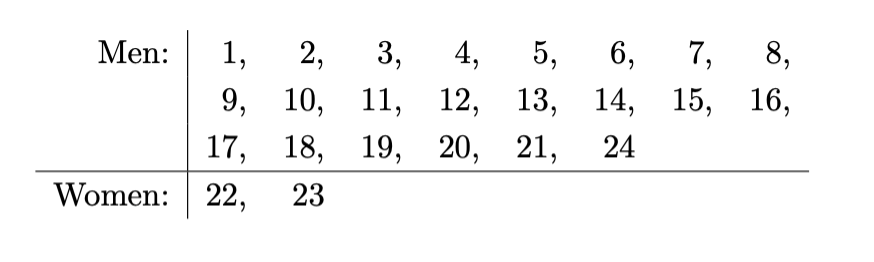 
   
6. The test is based on the sum of the ranks for one of the samples. Find the sum of the ranks for the women, $W_y$
   - for the ties (the 14s), we have $(4 + 5 + 6) / 3 = 5$ so you have 5, 5, 5
   - however, since all our ties come from one group, we can just say that they're 4, 5, 6, it's fine
   - (also we usually take the test stat from the smaller group because it's easier)

   - $W_y = 22 + 23 = 45$

7. Keeping the sample sizes the same, consider changes to the gender associated with each observation; if the null hypothesis were true, in how many ways could the outcomes have come out to be at least as
   inconsistent with the null hypothesis as that actually observed? Give an example of one situation as
   inconsistent and one more inconsistent with the null hypothesis.
   - we want to get test statistics of 45 or more (max is 47)
   - $(22, 23)$, $(21,24)$, $(22,24)$ and $(23,24)$ 
     - order doesn't matter &rightarrow; intuitively because we don't care about whether one woman is higher than the other 

8. How many ways are there to label 24 numbers so that 2 are “women” and 22 are “men”? What would you say about these possible labelling if the null hypothesis is true?

     - clicker

        

     - there are ${24 \choose 2} = 276$ ways to arrange the data for the women
       - so there are 276 ways to assign 2 out of 24 numbers to women

     - $\text{p-value} = \dfrac {4 \text{ ways to get our test stat}} {276 \text{ total ways }} = 0.0145$

### Kruskal-Wallis Test

- similar to Wilcoxon rank sum test but can be used to compare more than 2 groups

  - so it's a nonparametric test that allow use to compare more than 2 groups &rightarrow; alternative to ANOVA

- ANOVA overview

  - say we have 3 groups and we say
    $$
    \begin{align*}
    H_0&: \mu_1 = \mu_2 = \mu_3 = \mu \\
    H_A&: \text{at least one mean is different from others}
    \end{align*}
    $$

    - so under the null, the sample mean of the 3 groups should be close to one another and close to the overall sample mean

       

    - under the alternative, we can consider all means are different

       

      - that is sample mean of at least 1 group will be further from the overall mean

  - the test statistics of ANOVA use the variation in the difference between the group sample mean and the overall sample mean

    - under the null the variation will be small
    - under the alternative the variation will be larger
    - Kruskal-Wallis uses the same idea

  - see the pre-lecture materal

    - there's a way to calculate the test stat - using ranks and stuff
    - the test stat here follows the chi-squared distribution, where the degree of freedom is $\text{number of groups} - 1$

- case study:

   

  1. What do you think was the purpose of this study?

     - the study aimed to assess how alcohol and incentive can impact recall

  2. In constructing a hypothesis test based on the data given, what would you choose as the null hypothesis?

     - $H_0:$ the distribution of the scores are the same for the 3 treatments

  3. Of the methods you have met in your introductory course, which would possibly be appropriate for the
     example here? What reservations might you have about applying that test to the data given?

     - sounds like ANOVA
     - however, the ANOVA test relies on an assumption that the data within in each treatment group are Normally distributed
     - w/ small data set like the one here, that assumption is difficult to check

  4. Now list the entire data set ranked in order, assigning the lowest number rank 1 and the largest rank 15

      

  5. What is the overall mean rank (denoted $\bar R$)
     $$
     \bar R = \dfrac{120}{15} = 8
     $$

  6. Each group member should find the mean rankings within a group. Denote these rankings $\bar R_1, \bar R_2$ and $\bar R_3$. What are the three mean rankings?

      

  7. Assess the variation in the group ranking by computing
     $$
     \sum^3_{i=1} 5(\bar R_i - \bar R)^2 = 5\left[(3.8-8)^2 + (10.9 - 8)^2 + (9.3 -8)^2\right] = 138.7
     $$

  8. Why does the above look promising as a test statistic? Would you expect this statistic to be relatively large or relatively small if the null hypothesis is true?

     - note that the statistic is proportional to the variance of the within–group rankings in the entire data
       set
     - under the null hypothesis there would be no reason to expect the mean rankings within a group to
       differ much across the groups
     - so the variation in the $\bar R_i$'s would be relatively small under the null hypothesis

  9. Calculate test statistics
     $$
     \begin{align*}
     H &= \dfrac{12 \sum^3_{i=1} 5(\bar R_i - \bar R)^2 }{15 \times 16} \\
     &= \dfrac{12 \times 138.7}{15 \times 16} = 6.935
     \end{align*}
     $$

  10. Under the null hypothesis, H would follow the Chi-squared distribution on two degrees of freedom.
      That is, under $H_0$, $H \sim \chi_2^2$. Would this be a one or two–tailed test?

      - one–tailed (the right one), since small values are consistent with null hypothesis

  11. Find the p-value 

      - code: `pchisq(6.935, 2, lower.tail=FALSE)`
      - you get probability is 0.031
      - p-value is sufficiently small as to be surprising if there were no difference between the distributions of scores under the three different treatment
      - there is some evidence that at least two of the treatments have differing effects on the recall scores
      - but the main reservation here would be down to the sample size

  - the R code 

    ```R
    dall <- data.frame(
      AL = c(16, 10, 20, 29, -14), # AL
      AR = c(51, 58, 52, 47, 32), # AR
      PL = c(58, 12, 62, 43, 26)) # PL
    )
    
    kruskal.test(dall)
    ```

     

## Permutation Tests

- non-parametric test to compare two samples

  - good alternative for Wilcoxon rank sum test &rightarrow; especially when we have a lot of tied ranks

- <u>**the test stat is the difference of the sample means**</u>

  - other test stat may also be used (i.e sum of the sample like in the pre-readings)

- case study

  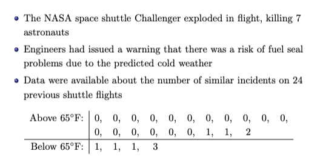 

  1. Discuss with your group the data and the issues. What is the question being posed in this example?

     - data are counts of failures of a component on a space shuttle
     - **there are two sets of data, but these are not samples** (this is likely literally all the shuttle flights that have happened)
     - question: whether there is a higher risk of O-ring failure at lower launch temp

  2. In constructing a test for these data, what would be your null hypothesis?

     - null hypothesis could be that the distribution of numbers of O-ring failures are same for launches above and below 65 degree (or means - we could also say we're testing if the underlying mean is equal)

  3. In conducting a hypothesis test, would you take a one–sided or two–sided alternative?

     - the question theorize that lower temp could increase failure rate - we would check for one sided
     - (below 65 degree the distribution of O-ring failure counts has a greater mean than for the corresponding count above 65 degree)

  4. Of the tests you have met in your introductory course, which would possibly be appropriate for the
     case here? What reservations might you have about applying that test to the data given?

     - two sample t-test seems to fit
       - problem: test relies on an assumption of Normality for both populations, and that is difficult to justify in this case 
       - data are counts, appear very non–Normal, and even transformations would not help
     - maybe Wilcoxon rank sum test
       - but we have many ties, so that's not possible either

  5. Let the test statistic by $t = \bar x - \bar y$, calculate test statistics

       

  6. The test is based on considering all the ways of regrouping the 24 observations so that 20 fall in one group (above 65◦F) and 4 in the other (below 65◦F). That is, the number of observations in each group remains fixed. In how many ways can the data be grouped so that 20 fall in one group and 4 in the other?

     - this is ${24 \choose 4} = 10,626$ 

  7. One way in which the data could be regrouped to be at least as inconsistent with the null hypothesis as actually observed is when the group with four observations contains p1, 1, 2, 3q . Compute the test statistic in this case.

     - test stat here would be $-1.6$​

  8. How many ways are there to group the data so that the group with four contains the numbers $(1, 1, 2, 3)$?

     - there is only one 2 and 3, so there is no choice when selecting those observations
     - however, there are 5 1s altogether, and two could be selected &rightarrow; that's ${5 \choose 2} = 10$ ways
     - so there are 10 ways to regroup the data where the group of four is $(1,1,2,3)$​

  9. Consider the ways the data can be regrouped to give a test statistic to be at least as inconsistent with the null hypothesis as that actually observed, assuming a one–sided alternative. Allocating each member of your group two cells to complete, fill in the table below

     - so basically we want grouping that will give us test statistics $t$ that's equal to or smaller than $-1.3$

     - table looks like

        

     - for $(0,1,2,3)$, there are 17 way to pick the 0s and 5 ways to pick the 1, giving $17 \times 5 = 85$ possibilities 

  10. How many ways are there to regroup the data so that the test statistic is at least as extreme as the
      case observed?

      - in total, there are $10 + 10 + 85 = 105$ to get a test stat as inconsistent as the one we observed

  11. Compute the p–value for the test based on the previous parts, assuming a one–sided alternative

      - since there are 105 ways to get a test stat as inconsistent, and there are 10,626 possible groupings, we can say 
        $$
        p\text{-value} = \dfrac {105}{10626} = 0.00988
        $$

  12. What would you conclude about the hypothesis of interest? Would you have any reservations about
      your conclusion?

      - the p-value is sufficiently small as to be very surprising if there were no difference between the
        distributions of the failure counts &rightarrow; we'd probably reject
      - reservations
        - how does one balance the risk of error in such a situation? 
        - why was the temperature 65 F selected? 
        - would data giving the exact temperatures provide more compelling evidence?

  13. Suppose the two sample sizes had been much bigger – ten times bigger, say. What problem would you
      have encountered completing the above activities?

      - procedure relies on some simple combinatorics, but the computations become intractable once the data
        sets become large
      - identifying all the relevant regroupings and then counting the number of possibilities for each would be tedious

# The Power of Hypothesis Test

- review question

   

  - answer is D, $\alpha = \text{significance level} = \text{probability of Type I error}$
  - recall: Type I is we reject $H_0$ when it's true

- significance level, $\alpha$  is the probability of rejecting $H_0$ when it is true

  - set before performing test
  - default value is 0.05

- p-value: probability of obtaining a test stat value at least as extreme as the one observed, assuming that $H_0$ is true

- type II error: failing to reject $H_0$ when it is false

  - **<u>the power of a test is its ability to detect when $H_0$ is false</u>**

- example: consider a right tails test

  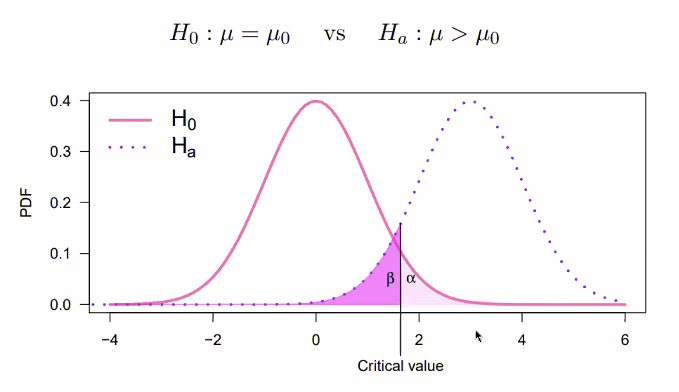 

  - consider something that's under $H_A$ (around $x = 1$ area), however, there's a probability that we don't reject (because it also falls under the same area as $H_0$) - so $\beta$ area is the probability of type II error

POST CLASS SHIT here

- aside: effect size

  - effect size measures the strength or meaningfulness of an effect in a study
  - it shows the magnitude of differences between groups or strength of relationships between variables
  - unlike a p-value that indicates if an effect exists, effect size quantifies how large the effect is
  - for example, in a medication study, effect size would indicate how much better the medication is compared to a placebo
  - it helps understand the practical significance of findings, revealing the real-world importance of the effect's magnitude

- case study

   

  1. What do you think was the purpose of this study?

     - the study aimed to assess how, if at all, an individual’s choices were influenced by the future. In
       particular, the researcher wants to identify whether individuals anticipate the position (left or right) of
       an image better than what would be expected by chance alone.

  2. We will consider here a special case of the study where a single subject has ten attempts to predict the location of an image. The subject will record a score T out of ten, that being the number of correct predictions, and that score is taken as the test statistic. Under the null hypothesis, what is the probability distribution of T?

     - let $p$ be the probability the subject can predict the location, under the null, it is random, so $p = 1/2$
     - thus, under $H_0: p = 1/2, T \sim Bin(10, 1/2)$
     - and it's binomial because they're independent trials with same probability of success

  3. In constructing the test, suppose we reject the null hypothesis when $T \geq 8$. What is the significance level of the test?

     - the general equation of binomial is 
       $$
       \begin{align*}
       P(T = t) &= {10 \choose t} \left(\dfrac{1}{2}\right)^t\left(\dfrac{1}{2}\right)^{10-t} \\
       &= {10 \choose t}\left(\dfrac{1}{2}\right)^{10}
       \end{align*}
       $$

     - so we can find
       $$
       \begin{align*}
       P(T \geq 8) &= P(T = 8, 9, 10) \\
       &= {10 \choose 8}\left(\dfrac{1}{2}\right)^{10} + {10 \choose 9}\left(\dfrac{1}{2}\right)^{10} + {10 \choose 10}\left(\dfrac{1}{2}\right)^{10}
       \\ 
       & \approx 0.0547
       \end{align*} 
       $$

     - we're kinda working backwards here, usually we find the decision rule (i.e reject if $T \geq 8$) based on the significance level, but here we have the rule so we find the significance level

       - intuitively, we're finding the probability to rejecting, while assuming $p = 1/2$ which means the null is true, so we are incorrectly rejecting, hence this is type I error

  4. Denote the parameter of interest in the study as $p$, this being the probability that the subject can
     correctly predict the location of an image. Let us define the power function of the test to be
     $$
     \pi(p) \coloneqq P(T \geq 8)
     $$
     The power function depends on the value of $p$, and it is the probability of rejecting $H_0: p = 1/2$ at a particular value of $p$ 

     - the test with critical region $\{8,9,10\}$ has power function
       $$
       \begin{align*}
       \pi(p) &= P(T = 8,9,10 \mid p) \\
       &= {10 \choose 8} p^8(1-p)^2 + {10 \choose 9} p^9(1-p) + p^{10}
       \end{align*}
       $$

     - we calculate this for a few different value of $p$

       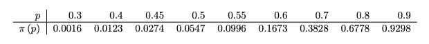 

     - in R, this is

       ```R
       sum(dbinom(c(8,9,10), 10, 0.3))
       
       # or
       pbinom(7, 10, 0.3, lower.tail = FALSE)
       ```

  5. Now sketch the power function curve for $0 < p < 1$

      

     - power function is increasing with $p$ &rightarrow; since with large values of $p$ would lead to rejection of $H_0$ (because people can actually predict the future)

  6. Suppose we had adopted a two–sided test for this example, with rejection of the null hypothesis occurring when $T \in \{0,1,9,10\}$ . Sketch what you think the power function will look like

     - power function is 
       $$
       \begin{align*}
       \pi(p) &= P(T = 0,1,9,10 \mid p) \\
       &= (1-p)^{10} + {10 \choose 1}p(1-p)^9 + {10 \choose 9} p^9(1-p) + p^{10}
       \end{align*}
       $$

     - plot of the function

        

       - because low probability would also lead us to reject $H_0$ (since it's two sided now)

  7. In the actual study, Bem recruited 100 volunteers and overall they demonstrated a 53.1% success rate in predicting the location of the image. This is reported with a p-value of 0.01. Does this really support the existence of precognition?

     - while the p-value is below our default alpha value (0.05), we could argue that the level of success is too
       low to really show evidence for precognition
     - also 53.1% of the time isn't that amazing, they're still wrong a lot of the time 
       - 53.1% is only slightly higher than the 50% assumed under the null
     - **as the sample size increase, the power of the test increase**
       - as the number of participants (sample size) increases, the statistical test becomes more sensitive to detecting even small deviations from the null hypothesis
       - means that with enough participants, even a slight deviation like 53.1% can become statistically significant, even if it's not practically meaningful (so the p-value could get even smaller)
     - statistical vs practical significance
       - finding can be statistically significant (i.e., unlikely to have occurred by chance) but still not be practically significant
       - in Bem's study, even though 53.1% is statistically significant, it's only slightly better than random guessing (50%) &rightarrow; his small difference might not be practically meaningful or convincing as evidence of precognition
       -  a larger sample size could strengthen the statistical claim, but it doesn't necessarily make the finding more scientifically credible, <u>especially when the effect size is very small</u>
     - point: we can conclude that while the p-value is small, the low estimated probability of success suggests
       that it is unlikely that precognition exists

  8. What would you conclude from Bem’s data?

     - there is reason to conduct further studies to try to replicate the results.

- aside: power, sample size and effect size

  - we originally chose our threshold $t_c = 8$ to get $P(T \geq t_c ) \approx 0.05$
    - so we reject $H_0$ when there's 80% success
  - if we have a bigger sample size, the threshold will change
    - for 100 trials, $P(T \geq t_c) \approx 0.05$ requires $t_c = 58$
    - so we reject $H_0$ when there is at least 58% success only
    - this makes sense because 8/10 can be due to luck <u>the same way</u> that 58/100 can be due to luck
  - when we have a bigger sample size, we can detect smaller differences (effect size)

- summary: power of a test

  - Neyman-Pearson principle of evaluating tests: for every hypothesis testing problem, there are usually many tests that can be used
    - first control Type I error (i.e significance level $\alpha$), the maximize power
    - with the same significance level, the higher the power, the more desirable the test
  - power is affected by
    - the specific alternative
    - the sample size
    - the test being used
  - power is often used in sample size calculations as well
    - e.g., if a 80% power is desirable for detecting a difference of 0.5, how
      many observations should we collect?

# Chi-Square Goodness of Fit

- we want to check if the data is in line with a model or hypothesis

  - using probabilities and expected outcome, see if our data agrees with the expected outcome

- case study

  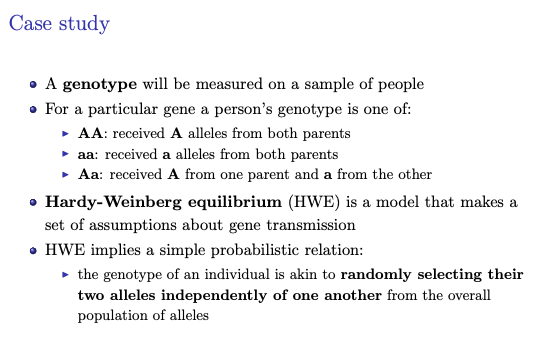 

  1. Say the population of alleles is 80% A and 20% a (we might say the population prevalence of A is 0.8).
     Then, the probability that a randomly selected individual has the genotype aa is
     $$
     P(aa) = \dfrac 1 5 \times \dfrac 1 5 = \dfrac 1 {25}
     $$
     What would be  $P(AA)$ and $P(Aa)$

     - so the model is suggesting random, so $P(A) = 0.8$ and $P(a) = 0.2$ and we can simply do multiplication
     - $P(AA) = 4/5\times 4/5 = 16/25$
     - note that there are 2 ways to get the heterozygous genotype (`Aa` and `aA`, and they're different for some reason)
       - the question wasn't exactly clear, in reality, the phenotype known as `Aa` can come from either `aA` or `Aa` - so the question really should have been $P(\text{heterozygous phenotype}) = P(\text{Aa or aA})$
       - so $P(Aa) = 2 \times 4/5 \times 1 /5 = 8/25$

  2. Now let us think about going in the other direction. Say we have some data on genotypes. For instance, a classic dataset on the MN blood group system genotype for a sample of 1000 British people gives

      

     What would we estimate the population prevalence of allele A to be in this population?

     - basically: Q1 assumes you know the probability/population, usually you don't so you need to infer from the data/sample

     - each individual have 2 allele, so $n = 2000$

     - in the AA group, each individual have 2 A &rightarrow; so we have $2 \times 298$ A

     - in the Aa group, we have 489 A and 489 a

     - in the aa group, we have $213 \times 2$ a allele

     - here we only care about A so we have
       $$
       \dfrac{2 \times 298 + 489}{2000} = 0.5425
       $$

  3. If we assume HWE and use the new allele prevalences estimated in question 2 , what genotype frequencies
     would we expect to see in a random sample of 1000 population members?

      

     - now we have $p_{A} = 0.5425, p_{a} = 1- p_A = 0.4575$ that we found in the last question (estimated from the data)

     - so we have 
       $$
       \begin{align*}
       E_{AA} &= 2000 \times p_{AA} = 2000 \times (0.5425)^2 = 294.3 \\
       E_{Aa}& = 2000 \times p_{aA} \times 2 = 4000 \times 0.4575 = 496.4 \\
       E_{aa} &= 2000 \times p_{aa} = 209.3
       \end{align*}
       $$

  4. In constructing a hypothesis test based on this scenario, what would you choose as the null hypothesis?

     - the null hypothesis would be that HWE is in effect.
     - the alternative is that HWE does not hold, that is, there is some other unspecified model generating the observed counts

  5. The chi squared test stat is

      

     Under the null, do you expect this test stat to be small or big

     - small as it should match with the expected frequencies

        

     - $\text{test stat} = 0.22$ 

  6. The 95th percentile point of the $\chi^2_1$ distribution is 3.84. Would you reject the null hypothesis at the 5% significance level?

     - more context: under the null, we expect the test stat to follow a Chi squared with $d$ degree of freedom where $d = (k - 1) - q$
       - $k$ is the number of categories
       - $q$​ is the number of parameters that we estimate from the data
       - in this case, we computed the expected values for three categories (AA, Aa, aa) and estimated one
         parameter from the data ($P(\text{phenotype} = A)$) 
         - this is to make the test more conservative earlier
         - recall earlier we estimated $p_{A}$ from the data (the other we inferred from $1 - p_A$) so we need to lose a degree of freedom
       - so $d = (3 - 1) - 1 = 1$​
     - answering the question
       - ==note: for chi-squared you always do upper tail==
       - since $\text{test stat} < 3.84$​, we do not reject

- TODO: summary 


# Contingency Tables Goodness of Fit

- case study:

  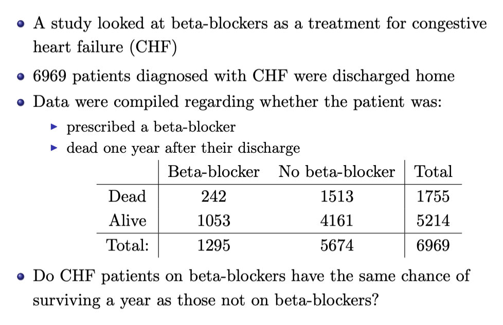 

  - key features

     

  1. What do you think is the target population for this study? That is, what do you think is the population of interest for this study?

     - population of interest is the patients with CHF who are discharge to go home

  2. Is saying independence between two variables should be null or alternative hypothesis

     - the null hypothesis must specify a model for the data, and here independence between the two variables is the default

        

  3. Based on the data table, what are natural estimates of (i) the probability of one–year mortality, and
     (ii) the probability of being prescribed a beta-blocker?

     1. probability of mortality is the proportion of all people that died &rightarrow; $1755/6969 = 0.255$
     2. probability of being assigned beta blockers is the proportion of people that did &rightarrow; $1295/6969 = 0.255$

  4. Using the estimates from above, and assuming that beta-blocker use and mortality are independent of one another, what 2 by 2 table do we expect to see for 6969 patients?

     - for example, we can say the expected number of patients prescribed beta-blockers who died is $6969 \times 0.252 \times 0.186 = 326.65$

     - the rest of them

        

  5. Using these four observed counts and four expected counts, compute the $\chi^2$​​ test statistic for these data

     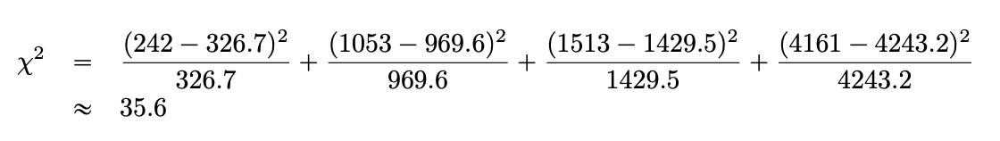 

  6. Calculate the degree of freedom

     - degree of freedom is $k - 1 - d$ 
       - $k$ is the number of categories and we have 4 here
       - $d$ is the number of parameters estimated &rightarrow; we estimated 2 
       - so `df = 4 - 1 - 2 = 1`

  7. stupid question

  8. What do we conclude from this hypothesis test?

     - pink line below is the $\chi^2_1$ dist

       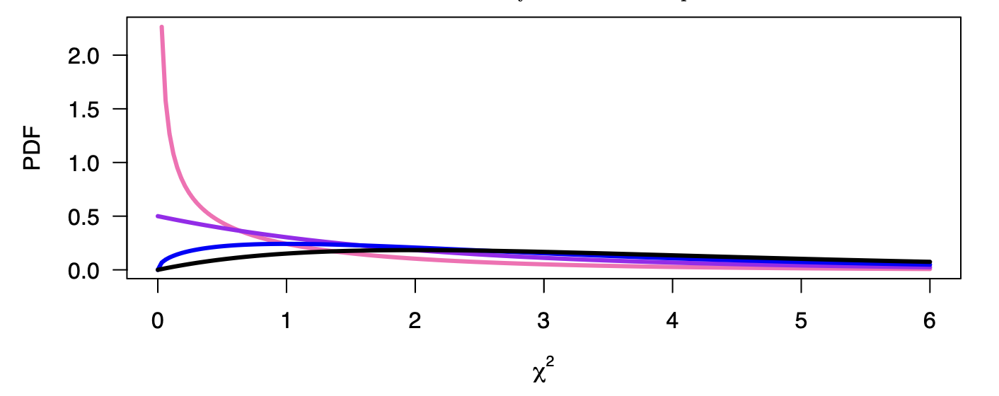 

     - test stat value fall far in the upper tail of the distribution, if we do the math it's something like $2 \times 10^{-9}$

     - strong evidence to reject the null

       - we can see that those patients on beta–blockers survive at a much higher rate than those not on the medication (18.6% mortality compared to 26.7%)

  - R code

    ```R
    CHFdata <- matrix(c(242, 1513, 1053, 4161), nrow=2, byrow=TRUE)
    chisq.test(CHFdata, correct = FALSE)
    ```

  
  

# Fisher Exact Test

- motivation

  - remember the $\chi^2$ goodness-of-fit test
  - but $\chi^2$ distribution is an approximation for our test stat
    - which doesn't work well when many of the $e_i$ are small ($<5$​) (also implies doesn't work well when $n$ is small)

- Fisher's exact test

  - alternative to $\chi^2$ test
  - $H_0$: the two binary variables are independent 
  - see pre-reading notes

- case study: problem with the $\chi^2$ test

   

  - we know that they are independent (since we randomly simulated the datasets) &rightarrow; thus <u>any rejection is a WRONG REJECTION (type 1 error)</u>

  - so if we keep going for 500, we have the following
    
     
    
    - note that these rejections ARE WRONG (type I error)
    - as the sample size increases, the proportion/type I error is more aligned with significance levels
    
  - <u>so when sample size is small, we're rejecting too much</u> with the $\chi^2$ test

  1. What do the simulation results tell us?

     - the test works fine when sample size is larger, but too many rejections when sample size is smaller

  2. A different test for the null hypothesis of independence between two binary variables is Fisher’s exact test. We describe how this test works using the following dataset

      

     More specifically, let Z denote the upper–left cell, the count of those who both are exposed and get the disease. How many possible values of Z are there?

      

     - Z can take on numbers $0, 1, \ldots, 5$​ so there are **6 values Z can take on** (need to count 0)
     - $Z = \min(5 ,8)$ so the other cells also make sense

  3. Our task is to work out the probability distribution of Z, assuming the null hypothesis is true, and treating the margins as fixed and known values. We'll do this in 3 steps

     1. Suppose 20 participants are standing in front of you, and you have 8 ‘diseased’ labels to distribute. How many different ways could you distribute these labels to 8 of the participants?

        - you have 8 labels to hand out (like picking captains), so it's ${20 \choose 8} = \frac{20!}{8! 12!}$

     2. Say that 5 exposed and 15 unexposed participants are standing in front of you, and you have 8 "diseased" labels to distribute. How many different ways could you distribute 4 labels to exposed subjects and 4 labels to unexposed subjects?

        - you have 5 exposed, and you have 4 labels to hand out &rightarrow; that's ${5 \choose 4}$
        - you have 15 unexposed, and you have 4 labels to hand out &rightarrow; that's $15 \choose 4$​
        - (the 4 is not random - it's from the observed data, we also multiply because under the null they're independent)

     3. What is $P(Z = 4)$​?

        - so from 2, we know there are 6825 ways to get $Z = 4$

        - so it's ways to get 4 over all possible ways to arrange

          $6825 / {20 \choose 8} = 0.054$

  4. What is $P(Z=5)$​

     - same thing above, just change up the numbers

     - for all values of $Z$

       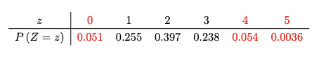 

  5. We can use Z as our test statistic. Use the R function `fisher.test` to compute the p-value

     - <u>more extreme here $z$ values where probability is smaller than what we observed</u>

       - so here $z = 5, 4, 0$​ are what is considered "more extreme"
       - (not clear if this test is one-sided or two-sided &rightarrow; but this case it's two-sided according to GPT)

     - so we add up all those probability, that gives us the p-value
       $$
       \begin{align*}
       \text{p-value} &= P(Z = 0) + P(Z=  4) + P(Z = 5) \\
       &= 0.051 + 0.054 + 0.0036 = 0.1086
       \end{align*}
       $$

     - p-value is pretty large, don't reject

  6. Does Fisher’s exact test fix the problem we identified with the chi-squared test? We apply Fisher’s exact test to all the datasets we simulated earlier. Here is what we see:

      

     - false rejection rate is much better 


# Density Curve Fitting

- we will learn how to use the $\chi^2$​ test to assess whether the data appears to come from a Normal distribution

  - if it's not Normal, we can try transformations to make it look Normal than use our regular methods &rightarrow; but interpretation might be difficult

- case study

   

  - the plots look something like

     

    - distribution of per–person income by country does not appear to be Normal
    - the distribution is over positive values and appears to be right skewed (i.e., exhibits a long upper–tail)

  - clicker:

     

    - notice that this is talking about the $x$ axis of the <u>histogram</u> above

    - when we say "country X is one unit to the right of country Y on the natural log-income scale," it means that the log-income of country X is one unit higher than that of country Y

      - in normal scale, this could mean it's the next bin over, which could be $\$100 \text{ million}$ or something like that

      - in the plot above, the x-axis unit for the log graph seems to be 1, so we can say 
        $$
        \begin{align*} 
        \ln(\text{income of X}) &= \ln(\text{income of Y}) + 1 \\
        e^{\ln(\text{income of X})} &= e^{\ln(\text{income of Y}) + 1} \\
        &= e^{\ln(\text{income of Y})}\times e \\
        \therefore \text{income of X} &= \text{income of Y} \times e \\
        e &\approx 2.72
        \end{align*}
        $$

    - so the answer is A: Country X has about 2.7 times the per-capita income of country Y

  1. Sometimes it is useful to describe a transformed version of a variable with a Normal distribution. For a
     distribution such as that of per-person income, a logarithmic transformation is a good candidate. 

     By default, here we use the natural log. Looking at the histogram of log-income, how does one interpret a
     one–unit change on the horizontal log-dollar axis?

     - see clicker question above

  2. If we bin the data into categories, as we do when constructing a histogram, then we can use the
     chi-squared goodness-of-fit test to assess Normality. The choice of cutpoints defining the bins (intervals)
     is more an art than a science. We proceed by dividing the range of the log-income data (5.959 to 11.449)
     into eight bins of equal width, which gives the nine cutpoints as
     $$
     5.959, 6.645, 7.332, 8.018, 8.704, 9.39, 10.076, 10.763, 11.449
     $$
     The observed counts for these bins are
     $$
     8, 22, 25, 32, 34, 31, 31, 4
     $$
     (8 countries have log-incomes between 5.959 and 6.645, 22 countries fall between 6.645 and
     7.332, and so on)

     How compatible are these observed counts with what we would expect to see from a sample of 187 draws from a <u>Normal distribution with mean 8.768 and standard deviation 1.253</u> (our "null hypothesis" - estimated from the data)

     - use R to find the probability of each bins, and multiply it by $n$​​

     - ex. expected counts of bin $[6.645, 7.332]$
       $$
       n[P(X \leq 7.332) - P(X \leq 6.645)]
       $$
     
       ```R
       prob = pnorm(7.332, mean = 8.768, 7.332) - pnorm(6.645)
       n = 187
       
       print(prob * n)
       ```
     
     - note: again, for the lowest interval, you just do everything lower than it, don't have to do the subtraction, for the highest interval, you have to do $1 - P(X \leq \text{lower bound})$​

       - because the Normal distribution has an unbounded range, we require a convention about handling the leftmost and rightmost bins
       - for the leftmost bin we compute the expected frequency of values less than 6.645, not the expected frequency of values between 5.96 and 6.6
       - similar thing for the rightmost bin
     
  3. The expected counts we get are:
     $$
     8.43, 15.11, 27.83, 38.32, 39.38, 30.21, 17.32, 10.41
     $$
     In our example, the discrepancy between observed and expected counts is summarized by a chi-squared statistic of $\chi^2 \approx 20$. This is to be compared with the $\chi^2_d$ distribution, for which value of d?

     - we estimated 2 values (mean and sd)
     - we have 8 bins
     - so $d = 8 - 1 -2 = 5$
     
  4. Researchers may want to find a transformation that will allow them to consider their data as Normally distributed. So if square rooting or the log transformation does not work, they may move on to more exotic transformations

     For instance, the lower–right panel of the Figure shows observed and expected counts when income is raised to the power 0.15. If the range of this transformed data is broken into eight bins of equal width, the observed and expected counts for the bins give a chi-squared statistic of $\chi^2 = 6.7$. 

     This value does not exceed the 95-th percentile of the relevant $\chi^2_d$​ distribution, and thus we could conclude that the transformed values are compatible with having arisen from a Normal distribution. 

     What issue arises with this new transformation?

     - it's hard to interpret
     - while logarithms are reasonably familiar to most people, it is unlikely many people will readily interpret data raised to the power 0.15

  5. Goodness–of–fit tests are set up to assess whether a random sample from a population is compatible with a particular assumption about that population (here Normality of some variable). How well does our present example, with data on income in 187 nations, fit this paradigm?

     - these data comprise of data on virtually all countries in the world - so this is more of a census than a sample 
     - but here you're still using methods and asking questions based on random sampling theory
       - things like CI, hypothesis test
     - it's still reasonable to ask questions like whether these data are consistent with the Normal distribution
     - <u>I think the point is you can still apply the same methods</u>

- summary

  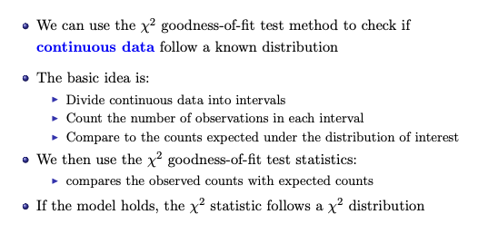 
  
  - note on interval size
  
      
  
  - transforming data
  
     
  

# Probability Plots

- case study

   

  - pre class questions
    - goal: to assess the impact of cloud seeding on rainfall
    - features of the experiments
      - blinding: experimenters and pilot did know whether the cloud was seeded
      - randomization: which days the cloud was seeded was random
      - balance: 26 seeded days and 26 unseeded days

  1. What do you think was the purpose of this study?

     - to assess the impact of cloud seeding on rainfall

  2. What type of study is this?

     - this is an experiment (they actually performed some changes to the cloud)

  3. This study includes which of the following features

     - see above

  4. The researchers are interested in applying a two–sample t-test to the data. What reservations might you have about this approach?

     - from what we've learned so far, two-sample t-test seems like the most likely test
     - however, the t-test relies on an assumption that the data within each treatment group are Normally distributed - which may or may not be appropriate here

  5. Ignore, this seems like a set up more so like a question

  6. Again, likely setup

  7. Plot the data to check for Normality in R. Use `qqnorm`

     ```R
     y.unseeded <- c(1202.6, 830.1, 372.4, 345.5, 321.2, 244.3, 163.0, 147.8,
                     95.0, 87.0, 81.2, 68.5, 47.3, 41.1, 36.6, 29.0, 28.6,
                     26.3, 26.0, 24.4, 21.4, 17.3, 11.5, 4.9, 4.9, 1.0)
     y.seeded <- c(2745.6, 1697.1, 1656.4, 978.0, 703.4, 489.1, 430.0, 334.1, 302.8,
                   274.7, 274.7, 255.0, 242.5, 200.7, 198.6, 129.6, 119.0,
                   118.3, 115.3, 92.4, 40.6, 32.7, 31.4, 17.5, 7.7, 4.1)
     
     plot1 <- qqnorm(y.unseeded)
     qline(plot1)
     plot2 <- qqnorm(y.seeded)
     qline(plot2)
     ```

     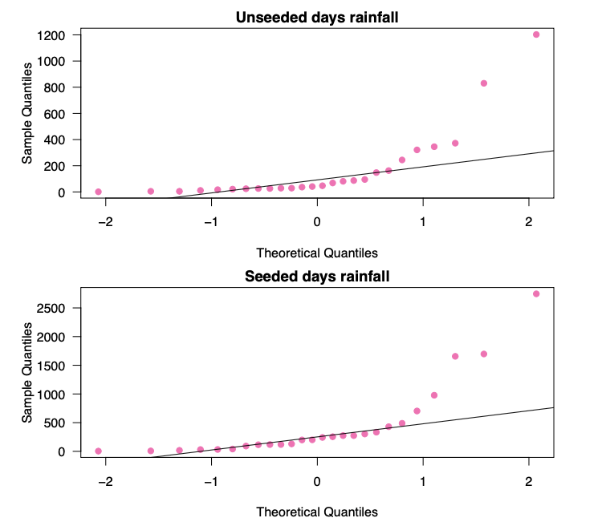 

     - both show severe departure from linearity (points are not falling on the line), indicating that a Normal model may not be appropriate for either data set

  8. How would you describe the distribution which generated the data you plotted?

     - in the case of right-skewed (or positively skewed) data, the QQ plot will show the sample quantiles rising more slowly than the theoretical quantiles at the beginning and then rising rapidly at the end
     - results in a curve that sags below the line at the lower end and curves above the line at the upper end
     - so this is right-skewed

  9. One approach to dealing with data of the type encountered here is to take (natural) logarithms to transform the raw values. Try creating the probability plots for the logs of the data sets. Comment on what you observe

      

     - taking logarithms seems to work well for the unseeded data, but may not be as good for the seeded data
     - in both cases, however, it is much more like we would expect to see when the data are from a Normal distribution
     - though may still have some hesitations, we would probably be happier applying the two-sample t-test to the logs of the data in this case
     - data that looks normal after taking the logs can be modelled by the Lognormal distribution


# Bootstrap: a resampling method

- variance and standard deviation are key to inference

  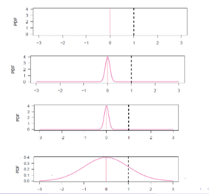 

  - tell us how unlikely or likely an observed value is
  - sometimes the standard deviation estimate (standard error) can be easily estimated
    - ex. for sample mean of a simple random sample &rightarrow; $SE(\bar x) = \dfrac{s}{\sqrt{n}}$ where $s$ was the sample standard deviation and $n$ is sample size
  - but for statistics like the median this is hard to compute/estimate
  - when sample size is small
    - distributional assumptions are hard to justify
    - the CLT may not work
  - so we have bootstrapping!

- bootstrapping

  - useful for 
    - constructing confidence intervals
    - calculating standard errors
  - does not rely on distributional assumptions

- case study: 

   

  1. What do you think is the *target population* for this study? That is, what do you think is the population of interest for this part of the study?

     - since the sample all came from a single Starbucks outlet, more realistically we could take the target population to be all regular Breakfast Blend coffees from that outlet over the six–day period in question
     - (don't say "target population is all 16 oz. "Breakfast Blend" coffees from all Starbucks that sell such coffees")

  2. Does the sample represent a simple random sample (s.r.s.) from the target population?

     - No, you would need all coffees to be available to sample
       - to obtain such a random sample, all regular Breakfast Blend coffees from that outlet over the six–day period would have to have been available to sample, and a s.r.s. of six coffees taken (not realistic)

  3. Why do you think one coffee was sampled on each of six days (and not, say, six coffees taken on the same day)?

     - coffees from the same day may be more similar
     - consideration given to variability in the caffeine levels over different days, perhaps due to different staff or variations in the coffee bean batches

  4. Suppose the parameter of interest is the mean caffeine content (in mg) of the target population. How would you estimate this using the data?

     - use the sample mean to estimate the population mean - here being 371.967 mg

  5. In your introductory stat course, you would have created a 95% confidence interval for the population mean using the sample mean $\bar x$ and sample standard deviation $s$. 

     You would have constructed an interval of the form $\bar x \pm 1.96 /\sqrt{6}$, or, given the small sample size, you may have replace the value 1.96 with the 97.5 percentile of the $t_5$​ distribution. What reservations do you have about these approaches?

     - clicker specific

        

       - answer is E because we use the $t$ distribution because we estimate the standard deviation
     - reservations: 

       - approach relies on the CLT, but the sample size is very small
       - though it is hard to say with only six observations, the data may well arise from a very skewed distribution
         - doesn’t matter if the sample size is large but for small sample some departure from the Normal weaken the interference 
         - <u>the small sample method using the t-distribution assumes the parent distribution is Normal</u>

  6. see

      

     - use slides from class to get the data

        

     - clicker question: 
       
        
       
       - D because 530 never occurred 

  7. Repeat the step above 9 times, get the mean of each time. The values of the sample mean you have found give an *empirical bootstrap distribution* (EBD) for nine resamples.

     - didn't have time to do it

  8. Take the mean of all the means found by your group. Depending on your group size, you’ll have
     between 30 to 40 mean values. 

     Compare this new value to the mean of the original dataset and to the means of each resample. What do you observe?

     - the mean of all resamples should be closer to the original sample mean than the mean of each resample

  9. Suppose the population mean is denoted $\mu$​. If we took the mean of all the resamples performed by all
     students in the class today, what would expect it to be (in mg)?

     - bootstrap distribution mean would be close to the <u>sample mean</u>

     - and you hope that the sample mean estimates the population mean

        

  10. Suppose you repeated your resampling two hundred times, so that you had two hundred (re)samples
      and two hundred (re)sample means. Can you suggest how you might use the empirical bootstrap
      distribution of sample means to give a 95% confidence interval for $\mu$​

      - use the 2.5 and 97.5 percentiles of the EBD

      - so we use <u>`quantiles`</u> instead of percentiles (`pt`) - because we have the distribution

         

- summary bootstrap

    

   

# Bootstrap Hypothesis Testing

- case study (same one)

  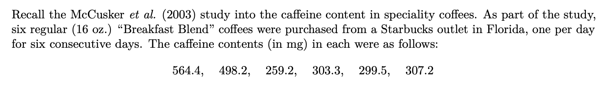 

  1. Suppose that Starbucks claims that the distribution of caffeine content in its regular Breakfast Blend has a mean no greater than 300 mg. What is the parameter of interest here?

     - it is the mean $\mu$

  2. In performing a hypothesis test about the above claim, what would you take as the null hypothesis?
     What would you take as the alternative hypothesis? 

     - we want to "disprove" the alternative in this case
     - writing $H_0: \mu \leq 300$ would have been OK too
       - keep in mind that we are trying to find evidence against the claim from Starbucks &rightarrow; since the claim of Starbucks is that the mean content level does not exceed 300 mg, only a mean above 300 mg would refute their claim

  3. Which method that you met in your introductory Statistics course could be used to conduct this test?

     - One sample t-test

  4. What reservations would you have about using the above test in this case?

     - small sample size
       - more details: t-test relies on assumption that underlying data is normally distributed - with a small sample size that's not verifiable (we also can't use CLT)

  5. Given that the sample mean is 371.97 mg and the sample standard deviation is 126.37 mg, compute
     the test statistic for your test from above.
     $$
     \begin{align*}
     t &= \dfrac{\bar x - \mu}{s/\sqrt{n}} \\ 
     &= \dfrac{371.97 - 300}{126.37/\sqrt{6}}\\
     &= 1.395
     \end{align*}
     $$

  6. Today, we will use bootstrapping to create the empirical bootstrap distribution for the t
     statistic. Here, the test statistic we calculate for each resample is
     $$
     t^* = \dfrac{\bar x -371.97}{s^*/\sqrt{6}}
     $$
     Try it out 10 times, record it 

     - didn't have time
     - The values of the test statistic you have found give an empirical bootstrap distribution (EBD) for 10
       resamples.

  7. Once you have received the contribution from all members, combine the values into one vector as follow:

     ```R
     # Enter the values of each member in R
     # The t.1, t.2, etc should be replaced by the values you have put on the google sheet
     t.member1 <- c(t.1, t.2, t.3, t.4, t.5, t.6, t.7, t.8, t.9, t.10)
     t.member2 <- c(t.1, t.2, t.3, t.4, t.5, t.6, t.7, t.8, t.9, t.10)
     t.member3 <- c(t.1, t.2, t.3, t.4, t.5, t.6, t.7, t.8, t.9, t.10)
     t.member4 <- c(t.1, t.2, t.3, t.4, t.5, t.6, t.7, t.8, t.9, t.10)
     # This combines the t* values from all members
     group.data <- c(t.member1, t.member2, t.member3, t.member4)
     
     # Plot the empirical bootstrap distribution computed by your group using the following command:
     hist(group.data)
     ```

     - from the slides

       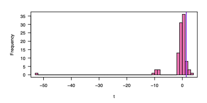 

  8. How might we use this empirical bootstrap distribution to conduct a hypothesis test at significance level 5%?

     - use the 95 % quantile of the empirical distribution for t
     - will reject the null hypothesis if the observed value of t, in this case 1.395, is above the 95-percentile of the EBD for the statistic

  9. How could a bootstrap p-value be found?
  
     - we would look at the proportion of $t^* > t$​ 
     - in our case, it's 0.11, so we don't reject
  
  10. How would you adapt this method in testing against a two–sided alternative?
  
      - if we're still at 5% significance level, we could use the 2.5% and 97.5% percentile instead
        - if observed $t$ fall outside that range we reject
      - p–value would be the proportion of values at least 1.395, and those less than or equal to –1.395

# Experimental Design

- case study: 

  - for each description of an experiment given, identify the following
    - the response variable
    - the experimental units
    - the factor(s)
    - the levels of the factor(s)
    - the number of treatments
      - note: levels of a factor refers to different conditions and variations of that experimental factor
      - while number of treatments refers to all possible combination of the levels of all factors in the experiment
    - whether blocking was applied and, if so, the blocking variable

  1. An experiment aimed to investigate how diet from birth could affect the weight of an adult pig. A sample of 24 pigs were randomly assigned to four different diets shortly after birth. Below are the weights (in kg) of the pigs after one year:

      

     - the response variable
       - weight, in kg, after one year
     - the experimental units
       - the pigs
     - the factor
       - diet type
     - the levels of the factor
       - four
     - number of treatments
       - four
     - whether blocking was applied
       - no

  2. An experiment was performed to compare the octane levels of five different types of gasoline, labelled A, B, C, D and E. Twenty different cars were used in the experiment and assigned a gasoline at random. The data (in some standardised units) are given below:

     - the response variable
       - octane level
     - the experimental units
       - the cars
     - the levels of the factors 
       - five
     - number of treatements
       - five
     - whether block was applied
       - no

  3. Research has suggested that folic acid is linked to a reduction in birth defects. A study conducted by the National Institute of Hygiene in Budapest enrolled women prior to conception, and divided these randomly into two groups. One group (of 2700 women) took daily multivitamins containing 0.8mg folic acid, while the other group (of 2050 women) received the same multivitamins without folic acid. Neither the women nor the investigators knew to which group each woman was allocated. Birth defects occurred in 35 cases where the women took folic acid and in 47 cases when the women did not.

     - the response variable
       - presence or absence of birth defect
     - the experimental units
       - the women
     - the factor
       - does level of folic acid
     - the levels of the factor
       - there's two: 0 mg and 0.8 mg
     - number of treatments: 
       - two

  4. Primer paint is applied to aircraft wings by either dipping or spraying. Three types of primer paint were tested in an experiment that involved three replications under each method of application. After the primer was applied in each case a finishing paint was coated on, and the adhesive force of the primer was measured. The adhesive forces measured after treatment on each aircraft wing are tabulated below:

     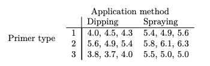 

     - the response variable
       - adhesive force
     - the experimental units
       - the aircraft wings
     - the factors
       - primer type and application method
     - the levels of the factors
       - two for application method, three for primer type
     - number of treatments
       - it's the combination of all the levels so $2 \times 3 = 6$
     - whether blocking was applied
       - no

  5. A manufacturer wishes to investigate possible differences in solubility of two cosmetic creams it makes. Three different labs tested two samples of each of the two types of cream, A and B, for percentage of solubility in water. The data are given below:

       

     - the response variable 
       - the percentage solubility in water
     - the experimental units
       - the cream samples
     - the factors
       - cream type 
       - they take the lab to the be blocking variable
     - the levels of the factors
       - 2 - cream A and cream B
     - the number of treaments
       - 2 as well
     - was blocking applied
       - blocking variable is a factor that is not of primary interest in an experiment, but is included to control for variability
         - groups subjects that are similar in ways that are expected to affect the response variable, so that any differences within these groups can be attributed more confidently to the treatment rather than to other sources of variability
       - here, "lab" is considered a blocking variable because the conditions or techniques at each lab could affect the results
         - by blocking according to the lab, the experiment controls for any lab-to-lab variability, which allows for a clearer comparison of the primary factor, which is the cream type

# Introducing ANOVA

- motivation

  - ANOVA used to compare more than 2 groups
  - if sample size is large enough, better to use ANOVA than Kruskal-Wallis

- notation

  - $y_{ij}$: response for the $j^{th}$ handle from the machine $M_i$
  - $\bar y$: the overall mean
  - $\bar y_i$: means response for the machine $M_i$

- sum of squares

  - let's just compute these (because we're told to) for now
    $$
    \begin{align}
    \sum^4_{i=1}\sum^5_{j=1} (y_{ij} - \bar y)^2 &= 49.84 \\ 
    \sum^4_{i=1}\sum^5_{j=1} (y_{ij} - y_i)^2 &= 43.02 \\
    \sum^4_{i=1}\sum^5_{j=1} (\bar y_i - \bar y) &= 5\sum^4_{i=1}(\bar y_i - \bar y) = 6.82
    \end{align}
    $$

  - analysis
    1. this is the total variation of the data around the overall mean
    2. this is the variation <u>within each machine</u> (within-group variation)
    3. this is the variation <u>between machine</u> (between-group variation)
  - clicker: which off the sums of squares would you expect to increase if we moved from the case where the mean rubber strength from the four machines are equal, to a case where there is an appreciable difference between the mean strengths of rubber from the four machines?
    - now that they're not equal, I would expect the between-group variation to change

- summary

  - in ANOVA, the goal is to study variation
    - where it comes from, what factors/predictors may explain it

  - variations are measured by <u>Sum of Squares</u> (SS)
    - basic idea is to decompose total variation into different sources
      - random variation within each group
      - random variation between each group

    - $SS_{total} = SS_{within} + SS_{between}$

  - if the <u>between-group variation is much larger than the within-group variation, then there may be a difference between the groups</u>

- case study

   

   

  1. What is the response variable in this study? What is the factor? How many levels does the factor have?

     - response variable is the tensile strength of the rubber handle
     - factor is the machine used, this have four levels (M1, M2, M3, M4)

  2. What graphical method would you use to explore the data?

     - side-by-side boxplot would work well

        

  3. What hypothesis would the company be interested in testing?

     - one popular is that the mean tensile strength of the rubber handles produced is the same for all four machines, that is 
       $$
       \begin{align*}
       H_0&: \mu_1 = \mu_2 = \ldots = \mu_g \\
       H_a&: \text{at least one of the means is different from the others}
       \end{align*}
       $$

  4. Find the overall sample mean of the data.

      

     - regarding the note: if you had an unbalanced design, you can just do mean across all data points like you normally would, this was a shortcut

  5. See above about the sum of squares thing

  

# Analyzing Sums of Squares in ANOVA

- notation:

  - one way ANOVA are for single factor experiment
    - so only one thing is varied (i.e machine - there can be multiple levels)
  - factors said to have $g$ levels (i.e there are 4 machines in the last example)
  - each group has $t$ observations (assuming number of observations in each groups are equal)
  - $y_{ij}$ dnotes the $j$th observation in the $i$th group
    - so $i = 1,2,\ldots,g$ and $j=1,2,\ldots,t$
  - $\bar y$ is the mean of all the data
  - $\bar y_i$ and $s_i$ is the mean and SD of responses <u>within group $i$</u>

- there's some math and stuff, but basically, from last class
  $$
  \begin{align*}
  \sum^4_{i=1}\sum^5_{j=1} (y_{ij} - \bar y)^2 &= 
  \sum^4_{i=1}\sum^5_{j=1} (y_{ij} - y_i)^2 +
  \sum^4_{i=1}\sum^5_{j=1} (\bar y_i - \bar y)  \\
  
  SS_{total} &= SS_{within} + SS_{between}
  \end{align*}
  $$

  - and since the SS themselves are sums of Normal distributions, this mean that they follow the Chi-squared distribution

- here are some key results for the hypothesis test in ANOVA (take as fact)

  1. when $H_0$ is true
     $$
     \dfrac{\text{Between group SS}}{\sigma^2} \sim \chi^2_{g-1}
     $$

     - extra detail: this is because we assume they all follow the same Normal distribution with the same variance

  2. whether $H_0$ is true or not
     $$
     \dfrac{\text{Within group SS}}{\sigma^2} \sim \chi^2_{g(t-1)}
     $$

  3. so combining 1 and 2
     $$
     \dfrac{\text{Between group SS } / (g-1)}{\text{Within group SS}/g(t-1)} \sim F_{g - 1,~ g(t-1)}
     $$

     - this is from the definition of the F distribution

        

  - point: when $H_0$​ is not true, we expect the F statistics to be large (the between group dominates)

    - since the between group SS should increase and the within group SS should remain the same

    - if it's False, the terms is going to be very big

- case study: returning to example last week

    

  - recall that you found

     

    - where 1 is the total variation of the data around the overall mean, 2 is the within group variation, 3 is the between group variation

  - the test statistics is called the <u>mean square ration</u>
    $$
    \dfrac{\text{Between group SS } / (g-1)}{\text{Within group SS}/g(t-1)} = \dfrac{6.82/3}{43.02/16} = 0.845
    $$

  - completing the ANOVA table 

     

    - note: MS is short for mean square - which is the SS divided by its degree of freedom

  - the test statistics would follow the $F_{3,16}$ distribution if the null was true

# Multiple Comparisons

- review

  - ANOVA can only tell us whether one or more groups are different from the others (but can't tell you which group are different)

- case study

   

  - ANOVA table

     

  1. Suppose that we are interested in comparing colonies 1 and 2. What would you use as an estimate of the difference in the mean departure dates from the two colonies?

     - you can do something like `mean(colony1) - mean(colony2)`
     - so $\bar y_1 - \bar y _2 = 214.2 - 243.6 = -29.4$ days

  2. What would be the variance of your estimate in part 1, assuming the variance in a departure date within a colony is $\sigma^2$ for all colonies? Under the assumptions of ANOVA, how would you estimate $\sigma^2$ using the whole data set?

     - recall: assumptions of ANOVA

       - observations within each group are independent
       - observations in different groups are independent
       - observations within groups are from Normal distributions (with the same variance)

     - we use the following facts: $Var(\bar X) = Var(X)/n$, $Var(X - Y) = Var(X) + Var(y)$ and that ANOVA assumes the within group variance is the same
       $$
       \begin{align*}
       Var(\bar y_1 - \bar y_2) &= Var(\bar y_1) + Var(\bar y _2) \\
       &= \dfrac{Var(y_1)}{n_1} + \dfrac{Var(y_2)}{n_2} \\
       &= \dfrac{\sigma^2}{5} + \dfrac{\sigma^2}{5} = \dfrac{2\sigma^2}5
       \end{align*}
       $$

     - and we would estimate $\sigma^2$​ by the pooled estimates (<u>which is the Within group MS or Residual Means Sq in the R output</u>) - in this case would be 55.875
     - so the estimate of the variance of $\bar y_1 - \bar y_2$ is 22.35

  3. What test statistics would you use to compare the two colonies?

     - we would use the difference in sample means standardized by an estimate of the standard deviation of
       that difference
       $$
       \dfrac{\bar y_{l} - \bar y_m }{\sqrt{\dfrac{2 \times \sigma^2}{5}}}
       $$
       

       - it's the test statistics for paired t-test

  4. With which distribution would you compare your test statistic to investigate whether a mean difference appeared significant?

     - it'll follow the t distribution with $n - k$ degree of freedom
       - it's also the DF used to get the Residuals in the R output
     - so $t _{16}$

  5. Suppose now we want to perform pairwise comparisons between each possible choice of pairs within the four colonies. How many such comparisons would there be?

     - so it'll be like $(1, 2), (1, 3), (1, 4), (2, 1), ...$
     - we don't want repeats so order doesn't matter
     - ${4 \choose 2} = 6$ possible pairwise combo

  6. You test at the 5% significance level whether a difference appeared significant by determining whether the statistic you computed for the two colonies was bigger in magnitude than the 97.5% percentile of the appropriate t distribution. We would need to perform several such tests to make all pairwise comparisons. What is the problem with this approach

     - this will inflate the Type I error (called the multiple comparison problem)
     - each test has a chance of a Type I error and across multiple test this will get inflated (since we reject as soon as one of them is different)

  7. Some Venn Diagram thing explaining Bonferroni

  8. Making the adjustment to the test suggested in the previous part, determine your criterion for rejecting the hypothesis that the mean departure date of colonies l and m are equal

     - new significance level is $0.05 / 6 = 0.00833$
     - if we use a two-sided alternative, the percentile would be $1 - 0.00833/2$​

  9. The critical value $t_{16} = 3.0$. Below is a partially filled table with the pairwise tests information for the data

     - we're basically seeing if 
       $$
       \abs{\dfrac{\bar y _l - \bar y_m}{4.7267}} > t_{16}(0.9958)
       $$

     - we have

        

# Interaction in Two-Way ANOVA

- there are cases where we have more than one factors

  - sex and age could affect physical response

- today, we'll introduce the concept of interactions between factors

- clicker

  - it's the square root of the within-group variation
  - (because $\sigma^2$ is the common variance, which is said to be the same across all groups - thus we look at the within group)
  - $\sigma^2$ is the approximation of the mean square of the within group (not the SS)
  - here, we're looking for $\sigma$ so it's $\sqrt{16.20}$​

- main effect: constant effect of one factor across all values the other factor

   

  - when factors of interst has 2 levels
    - difference between the mean response of the 2 levels ignoring other factors

    - main effect of A
      $$
      \bar y_{A+} - \bar y_{A - } = \dfrac{50 + 40}{2} - \dfrac{30 + 20}{2 } = 20
      $$

    - main effect of B
      $$
      \bar y_{B+} - \bar y_{B-} = \dfrac{50 + 30}{2} - \dfrac{40 + 20}{2} = 10
      $$

    - interpretation: can graph them like

       

- interaction

  - when there is interaction
    - the effect of factor A appears not to be the same for the two different levels of factor B
    - makes no sense to talk about main effect
      - we must consider the effect of factor A for a given level of factor B (and vice versa)


- case study 1

   

  1. Use the data above to estimate the main effect of A, that is, estimate the difference between the mean response when A is + and the mean response when A is –
     $$
     \bar y_{A+} - \bar y_{A - } = \dfrac{50 + 40}{2} - \dfrac{30 + 20}{2 } = 20
     $$

  2. Repeat Q1, but this time estimating the main effect of B
     $$
     \bar y_{B+} - \bar y_{B-} = \dfrac{50 + 30}{2} - \dfrac{40 + 20}{2} = 10
     $$

  3. illustrate the data by adding two lines to complete the plot below. One line should be for when B is +,
     the other for when B is –

      

  4. Now, let’s suppose the data below are the results of a similar experiment:

      

     Estimate the main effect for A. Comment on the result.
     $$
     \bar y_{A+} - \bar y_{A-}  = \dfrac{50 + 20}{2} - \dfrac{40 + 30}{2} = 0
     $$

  5. Complete the plot below, again adding two lines as in Q3. Comment on what you observe. Does factor A have an effect on the response?

     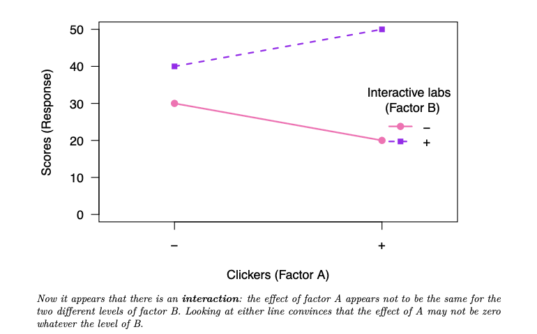 

     - if they cross, you have interactions, almost parallel mean no interaction

- case study 2: How does the # of hours studying impacts a student’s grade?

   

  1. Discuss in your group the relationship between hours spent studying and final grade, and how it
     appears to differ between the course
     - here there is interaction with quite a complicated non-linear form
  2. A student asks you “Should I take course C1 or C2?”. In the light of the information above, what would
     your reply be?
     - due to the interaction, this question can only be answered with another question relating to how much
       time the student will spend studying

# Two Way Design Analysis

- if we have a plot of means that indicates there might be some interaction, how do we know if the interaction is significant or not

  - need to do hypothesis testing

- main effect:

  - let say we have this table

     

  -  there is no interaction between A and B you would expect

     
    $$
    \bar y_{22} - \bar y_{21} \approx \bar y_{12} - \bar y _{11}
    $$

    - when joining the means in a plot of means where no interaction is present, we may observe (theoretically
      at least) two parallel lines
    - differences between the two end points are $\bar y_{22} - \bar y_{21}$ and $\bar y_{12} - \bar y_{11}$
    - since we want the lines to be parallel, we'd expect them to be equal

- case study

   

  1. Illustrate the data by creating a plot of means.

      

  2. Discuss the plot with your group.

     - it looks as though there is a strong interaction between clickers effect and instructor
     - there is little difference between the mean grades when the professors do not use clickers, but a great disparity in the grades when both profs use clickers in the course
     - whereas for Prof Jones the use of clickers appears to greatly improve student performance, for Prof Smith the opposite may be true

  3. TODO: maybe this question, not really sure what it's asking

  4. In the case study above, is $\bar y_{22}  - \bar y_{21}  \approx \bar y_{12} - \bar y_{11}$​

      

  5. In two-way ANOVA, the mean square MS of the interaction term is

      

     To assess whether the interaction term variation is large, you would compare its mean square to the
     mean square of which term?

     - interaction term mean square is compared to the mean square error (MSE)
     - to calculate the test statistic, we divide the interaction mean square by the MSE

  6. A partially completed ANOVA table is given, fill it out

     - for each row, we divide SS by its df to get the MS

     - for each row, we divide MS by MS_Error to get F statistics

        

  7. To which distribution would the test statistics be compared?

     - each would be compared agians ttheir own, just so happens that here all the distributions are the same
     - the statistics follows a $F_\text{(df of group), (df of error)} = F_{1, 36}$

  8. Suppose the 95th percentile point of the F distribution in question is 4.11. Based on the above, what model would you adopt for the data?

     - all F statistics are larger than the critical value (we reject the null)

     - hence we say that all the terms are significant, so we'll adopt the model
       $$
       Y = A + B + AB + \varepsilon
       $$
       (include interaction term too as it is significant)


# Contrasts

- sometimes we want to group levels together in ANOVA

  - ex. factor: animal species with 6 levels
    - 3 mammals, 3 reptiles &rightarrow; interested in comparing mammals to reptiles, not each species 
  - combining levels is referred to as <u>contrast</u>

- case study

   

  1. The scientist wishes to estimate the difference in mean growth between biological and non-biological
     reagents. Suggest an estimate in terms of the group means.

     - there are 2 samples with biological reagents (sample means $\bar y_A$ and $\bar y_B$)

     - 1 sample with non-biological reagents (sample mean $\bar y_C$)

     - an estimate have to weight these accordingly, so that biological has the same weighting as non-biological 
       $$
       \bar y_A + \bar y_B - 2 \bar y_C = 4.94 + 5 -2\times 4.74 = 0.46
       $$
       or 
       $$
       \dfrac{\bar y_A + \bar y_B}{2} - \bar y_C = \dfrac{4.94 + 5}{2} - 4.74 = 0.23
       $$

  2. How would you modify this estimate to create an adequate test statistic?

     - the test stat is of the form $t ^* = \text{estimated difference} / \text{se}$ 

     - but we'll have to estimate the SE of the estimated difference accordingly

        

     - as an estimate of $\sigma^2$, we can use the MSE in ANOVA which is $0.023667$

     - so the test stat is 
       $$
       t^* = \dfrac{0.46}{\sqrt{6 \times 0.023667/ 5}} = 2.7295978
       $$

  3. Using this test statistic, wow would you assess whether the difference between biological and non-
     biological reagent is significant?

     - compare this test statistic to a t distribution with the same degrees of freedom as the MSE,
       so here $df =12$

     - since it's 2 sided alternative

       ```R
       2*pt(2.7295978, 12, lower.tail = FALSE)
       ```

  4. What may be the advantage of using the above method over pooling the data of the two biological
     reagents, and considering them as one group?

     - if we pooled the data from two groups into one group, we cannot account for the small differences these
       groups may have
       - ex. it may be that biological reagents A and B are more similar to one another than to the non-biological reagent C, but these two biological reagents may still differ slightly from one another
     - using the above linear combination, we account for these differences between groups

  5. Let’s now assume that the scientist explored five different reagents instead of three, two biological (A
     and B), and three non-biological (C, D and E). The complete data are given below:

      

     - two biological reagents appear to promote more growth than the three non-biological reagents
     - there are no great differences in variation within the groups, suggesting ANOVA can applied

  6. The researcher wishes to estimate the difference in the response variable between the biological and non-biological reagents. Can you suggest an estimate of this difference using the treatment group means?

      

  7. In this activity you have computed estimates of effects based on functions of the g treatment group
     means of the form

      

     for some constants c1, . . . , cg . That is, each estimate was a linear combination of the group means. 

     What do you notice about the numbers c1, . . . , cg in each example?

     - we can notice that $c_1 + c_2 + \ldots + c_g = 0$ 
     - hypothesis test can be constructed for contrasts
       - similar to two-sample t-test

     

# Further Designs

- today we're explore randomized complete block design

  - one way anova is complete randomized design (no block)
  - this is the way to design exp when there is a nuissance factor

- blocking 

  - TODO
  - paired test is kinda blocking
  - different kinda of blocking

- see clickers on the ANOVA changing 

  - it's E

- case study

  1. One of our colleagues suggests that we should scan the brain of the 6 patients with brain conditions with scanner A, the liver of the 6 patients with liver conditions with scanner B, and the heart of 6 patients with heart conditions with scanner C, and then that we compare the time it takes to produce the images using a one-way ANOVA with the scanner type as factor. What would be your main reservation with this approach?

     - we won't know how good scanners are on other organs (i.e won't know how good A is at scoring scanning livers or hearts)

  2. Another colleague suggests two different approaches. 

     - Approach 1: randomly assign the patients to a scanner. 
       - 

     - Approach 2: for each scanner, randomly select (without replacement) 2 patients with each of the conditions. Specifically, for scanner type 1, randomly select 2 of the 6 patients that need a brain scan, randomly select 2 of the 6 patients that need a liver scan, and randomly select 2 of the 6 patients that need a heart scan. For scanner type 2, randomly select 2 of the 4 remaining patients that need a brain scan, etc.
     - Which of these approaches would you choose, and why?
       - should block by type of scanners and type of organs

  3. Using the best approach among those described in the previous questions, we collect the data. While there may be differences in the time it takes to scan different body parts, we are primarily interested in the overall differences in the scanner types. Thus, we start with applying a one-way ANOVA with scanner type as factor. Fill in the ANOVA table below

  4. What would you conclude based on these results?

  5. Using the same data as in question 3, we now use a two-way ANOVA with both scanner type and body part as factors. Here is the partial ANOVA table returned by R. We can see that now we have the results for the variable body part. How else do the results from this table differ from the partial results from the one-way ANOVA above? Explain these change

      

  6. Fill in the table for question 5

  7. What would you conclude with this new analysis? Compare this new conclusion with the conclusion
     you have made with a one-way ANOVA.

     

# Midterm Review

- no question on contrast

- what is signed rank test?

- see review slides

- sign test

  - paired samples or one sample
  - $H_0: \text{median} = \theta $
  - test stat
    - $t = \# \text{ of } +$
    - $t \sim \text{Bin(n, 0.5)}$
  - p-value: use binomial
  - assumptions
    - TODO

- Wilcoxon rank sum test

  - use: 2 indep sample

  - $H_0:$ distribution are the same between the two

    - or two median is the same

  - test statistics

    - sum of the rank of the smaller grouo
      $$
      W_x = \sum^m_{I=1} R_{i,X}
      $$

    - take average of the ties, if the ties in the one group, it's fine

  - p-value

    - TODO

  - example: TODO

- signed rank test

  - used: paired samples
  - TODO: did we do this one tf
    - it's included withtin the sign test
    - basically you take the difference, then treat it as one simple


# Linear Regression Introduction

- regression review 

  - linear model implies the following relaiotnship
    $$
    y= \beta_0 + \beta_1 x + \varepsilon
    $$

    - y is the response variable
    - $x$ is the explanatory variable
    - $\beta_0$ is the intercept, $\beta_1$ is the slope
      - this is the population parameter, we need to esimtate it to get $\hat \beta_i$
    - $\varepsilon$ is the error term

- residual 

  - $e_i$ is the vertical distance from the (actual) point from the line fitted
    - can be negative or positive (depends on if the point is above or below the line)
    - so we square it
    - $e_i = y_i - \hat y_i$​
    - we try to minimize $\sum^n_{i=1} e_i^2$​
    - sum of the residuals is always 0
      - sum of the squares of residuals is a different story

- least squares estimates 

  - simple linear regression model
    $$
    y = \beta_0 + \beta_1 x + \varepsilon
    $$

  - the simple linear regression line
    $$
    \hat y = b_0 + b_1 x
    $$

    - so $b_0$ and $b_1$ are estimates $\beta_0$ and $\beta_1$ (based on data)

    - slope
      $$
      \begin{align*}
      b_1 &= r \dfrac {s_Y}{s_X}  \\
      \\
      r &: \text{sample correlation coefficients for $x$ and $y$} \\
      s_Y &: \text{sample standard deviation of $y$} \\
      s_X &: \text{sample standard deviation of $x$}
      \end{align*}
      $$

    - intercept
      $$
      \begin{align*}
      b_0 &= \bar y - b_1 \bar x \\
      \\
      \bar y &: \text{sample mean of $y$} \\
      \bar x &: \text{sample mean of $x$}
      \end{align*}
      $$

  - regression line will go through $(\bar x, \bar y)$​ 

- coefficient of determination

  - interpreted as the proportion of the variation in the response variable that is explained by the model

- case study

  1. The “Name Game” is a method to help individuals recall the names of people in a group. The group
     members sit in a circle, and the first member says their full name. The second person must repeat the
     full name of the first person before adding their own. The third member must repeat the names of
     the first two people before adding their own, and so on.

      

     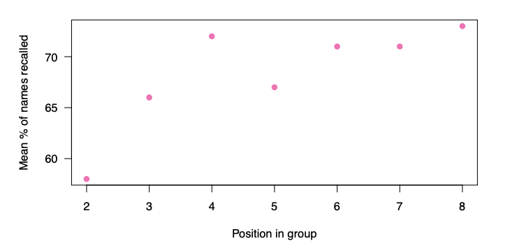 
     
     1. Decide whether a linear model might be viable for these data.
     
        - quite strong positive correlation which supports a linear model
        - important to look at the scatter plot, though the 4th point wouldn't fit a linear model super well, overall data seem to support a linear model
     
     2. Find the regression line for mean recall rate (Y) against group position (X) here.
        $$
        \begin{align*}
        b_1 &= \dfrac{rS_Y}{S_X} = \dfrac{0.798 \times 5.219}{2.160} \approx 1.93 \\
        b_0 &= \bar y  - b_1\bar x = 68.286 - 1.93 \times 5 = 58.64 \\
        \\
        \hat y &= b_0 + b_1x = 58.64 + 1.93 x 
        \end{align*}
        $$
     
     3. Does the point $(\bar x, \bar y)$​ lie on the line?
        - Yes it does, if you use LSE it'll always lie on the line
     
     4. If the above model is suitable here, explain clearly how you would interpret the gradient of the line fitted.
     
        - The gradient here indicates that increasing the position in the group by one person would increase
          the percentage of names recalled by 1.93%
     
     5. Calculate all the residuals for the fitted model, to two decimal places. Each member in your group should compute two residuals
     
        - for example $e_i = y_1 - \hat y_1 = 58 - (58.64 + 1.93 \times 2) = -4.5$
        - other residuals are 1.57, 5.64, –1.28, 0.78, –1.14, and –1.07
     
     6. Find the sum of the residuals, $\sum^n_{i=1} e_i$, and the sum of the squares of the residuals, $\sum^n_{i=1}e_i^2$​. What do you notice? The regression line minimizes which of these?
     
        - sum of the residuals is very close to zero
        - in fact, for a line made by LSE, the sum of the regression should always be zero 
        - the sum of squares is a different story though - which should always be positive
     
  2. The variance of the residuals is defined to be
     $$
     s^2 = \dfrac{\sum_i e_i^2}{n-2}
     $$
  
     1. Why does the variance of the residuals involves the sum of their squares?
     
        - because if you use $\sum e_i$ alone it'll just be 0
     
     2. The divisor in the expression for $s^2$ is $n-2$ and not $n-1$. By thinking about the number of
        parameters in the model fitted, can you suggest an explanation for this divisor?
     
        - model has two parameters: the slope and the intercept
        - hence there are two unknowns to estimate in finding the residuals and their variance
        - we lose a degree of freedom for each parameter estimated
     
     3. Given that the total sum of squares is: $\sum^7_{i=1}(y - \bar y)^2 = 163.428$​ and using the value of the sum of the squares of the residuals you calculate above, find $R^2 =\dfrac{\sum^7_{i=1}(y - \bar y)^2 - \sum^n_{i=1} e_i^2}{\sum^7_{i=1}(y - \bar y)^2}$​
        $$
        R^2 = \dfrac{163.428 - 59.286}{163.428} = 0.637
        $$
     
     4. Comment on the $R^2$​ value, and offer an interpretation 
     
        - R2 measures the percentage of variation in the data accounted for by the model and not the residual variation
        - note: this statistics is just the square of the sample correlation


# Regression Sum of Square

- we are usually interested in drawing conclusions about the population

  - i.e is $\beta_1 = 0$

  - we'll use ANOVA (F-test) to test
    $$
    H_0: \beta_1 = 0\\
    H_a: \beta_1 \neq 0
    $$

- blah blah some math
  $$
  \begin{align*}
  \sum^n_{i=1} (y_i - \bar y)^2 &= \sum^n_{i=1} (\hat y_i - \bar y)^2 + \sum^n_{i=1}(y_i - \hat y_i)^2 \\
  \text{SS Total} &= \text{SS Model} + \text{SS Error}
  \end{align*}
  $$
  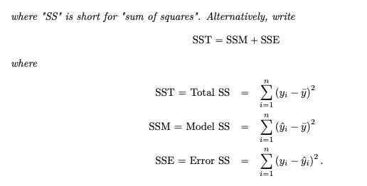	

- case study

  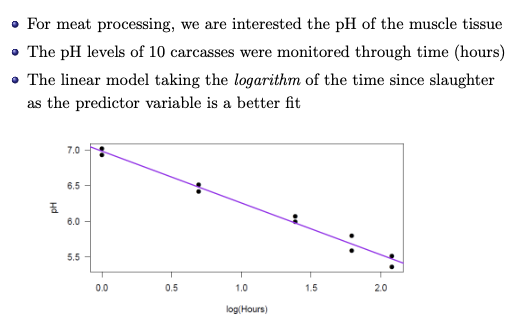 

  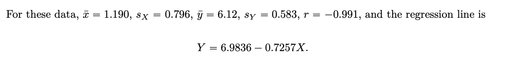 

  1. How would you expect the plot to look if pH did not depend on the time since slaughter? What would you say about the regression line in that case?

     - would expect to observe a plot in which the points were scattered about $\bar y$
     - so the only variation in the response variable would be due to noise. In that case we would expect $b_0 \approx \bar y$ and $b_1 \approx 0$

  2. By adding a horizontal line for $\bar y$​ in the above plot, describe the sums of squares in (1)

      

  3. Which of the two sums of squares on the right hand side of (1) would you expect to be the larger in this example?

     - model has slope appreciably different from zero, and the scatter about the line is rather minimal
     - we would expect the Model SS (often called the Regression SS) to be larger

  4. The information we obtain from breaking down the variation in the data is often expressed in an ANOVA table, as follows

      

     Complete the table

     - completed table

       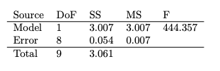 

  5. We can construct hypothesis test
     $$
     \begin{align*}
     &H_0: \beta_1 =0 &&H_1: \beta_1 \neq 0
     
     \end{align*}
     $$
     under the assumption that $\varepsilon \sim N(0, \sigma)$ for some $\sigma$, the test statistics is
     $$
     \begin{align*}
     F &= \dfrac{MSM}{MSE} \\
     F &\sim F_{1, n-2}
     \end{align*}
     $$
     When $H_0$ is false, the test statistic becomes inflated, as then MSM tends to be high relative to MSE. So large values of the test statistic (in the upper tail of  $F_{1, n-2}$) lead to rejection of H0. Given that the 95th percentile of the $F_{1,8}$ distribution is 5.318, what do you conclude about the data in this case study?

     - test statistic falls in the far upper tail of the F distribution it would follow if the pH level did not depend linearly at all on the (log of) time since slaughter. 
     - at the 5% significance level we would reject the null hypothesis that the pH level does not depend linearly on the log of the time since slaughter (i.e reject $H_0: \beta_1 = 0$)

# Properties of Estimators in Regression

- motivation
  - we want to quantify the uncertainty around a parameter estimates
  - informally: give us a sense of how much faith we should have in that point estimate
    - population mean is more likely to be close to 0 if CI is $(-1, 1)$ than if it's $(-1000, 1000)$
  
- consider parameter estimates as random variables
  - e.g sample mean
  
- regression model
  - response $Y$ is and explanatory variables are modelled
    $$
    Y = \beta_0 + \beta_1 X + \varepsilon \\
    \varepsilon \sim N(0, \sigma^2)
    $$
  
  - parameters are $\beta_0, \beta_1$ and $\sigma$
  
- the estimators
  
   
  
  - lower case letters are the estimators for the parameters (upper case letters)
  - estimators are all unbiased
    - estimators do not underestimate or overestimate the population parameter
  - want to quantify variance of these estimators
  
- clicker
  - answer is e, but why?
  
- $se(b_1)$
  - we know
    $$
    Var(b_1) = \dfrac{\sigma^2 }{\sum^n_{i=1} (x_i - \bar x)^2}
    $$
  
    - estimate for $\sigma^2$ is $s^2$
  
  - so we have 
    $$
    se(b_1) = \sqrt{\dfrac{s^2}{\sum^n_{i=1} (x_i - \bar x)^2}}
    $$
  
- clicker about the mean
  - if we increase the slope, we rotate the line, the y-intercept goes down 
  - the mean of the predictor variables being positive mean that $\bar x$ is in the first quadrant, so our line is in the fist quadrant
  
- case study
  
   
  
  1. Is this study an experiment or observational?
  
     - there's no treatment applied to the NHL players, so it's purely observational
  
  2. What do you think is the response variable in the study?
  
     - response is the number of goals scored in the season
  
  3. Does the scatterplot above show a relationship between the two variables similar to what you would have expected?
  
     - reasonable to assume that as the number of shots a player takes increases so the number of goals they score would go up
  
  4.  
  
     -  null hypothesis would assert that the number of goals scored by top NHL players does not
       depend linearly on the number of shots take
     - given that the F stat falls above the 95 percentile of $F_{1,48}$ (which is 4.04), we would reject the null
  
  5.  
  
     - now from above, we know that 
       $$
       \begin{align*}
       se(b_1) &= \sqrt{\dfrac{s^2}{\sum^n_{i=1}(x_i - \bar x)^2}} \\
       &= \sqrt{\dfrac{61.47}{49 \times 46.45^2}} \\
       &= 0.0241
       \end{align*}
       $$
  
     - since $b_1=0.0731$​ we know the confidence interval is of the form
       $$
       0.07313 \pm 2.01 \times \text{se(estimate)} \\
       0.07313 \pm 2.01 \times 0.0241 \\
       (0.0246, 0.122)
       $$
  
  6. Another test for the null hypothesis $H_0: \beta_1 = 0$ compares the test stat
     $$
     \dfrac{b_1 }{se(b_1)} \sim t_{n-2}
     $$
     Compute the associated test statistics here 
     $$
     \dfrac{b_1}{se(b_1)}=\dfrac{0.0731}{0.0241} = 3.033
     $$
  
     - note that if you square this, you would get the F statistics
     - you reject the null here still

# Multiple Linear Regression

- we can have more than one predictor
  - we have multiple linear regression model
  
    	
  
  - the parameters themselves $\beta_i$ need to be linear, the $x$ can be whatever 
  
- general multiple regression model
  - $B_j$ is parameter
  - $e_i$ is the error
  
- visualizing the relationship between $Y$ and $(X_1, X_2)$ is dififcult
  - 3D plots are hard to view
  
  - bivariate scatterplots do not fully represent the relationship between 3 variables
  
    - especially if there are correlation between $X_1$ and $X_2$
  
  - example
  
    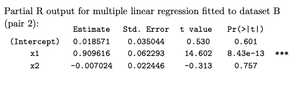 
  
    - even though p-value is large, so we cannot reject $H_0$ (saying $x_2 = 0$) even though the graph individually looks related to $y$​
    - but there's case where $x_1$ or $x_2$ is related, that means that we can just use one of them, that's enough
      - multicollinearity
  
- case study:

   

- clicker

   

  - answer is C
    - A is true because $\beta_1$'s CI does not include 0 at all, so it's very likely to be non-zero
    - while $\beta_2$'s CI does include 0, so sometimes, it might be 0

- review sum of squares and stuff

   

  - mutliple $R^2$, though recalls that it always increases with more parameters
  - look at adjsuted $R^2$

# Curve Fitting In Regression

- not all relationships are linear

- method is the same, we want to minimize residual sum of squares
  - adding an explanatory variable will decrease the RSS

  - exceptions: where RSS will stay the same

    - if $y = \beta_0 + \beta_1 x_1$ with no error, we have perfect fit - the RSS will be 0, so cannot be lower
    - or if $x_1$ and $x_2$ are perfectly correlated

    - but perfectly fitted data is not realistic IRL

- first analysis: we just do a regular regression

   

- second analysis: use an $x^2$ term
  - use a multiple linear gression with $X$ and $X^2$​

    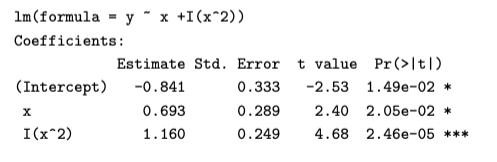 

  - in R `lm(formula = y ~ x + I(x^2))`
    - get pretty good results

- comparing the 2 

  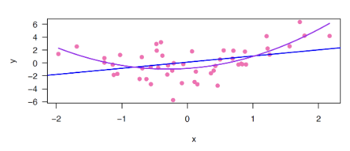 

  - clicker

     

    - SS will decrease because we're adding an extra term

  - clicker 

     

    - it's C, to interpret we need to look at the derivative
      - `X` and `X^2` are not 2 different variables, so you can't exactly hold one thing constant while the other things changes
      - so you need to look at the rate of change of x, which is the derivative

  - interpreting polynomial regression

    - regression line is: $y = b_0 + b_1x + b_2 x^2$

    - how does $y$ changes with respect to $x$
      $$
      \dfrac{dy}{dx} = \dfrac{d(b_0 + b_1 x + b_2 x^2)}{dx} = b_1 + 2b_2x
      $$

    - things to remember

      - cannot interpret $b_1$ and $b_2$ separately in this case 
      - because you can't change $X$ and keep $X^2$ fixed
      - because rate of change depending on the value of $X$​

- clicker

    

  - 95% CI of $\beta_2$ exclude 0
    - can reject the null hypothesis that $\beta_2 =0 $
    - evidence for quadratic relationship

- is it linear

   

- polynomial model of order q

   

  - total parameter is $q + 1$ paramteres

  - which models is the most consistent with the data?

  - we used a hypothesis testing with two models
    - but what should we do when comparing 4 models
    
  - algorithm to pick

     

  - limitation: it maybe unstable if the order is higher than 2 (i.e $p \geq 3$)

    - the relationship may change if samples are taken from the same population

    - also extrapolations are dangerous 

       

# Residuals In Regression

- estimates, intervals and hypothesis test in a regression analysis assume that the model is correct

  - if the model is incorrect for the data, the methods used could be incorrect

- how do we know if the model we are using is good?

  - we can check whether the assumptions of the model seems reasonable for our data

- to asses whether the condtions of a multiple linear regression model seem to hold for our data

  - can analyze the estimated errors (look at residuals)
  - in linear regression, we assume:
    - mean of response is a linear function of the predictors
    - errors are independent
    - errors are Normal random variables with mean zero and constant variance (i.e $e_i \sim N(0, \sigma^2)$)

- case study 

   

  1. What information is each plot conveying?

     - plot #1 is just a scatterplot of the response variable (JANTEMP) against the predictor variable (LONG)
     - plot #2 gives a scatterplot of the residual values (the difference between the observed and fitted values) against the fitted values
     - plot #3 is a scatterplot of the residuals against the predictor variable (the scaled
       longitude)
     - plot #4 is a Normal scores plot of the 56 ordered residuals against the corresponding Normal scores

  2. Which of these plots generalize easily to multiple linear regressions (i.e., regressions with more than one
     explanatory variable)?

     - plot 2 and 4 because neither of them really relies on the predictor variable, but on the model and the data itself

  3. We now focus on a different dataset with n = 200 observations of $(X_1, X_2, Y)$. Below, are some plots looking at the residuals when multiple linear regression is applied with Y as the response variable and $X_1$ and $X_2$​ as the explanatory variables. Do any of the plots raise concerns about the appropriateness of the model for these data? If so, do the plots hint at how one might fix the problem?

      

     - curved pattern in the residuals versus $X_1$ plot suggests that the relationship between $Y$ and $X_1$​ is not linear

       - so we can try adding a $X_1^2$ term 

     - when we add the extra term, the fit looks a lot better

       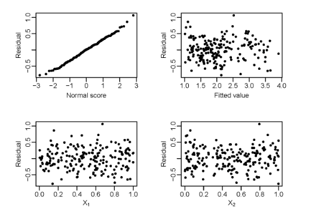 

  4. Same issue again, but for a different dataset producing the residual plots below. What, if anything, would you suggest

     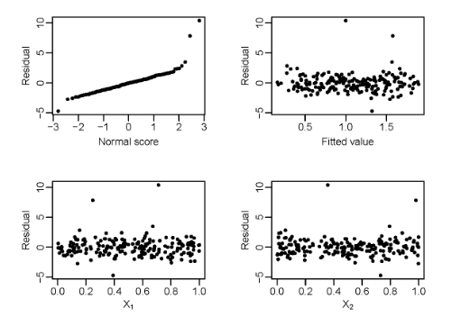 

     - there seems to be several outliers, we can try to remove them, that gives the following model

        

       looks a lot better

  5. The same issue one more time, for a dataset producing the residual plots below:

     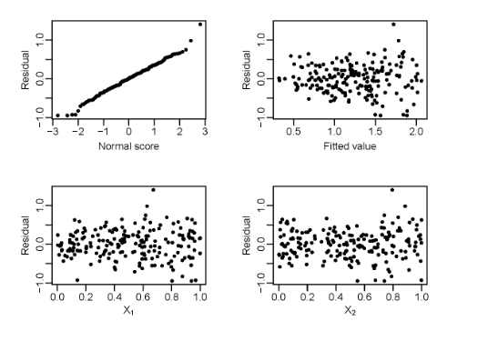 

     - plots doesn't particularly call out to us to add $X_1^2$ or $X_2^2$ and there doesn't seem to be any outliers

     - however, we can see a "funnel" shape pattern in the plot of the residual against the fitted value

       - indicate that the variation increases with the fitted value

       - common to try some transformations to remedy this

       - if we take the square root of the response variable, the plots become

          


# Multiple Regression and ANOVA

- you can introduce dummy variables for categorical variables

  - the dummy variable is basically saying if it is "on" or not
  - if the variable has $g$ levels, you need $g- 1$​ dummy variable
  - see the pre-class notes

- regression or ANOVA

  - todo: reminder of ANOVA machine
  - Jill feels this is is a MLR regression problem 
    - basically the only variable is the Machine variable - which has 4 levels and requires 3 dummy variables

- multiple regression: fit a MLR of $Y$ on $X_1, X_2, X_3$

  ```R
  lm(y ~ x1 + x2 + x3)
  ```

- ANOVA vs regression

   

  - they are equivalent! (in the setup above)

- case study 2

   

  - we've done this before with ANOVA

  - however, we can do a different encoding with regression as well

     

  - model without interaction between the 2 

     

  - model with interaction between the 2 factors

     

  - if we regress on the model with interaction (i.e $X_1, X_2, X_3$)

     

- basically, ANOVA can be written as a regression model

   

- ANOVA vs regression

  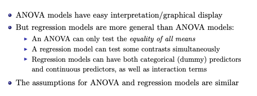 

  

# Risk and Odds Ratio

- we will look at the relationship between 2 binary variables

   

- TODO: risk ratio, actually most of these are questions in the sheet

  - risk = probability $1/ 4$
  - odds is the probability of getting over probability of not getting (more like ratio)
    - $(1/4) / (1-  (3/4)) = 1/3$ (or 1:3)
  - risk ratio is the ratio of the risk for $X = 1$ and $X=0$​
    - slides is pretty useful here
    - TODO: interpretation of these things, odds ratio, risk ratio

- case study

  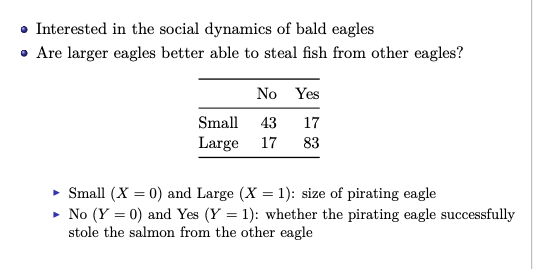 

  1. Let’s explore another way we could look at the relationship between X and Y , here whether successfully pirating events are associated with eagle size. We could look at the proportion of attempts that are successful against size.

       

     How would you interpret this graph? Specifically, what does it tell you about how small and large eagles differ in their pirating attempts.

     - compared to small eagles, large eagles have a higher proportion of successful pirating attempts

  2. Risk is defined as the probability that an event will occur. How would you estimate the risk of a successful pirating attempt for large eagles?

     - estimate this risk with the proportion of successful attempts for large eagles: 0.83

  3. When both variables are binary, a summary of the dependence of $Y$ on $X$ is the risk ratio. At the population level, this is the ratio of the chance that $Y = 1$ given $X=1$ to the chance that $Y=1$ given $X=0$. If we define small size as $X=0$ and large size as $X=1$​, what is the sample risk ratio for the eagle data set?

     - it's chance of successful of large eagles over chance of successful of small eagles
       $$
       \hat{RR} =\dfrac{\text{prob success of large eagles}}{\text{prob success of small eagles}}= \dfrac{83 / (83 + 17)}{17/(17+43)} = \dfrac{83/100}{17/60} = 2.929
       $$

  4. How does the risk ratio relates to the graph?

     - can see that it represents the increase in proportion of successful attempts when going from small to
       large eagles

  5. Why do you think fitting a linear regression where the response variable is the proportion of successful attempts (i.e. risk) and the predictor variable is the binary variable size may be inappropriate? Hint: think of the assumptions of the linear regression and think about the sample size.

     - linear regression methods assume that the error is normally distributed, and thus the error should
       be able to take values from $-\infty$ to $\infty$
       - we have proportion data, which can only have values between 0 and 1
       - such the error values could only take values between -1 and 1
       - it is unlikely that we would not violate the normality assumption
     - also while we had a sample of 160 attempts in the original data (i.e. $n=160$), if we use proportion data we only have 2 data points ($n = 2$)

  6. A common alternative measure for binary variables is the odds. The odds calculates the ratio of number of successes to number of failures. Odds are defined as $\text{odds} = \dfrac p {1-p}$ , where p is the probability of success. What would be the odds of a successful pirating attempt for large eagles?

     - odds of success is the probability of success over the probability of failure

       - probability of success: $83/100$
       - probability of failure: $17 / 100$

     - overall the odds is
       $$
       \text{odds} = \dfrac{0.83}{0.17} \approx 4.882
       $$

     - means that for every 1 unsuccessful attempt, large eagles have $\approx 4.882$ successful attempts

  7. What would be the odds of a successful pirating attempt for small eagles?

     - probability of success: $17/(17+43)$

     - probability of failure: $43/(17+43)$​

     - so the odds is 
       $$
       \text{odds} = \dfrac{17/60}{43/60} \approx 0.395
       $$

     - this means that for every 1 unsuccessful attempt, small eagles have 0.395 successful attempts

  8. An alternative summary of the dependence of $Y$ on $X$ is the odds ratio. This measure will be essential next class, when we explore logistic regression. As the name implies, this is the ratio of the odds that $Y=1$ given $X=1$ to the odds that $Y=1$ given $X=0$​​. What is the sample odds ratios for the eagle dataset?

     - it's basically the odds of large eagles over odds of small eagles
       $$
       \hat{OR} = \dfrac{4.882}{0.395} \approx 12.349
       $$

  9. If our null hypothesis is that there is no difference between small and large eagles, what would be our hypothesized value for the risk and odds ratios?

     - we would hypothesize that the value of the ratio is 1

# Intro to Logistic Regression

- last class: odds ratios quantify the relationship between two binary variables

  - but what if we have the case that $Y$ is binary response and $X$ is continuous
  - i.e frog survival is affected by pollutant concentration? (survive is response and it's Yes or No, while Pollutant concentration is a numeric number)

- we can't use linear regression cuz it'd look like this

   

- logistic regression 

  - response $Y$ follows a binomial (or Bernoulli) distribution

  - models the probability of $Y = 1$ given the value of $X$
    $$
    \begin{align*}
    P(Y = 1 \mid X) &= \text{expit}(\beta_0 + \beta_1X) \\
    \\
    \text{expit}(z) &= \dfrac{1}{1+e^{-z}}
    \end{align*}
    $$

    - this transform $z$ to the probability scale

       

  - alternative definintion
    $$
    \begin{align*}
    \text{logit}(P(Y = 1 \mid X)) &= \beta_0 + \beta_1 X\\
    \\
    \text{logit}(p) &= \log \left(\dfrac{p}{1-p} \right)
    \end{align*}
    $$

    - it transform from the probability scale to the whole real line

       

  - use logit if you want the log odds, use expit (which is the exponentiated version of log odds) if you want just the probability 

- interpretation

  - the logistic regression function is modelling the log odds (that's the response)
  - interpreting in log odds
    - intercept: $\hat{\beta}_0$ represents the log-odds of the reference group (e.g., non-students)

    - slope: $\hat{\beta}_1$​ represents the difference in log-odds between the treatment and the reference group (e.g., students vs. non-students)
  - interpreting the exponentiated version
    - intercept: $e^{\hat{\beta}_0}$ represents the odds of the reference group, i.e., proportion of success relative to proportion of failures in the sample 

    - slope: $e^{\hat{\beta}_1}$​​ represents the *odds ratio*, i.e., ratio between the odds of the treatment vs the odds of the reference group

- case study

  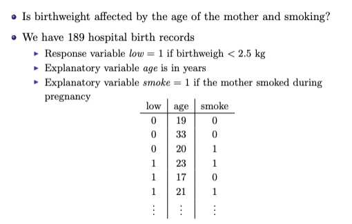 

  - R output

      

  1. Based on the logistic regression output, what would you estimate the chance of low birthweight to be for a 25-year-old, non-smoking mother?

     - want the probability so we'll use expit
       $$
       \text{expit}(\hat\beta_0 +\hat\beta_125 + \hat\beta_2 0) = \text{expit}(0.06091 - 0.04978 \times 25) = \text{expit}(-1.184) = \dfrac{1}{1+e^{1.184}} = 0.23
       $$

     - so there's a 23% chance

  2. Give an estimate of the multiplicative increase in the odds of low birthweight for a smoking mother compared to a non-smoking mother of the same age

     - since it's multiplicative increase, we want to do the exponentiated version of the output (which is $\hat\beta_2$ here)
       $$
       e^{\hat\beta_2} = e^{0.69185} = 2.00
       $$

     - so it's 2 times as likely 

  3. Give a 95% confidence interval for the multiplicative increase in the odds of low birthweight for a smoking mother compared to a non-smoking mother of the same age

     - usual approach of CI for $\beta_2$ give us 
       $$
       0.69185 \pm (1.96 \times 0.32181)
       $$

     - we move to the odds ratio scale be exponentiating so if we exponentiate both endpoints we get 
       $$
       (1.06, 3.75)
       $$

       - note that $e^{\beta_2}$ is not actually the middle of this interval, but that's fine


# Time Series

## Intro

- time series: a sequence of measurements of the same variable made over time

  - ex. daily closing stock prices, daily temperature

- serial correlation

  - refers to the correlation between a variable and its lagged values over time
    - i.e it measures the degree to which a variable is correlated with itself at different points in time
  - common issue in time series data and can arise when there is a pattern or structure in the data that persists over time  &rightarrow; violates one of the assumptions of many statistical models, including linear regression, which assumes that the errors (residuals) are independent of each other
  - when serial correlation is present, it can lead to inefficient parameter estimates, biased standard errors, and misleading inference

- case study

   

  1. What feature makes it different from other datasets considered during the course?

     - the data is collected in time order &rightarrow; we cannot assume the values are mutually independent

     - there may be serial correlation in the data (values may be correlated over time)

  2. To start, consider just the observations for the last five years. Suppose we want to assess whether these values are correlated over time (i.e., whether there is a dependence in the data). We define a run to be a sequence of values which lie the same side of the sample mean (a run may consist of a single value). The sample mean for these five observation is 166.48 lbs, and thus we have the following two runs:
     $$
     \mid 156.8, 156.8, 165.4 \mid 174.7, 178.7
     $$
     where the symbol $\mid$ represents a new run

     1. In the five data there are three values below the mean and two above. Replacing each number in the sequence with a if it lies above the mean, and b if it lies below, the sequence of numbers is now replaced by a sequence of letters:
        $$
        bbaaa
        $$
        How many different sequences are there of two a ’s and three b’s? Write them down in the following
        table, including the number of runs in each:

        - there are $5 \choose 2$ orderings where we have 2b's and 3a's, we can list them out as 

           

     2. If the five observations are independent, each of the possible orderings above would have the same probability. Under this assumption, complete the following probability distribution for the number of runs with of two a’s and three b’s:

        - basically we just count how many sequences of that number of runs and then divide by 10

           

     3. Find the mean value of the number of runs assuming the data are independent; that is, what is the expected value of the number of runs assuming independence?

        - the mean is the weighted average
          $$
          2 \times 0.2 + 3 \times 0.3 + 4 \times 0.4 + 5 \times 0.1 = 3.4
          $$

     4. Compare this to the actual number of runs in the data

        - 3.4 is larger than the actual number of runs of 2.
        - so helps to look at the observed number of runs compared to probability distribution of the runs under the null hypothesis of independence

  3. Now consider the complete data series of all 23 observations. The mean of the complete series is 166.19 lbs

     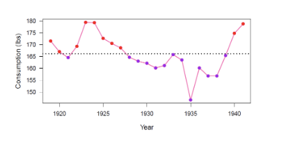 

     - ==counting the coloured segments, we can see that there are 5 runs==

- run test

  - expected number of runs: for independent observations, the mean number of runs can be approximated by
    $$
    \begin{align*}
    \mu &= \dfrac{2 n_a  n_b}{n_a + n_b} + 1 \\
    \\
    n_a &= \text{\# of observations above the sample mean} \\
    n_b &= \text{\# of observations below the sample mean}
    \end{align*}
    $$

    - ex. in our example above
      $$
      \begin{align*}
      n_a &= 10 ,~~~~~n_b= 13 \\
      \mu &= \dfrac{2 \times 10 \times 13}{23} + 1 = 12.304\\
      \end{align*}
      $$
      and the number of observed run was 5 so <u>there are longer runs of values above and below the mean than would be expected if the values were independent</u> (i.e we expect it to oscillate above and below the mean more than it actually did)

  - want to know if this difference between observed and expected # of runs is significant &rightarrow; statistical test

    - test statistic
      $$
      \dfrac{\text{\# of runs } - \mu}{\sigma}
      $$

    - the variance of the number of runs is approximated as 
      $$
      \sigma^2 \approx \dfrac{2n_a n_b (2n_an_b -n_a-n_b)}{(n_a+n_b)^2 (n_a+n_b-1)}
      $$

    - under the null hypothesis of independence: **the tests statistics approximately follows the $N(0,1)$​ distribution** (i.e two-sided z-test)

  - example: in our example above

     

- summary

  - time series is data measured repeatedly over time
  - time series data may be correlated
    - i.e., there may be serial correlation in the data
    - data are no longer independent
  - so the run test is a simple method for testing independence &rightarrow; and it is non-parametric 

## Time Series Smoothing

- properties of a time series: a times series $x(t)$ can exhibit

  - trend: long term change in the mean of the series
    - a tendency to go up or down
  - seasonal effect: regular variation with "season"
    - "season" might be month day year, etc
    - basically saying that such effects are periodic
    - ex. temperature (colder during the winter, warmer during the spring)
  - cyclical effect: oscillations of possibly unknown cause
    - not associated with fixed or known period

- decomposing a time series: 

  - assumption of a seasonal effect $S(t)$

    - is additive
      $$
      \begin{align*}
      X(t) &= \mu + S(t) + \varepsilon(t) \\
      \\
      \mu &: \text{underlying mean} \\
      S(t) &: \text{seasonal effect} \\
      \varepsilon (t) &: \text{random component}
      \end{align*}
      $$

    - repeats itself every $p$ time units (the period)
      $$
      S(t + p) + S(t)
      $$
      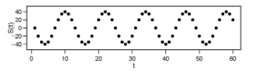 

    - does not induce change in the mean 
      $$
      S(t + 1) + \ldots + S(t + p)  = 0~~~~~~~ t= 0,1,\ldots
      $$

      - i.e when summed over an entire period, the net effect is 0

- case study

   

  1. What are the key features of this times series?

     - series apparently exhibits an upward trend, and a seasonal effect

  2. Suppose you fitted a regression line to the data, and so modelled the series by $X(t)$ where
     $$
     X(t) = \beta_0 +\beta_1 t + \varepsilon
     $$
     and $t$ represents time. Why might this model be inadequate? Why might inference (hypothesis tests,
     confidence intervals for the parameters) based on this model be unreliable?

     - model fails to incorporate a seasonal effec
     - in particular, the residuals would not be uncorrelated for the above model
     - would make the inference based on the model, which assumes independent errors, unreliable

  3. If the series exhibits a seasonal effect, what is the period of such an effect

     - the period is 4

  4. Assuming the series contains an additive seasonal effect, how might we estimate the terms $S(1), \ldots, S(p)$ One approach involves smoothing the series $x(t)$ by averaging each p consecutive values to create a new series $\text{Sm}(xt)$

     - you basically grab 4 values (here it's the first 4), then taking their average (aka windowing or aggregation in coding terms)
       $$
       Sm(xt)[0] = \dfrac{139 + 192 + 468 + 503}{4}=325.50
       $$

     - doing the rest of them you get

        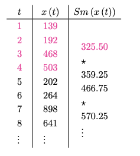 

     - plotting it you get

        

  - gonna abandon this and do the class notes instead

- estimating the seasonal effect

  1. Smoothing 

     - smooth it over the period (here 4)

         

     - you would expect that $Sm(x(t))$ does not exhibit a seasonal effect
     - the first value where $Sm(x(t))$ is located is at $t = 2.5$ (this is a bit weird so we want to center the smoothed series)

  2. Centering

     - create $Cm(x(t))$ by averaging 2 consecutive values of $Sm(x(t))$

       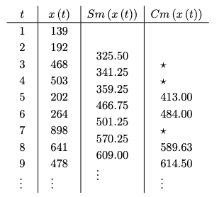 

     - plotting 

        

  3. Average Diff

     - estimate the seasonal indices as 

       - mean difference between $Cm(x(t))$ and the original series $x(t)$ for each quarter where the two series have value

     - i.e the estimate for the the second quarter effect

        

     - computing all of them

        

  4. Adjusting 

     - recall that our assumption is that the seasonal effect does not induce change (i.e $S(1) + S(2) + S(3) + S(4) = 0$)

     - but the sum of our estimate indices is $-29.7$

     - to adjust, we subtract the average discrepancy ($-29.7/4 = -7.428$)

       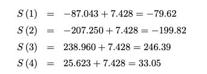 

- use the model above to predict Q1 2012

   
